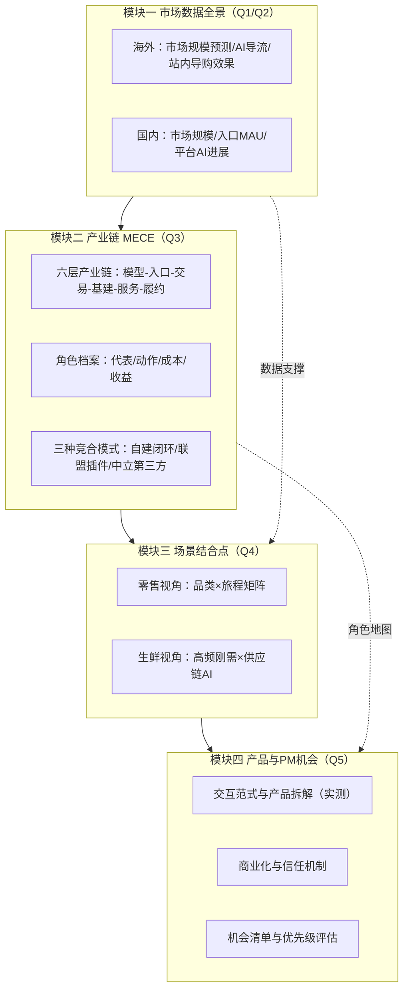

# AI 电商行业研究计划（总览）

> 版本：v1.0 ｜ 编制时间：2026-07 ｜ 数据截至：2026-07
> 配套文档：`01 市场数据与图表清单`、`02 产业链 MECE 分析`、`03 零售与生鲜结合点`、`04 产品与 PM 机会地图`、`05 数据源手册与访谈提纲`

---

## 一、研究背景与核心判断（为什么是现在）

三组信号表明 2025H2–2026 是 AI 电商从「演示」进入「规模化」的拐点，本研究的时间窗口价值极高：

1. **流量与转化双重逆转（海外）**：Adobe Analytics 显示，2026Q1 美国零售网站 AI 来源流量同比 +393%（2025 年 11–12 月假日季 +693%，12 月峰值 +1151%）；2026 年 3 月 AI 流量转化率首次反超非 AI 渠道 **+42%**（一年前还是 -38%），单次访问收入（RPV）高 37%。
2. **站内导购跑出真金白银**：Amazon Rufus 2025 年被 3 亿+ 用户使用，带来约 **120 亿美元增量年化销售**，使用者购买完成率高 60%；Salesforce 口径 2025 假日季 AI 与 Agent 影响了 **20% 的零售订单、2620 亿美元**销售额。
3. **国内进入「入口卡位战」**：豆包（3.83 亿 MAU）内嵌抖音电商实现对话内闭环；千问（1.66 亿 MAU）与淘宝全面打通；腾讯元宝与京东 AI Agent 打通小程序生态；京东「京言」单季辅助购物用户近 8000 万；拼多多、快手、小红书全部下场。2026 年 618 被业内称为「AI 电商普及元年」的分水岭。

**核心判断（待研究验证的总假设）**：电商的第一入口正在从「搜索框/信息流」向「对话框/代理」迁移；价值分配将在「模型—入口—交易—基建—服务」五层之间重新洗牌；零售商的胜负手从流量运营转向「商品数据的机器可读性 + 自有 Agent 能力」。

---

## 二、研究目标与关键问题

### 2.1 研究目标

产出一份可支撑业务决策的《AI 电商行业研究报告》，回答三个决策问题：

- **看清**：AI 电商的真实规模、增速、格局与产业链利益分配（用数据说话，图表化）。
- **看透**：站外 LLM 种草/导流与站内 AI 导购两条路径的机制差异、成本收益与终局关系。
- **看准**：零售与生鲜零售的结合点在哪里；从互联网产品经理视角，哪些机会值得投入。

### 2.2 五大关键问题（对应五个研究模块）

| # | 关键问题 | 对应模块 | 交付物 |
|---|---|---|---|
| Q1 | 国内外 AI 电商有多大、增速多少、由哪些数据构成？ | 模块一：市场数据全景 | 数据底表 + 15~20 张核心图表 |
| Q2 | 站外 2C LLM（豆包/ChatGPT 等）与站内 AI 导购（Rufus/淘宝 AI 等）各自的用户规模、转化效果、商业化进展？ | 模块一 + 模块二 | 双路径对比数据卡 |
| Q3 | 产业链上有哪些角色（MECE）、代表玩家、做了什么、成本与收益结构？ | 模块二：产业链分析 | 产业链全景图 + 角色档案 |
| Q4 | 零售与生鲜零售两个场景，AI 的结合点、案例与优先级？ | 模块三：场景结合点 | 旅程×品类结合点矩阵 |
| Q5 | 从产品技术（尤其互联网 PM）视角，有哪些可落地的结合机会？ | 模块四：产品机会 | 机会清单 + 评测报告 |

---

## 三、范围界定与关键定义（避免研究跑偏）

### 3.1 AI 电商的定义与本研究口径

本研究中「AI 电商」指：**以大模型/Agent 技术介入消费者「需求唤起 → 决策 → 交易 → 履约 → 售后」链路，或介入商家经营链路的电商形态**。研究重心放在**消费者侧导购与交易链路**；商家侧经营 AI（营销内容、客服、供应链）作为产业链一层覆盖，不单独展开（生鲜模块例外，因供应链 AI 是生鲜的核心结合点）。

### 3.2 两条路径（用户指定，必须都看数据）

- **路径 A：站外 2C LLM 种草/导流/闭环**——用户在通用 AI 助手内完成购物决策的起点。代表：ChatGPT（Buy it in ChatGPT / 零售商 App）、Gemini/Google AI Mode、Perplexity、豆包（帮你选/买前问豆包）、千问 App、腾讯元宝×京东、Kimi。
- **路径 B：站内 AI 辅助导购**——电商/零售 App 内嵌的 AI 工具。代表：Amazon Rufus、Walmart Sparky、淘宝 AI 万能搜/千问 AI 购物助手、京东京言与京东 AI 购、拼多多 AI 搜索、快手 AI 购物助手、Instacart Cart Assistant（白标输出给 Kroger/Sprouts）。

### 3.3 分析框架：AI 电商能力五级（本研究自建框架，类比自动驾驶分级）

| 级别 | 名称 | 特征 | 代表 |
|---|---|---|---|
| A1 | 站内问答辅助 | 答疑、比较、攻略，不改变交易流程 | Rufus 早期、淘宝问问、京言 |
| A2 | 站外种草导流 | AI 给推荐 + 跳转链接，交易在别处 | ChatGPT 推荐、点点、元宝×京东（跳小程序） |
| A3 | 对话内闭环 | 选品、下单、支付不出对话界面 | 豆包×抖音电商、千问×淘宝、Buy it in ChatGPT（已收缩） |
| A4 | 授权代理执行 | 凑单用券、盯价代拍、跨店代买 | Rufus Buy for Me、淘宝「一键执行」、AI 低价帮抢 |
| A5 | 自主代理 | 长期授权、全网比价、自动补货决策 | 尚未规模化（信任/风控瓶颈） |

> 用途：给每个产品/玩家标级，观察「各级渗透率」与「升级卡点」，是贯穿全报告的坐标系。

### 3.4 明确不做（Out of scope）

- B2B 代理式采购（Gartner 口径 15 万亿美元赛道，仅在市场规模部分做对照注释）；
- 纯技术层大模型能力评测（只评测「导购场景表现」）；
- 跨境电商独立展开（作为产业链玩家的动作覆盖）。

---

## 四、总体研究框架

逻辑：先用数据确立「有多大、多快」（模块一），再拆「谁在分钱、怎么分」（模块二），然后聚焦到「零售/生鲜怎么用」（模块三），最后收敛为「我能做什么」（模块四）。

---

## 五、研究方法（四条证据线）

| 方法 | 说明 | 产出 |
|---|---|---|
| 案头研究 | 财报/官方发布 > 权威第三方（Adobe、Salesforce、McKinsey、QuestMobile、网经社、艾瑞、信通院）> 严肃媒体 > 自媒体（仅作线索）。全部数据带来源与口径标注 | 数据底表（`data/` 目录 CSV） |
| 产品实测 | 自建「AI 导购评测协议」：10 个标准购物任务 × 10 个产品 × 6 个评分维度，录屏留档 | 评测报告 + 截图库（见文档 04 §6） |
| 专家访谈 | 平台 AI 产品负责人、品牌电商操盘手、GEO 服务商、生鲜零售数字化负责人、投资人，各 2~3 人 | 访谈纪要（提纲见文档 05） |
| 数据监测 | 每月固定跑一遍「监测清单」（入口 MAU、平台公告、协议进展），报告期内保持数据新鲜 | 月度数据快照 |

**数据口径纪律（重要）**：AI 电商数据陷阱极多，所有数字必须三标注——①指标口径（WAU/MAU/年度用户/设备数不可混比）；②统计主体（厂商自报 vs 第三方）；③「AI 影响的销售」vs「AI 内完成的交易」（Salesforce 2620 亿美元是前者，eMarketer 2026 年美国 205.7 亿美元是后者，相差一个数量级）。详见文档 01 §4。

---

## 六、执行计划（六个阶段）

| 阶段 | 工作内容 | 关键产出 / 退出标准 | 建议节奏 |
|---|---|---|---|
| P0 立项对齐 | 确认研究边界、报告受众、决策场景；冻结本计划 | 计划评审通过 | 0.5 周 |
| P1 数据全景 | 按文档 01 清单完成国内外数据采集与图表制作；补齐付费报告（QuestMobile/艾瑞/eMarketer） | 数据底表 + 图表初稿（≥15 张） | 1.5~2 周 |
| P2 产业链拆解 | 按文档 02 框架完成六层角色档案与成本收益测算；绘制利益流动图 | 产业链全景章节初稿 | 1.5~2 周 |
| P3 产品实测 | 执行评测协议（国内 6 款 + 海外 4 款），沉淀交互拆解与截图 | 评测报告 + 案例库 | 1 周（可与 P2 并行） |
| P4 场景深挖 | 零售/生鲜结合点矩阵；完成 8~10 场专家访谈交叉验证 | 结合点矩阵 + 访谈纪要 | 2 周 |
| P5 综合成稿 | 机会清单优先级评估（RICE）；撰写报告并评审 | 终版报告 + 高管版 10 页摘要 | 1~1.5 周 |

里程碑检查点：P1 结束时校验「数据能否支撑五大关键问题」，不足则先补数据再进入 P2；P4 结束时用访谈结论回头修正 P2 的成本收益假设。

---

## 七、最终交付物清单（报告目录草案）

1. 执行摘要（10 页高管版）
2. 市场全景：全球与中国的规模、增速、渗透率（图表章）
3. 双路径对比：站外 LLM 种草 vs 站内 AI 导购（机制、数据、终局关系）
4. 产业链 MECE 全景：六层角色、代表、动作、成本收益、竞合模式
5. 场景篇 I：综合零售的结合点与案例
6. 场景篇 II：生鲜零售的结合点与案例
7. 产品篇：交互范式、实测评测、信任与商业化机制
8. 机会篇：PM 视角机会地图与优先级（含 90 天可验证的 MVP 建议）
9. 附录：数据底表、口径说明、访谈纪要、评测明细

---

## 八、风险与应对

| 风险 | 说明 | 应对 |
|---|---|---|
| 数据口径混乱 | 厂商自报数据（如 Rufus 增量销售、豆包 MAU）缺乏第三方审计 | 执行三标注纪律；关键数字找 ≥2 个独立来源交叉 |
| 行业变化过快 | 研究期内可能出现重大产品/协议变动（参考：ChatGPT Instant Checkout 半年内上线又收缩） | 月度监测清单 + 报告设「事实截止日」 |
| 海外信息二手化 | 大量英文自媒体内容互相转抄、细节失真 | 关键事实回溯到公司官方新闻稿/财报电话会原文 |
| 访谈样本偏差 | 平台方倾向夸大 AI 效果 | 每类角色至少访谈一位「利益相反方」（如商家 vs 平台） |
