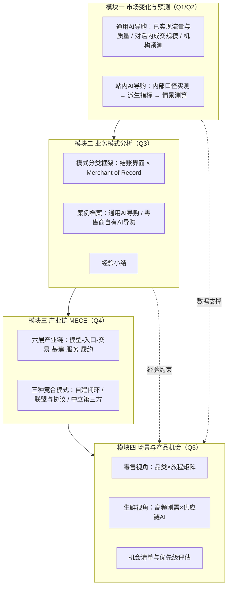

# AI 电商行业研究计划（总览）

> 版本：v2.0 ｜ 编制时间：2026-07 ｜ 数据截至：2026-07
> 配套文档：`01 市场数据与图表清单`、`02 产业链 MECE 分析`、`03 零售与生鲜结合点`、`04 产品与 PM 机会地图`、`05 数据源手册与访谈提纲`、`06 研究报告评分标准与独立评审机制`、`07 评分记录`
> 交付成果物：`report/` 目录（研究报告 + PPT + 评分记录）

---

## 〇、交付定位与数据纪律

**定位：行业研究报告**，供业务判断与投入决策参考，不针对特定企业受众裁剪。叙事以行业结构与可验证证据为主线，结论落到「哪些动作值得投入、依据是什么、如何验证」。

### 交付格式

- 研究报告：`report/AI电商行业研究报告.md`（可直接转换为 Word/PDF）
- 汇报 PPT：`report/AI电商行业研究报告.pptx`（16:9，由 `scripts/make_pptx.py` 生成，数据更新后可重新生成）
- 图表：`charts/*.png`（由 `scripts/make_charts.py` 生成，每张图底部附数据来源、口径说明与编制说明）

### 数据分级规则（贯穿全部产出）

| 等级 | 定义 | 使用方式 |
|---|---|---|
| P1 第三方与事实性披露 | 独立第三方监测数据；官方公告、协议文档、司法文件中的事实性内容（时间、条款、判决）；经审计财务数字 | 可作为结论主证据 |
| P2 企业自报运营数据 | 企业自行统计并披露的运营与效果数据，无论披露渠道为财报电话会、新闻稿或发布会 | 须标注「公司口径」，并说明归因方法的已知局限 |
| P3 内部口径 | 业务方提供、未公开披露、无第三方交叉验证 | 仅报告内部对照，不与 P1 混排比较，不用于对外引用 |
| P4 未采纳 | 存在夸大风险、口径不明或无法交叉验证的自报数据 | 不展示、不进入结论；清单沉淀于报告附录 B |

**原则：宁可留白，不用可疑数字。** 不置信数据既不展示（不以斜纹、灰显等方式呈现），也不作为任何结论的依据。

### 四项口径纪律

1. **区分「AI 影响的销售」与「AI 界面内完成的交易」**。Salesforce 口径 2620 亿美元属前者，eMarketer 口径美国 2026 年约 206 亿美元属后者。**两者地域与周期均不同，不可相除取倍数**，但足以说明二者不在同一量级。
2. **区分观察性对比与因果效应**。「使用者相对未使用者提升 X%」「AI 渠道相对非 AI 渠道提升 X%」均存在混淆，应视为相关性上限；需随机对照实验才能得到因果结论。
3. **区分实测、机构预测与本报告测算**。三者在图注与附录 A 中分别标注；第三方预测值在来源上属 P1，但性质上不是观测值，不作为规模基数。
4. **区间不取单点**。来源给出区间的数据一律保留区间；图表因绘图需要取端点时，标签保留原始区间并在图注说明。

### 质量控制

成果物在发布前执行独立评审循环：评审人与作者分离、盲评、按数据严谨性／结论合理性／结构逻辑／洞察深度／可执行性／呈现质量六维逐维打分并附证据引用；未达标须整改后复评。评分标准与历轮记录属内部质量控制材料，不随成果物对外。

此外，`scripts/make_pptx.py` 内置立场一致性校验（`check_stance()`）：把报告的限定语与被禁表述编码为规则，生成 PPT 时机械校验，不一致即中止生成——用于防止 PPT 在多轮修订中偏离报告立场。

---

## 一、研究背景与核心判断（为什么是现在）

四组信号表明 2025H2–2026 是 AI 电商从「演示」进入「规模化」的拐点：

1. **站外 AI 引荐的流量与质量双重逆转**：Adobe Analytics 显示，2026Q1 美国零售网站 AI 来源流量同比 +393%（2025 年 11–12 月假日季 +693%，12 月峰值 +1151%）；2026 年 3 月 AI 流量转化率首次反超非 AI 渠道 **+42%**（一年前为 −38%），单次访问收入高 37%。
2. **对话内代结账的一次明确失败**：ChatGPT Instant Checkout 2025-09-29 上线、2026-03-05 下线，存续约 5 个月，峰值接入商家约 12 至 30 家；替代方案改为商家自运营结账的零售商应用。这是判断交易环节归属的关键证据。
3. **站内导购跑出可量化效果**：Amazon Rufus 2025 年被 3 亿以上用户使用，带来近 **120 亿美元增量年化销售**，使用者购买完成率高约 60%（公司口径，含自选择偏差）；Salesforce 口径 2025 假日季 AI 与 Agent 影响了约 20% 的零售订单、2620 亿美元销售额。
4. **国内进入入口卡位与生态闭环阶段**：豆包（3.83 亿 MAU）与抖音电商全链路打通；千问（1.66 亿 MAU）于 2026-05-11 与淘宝全面打通；腾讯元宝与京东通过小程序生态联盟；拼多多、快手、小红书均已下场。

**核心判断（研究待验证的总假设）**：电商的第一入口正在从「搜索框／信息流」向「对话框／代理」迁移；价值分配将在「模型—入口—交易—基建—服务」五层之间重新洗牌；零售商与平台的胜负手从流量运营转向「商品数据的机器可读性 + 自有导购/代理能力 + 交易主权的守住」。

---

## 二、研究目标与关键问题

### 2.1 研究目标

产出一份可支撑业务决策的《AI 电商行业研究报告》，回答三个决策问题：

- **看清**：AI 电商的真实规模、增速、格局与产业链利益分配（用带口径的数据说话，图表化）。
- **看透**：通用 AI 导购与站内 AI 导购两类主体的机制差异、成本收益与终局关系。
- **看准**：零售与生鲜零售的结合点在哪里；从产品经理视角，哪些机会值得投入、如何验证。

### 2.2 五大关键问题

| # | 关键问题 | 对应报告章节 | 交付物 |
|---|---|---|---|
| Q1 | AI 电商已实现的规模与增速是多少，由哪些可追溯数据构成？ | 第一章 1.1–1.5 | 数据底表 + 图 1 至图 6 |
| Q2 | 站内 AI 导购的实测运营指标如何，瓶颈在哪一环？ | 第一章 1.6–1.8 | 内部口径对照 + 图 7、图 8 + 情景测算 |
| Q3 | 主要业务模式有哪几类，各自的案例与经验是什么？ | 第二章 | 模式分类框架 + 案例档案 + 经验小结 |
| Q4 | 产业链上有哪些角色（MECE）、代表玩家、成本与收益结构？ | 第三章 | 六层产业链 + 角色档案 |
| Q5 | 零售与生鲜场景的结合点与产品机会有哪些？ | 第四、五章 | 旅程×品类结合点矩阵 + 机会清单 |

---

## 三、范围界定与关键定义

### 3.1 AI 电商的定义与本研究口径

本研究中「AI 电商」指：**以大模型／Agent 技术介入消费者「需求唤起 → 决策 → 交易 → 履约 → 售后」链路，或介入商家经营链路的电商形态**。研究重心放在**消费者侧导购与交易链路**；商家侧经营 AI（营销内容、客服、供应链）作为产业链一层覆盖，不单独展开（生鲜模块例外，因供应链 AI 是生鲜的核心结合点）。

### 3.2 两类主体

- **通用 AI 导购**——用户在通用 AI 助手内完成购物决策的起点。代表：ChatGPT（零售商应用）、Gemini／Google AI Mode、Perplexity、豆包、千问、腾讯元宝。
- **站内 AI 导购**——电商／零售自有站点或 App 内嵌的 AI 工具。代表：Amazon Rufus、淘宝 AI 万能搜与千问 AI 购物助手、Instacart Cart Assistant（白标输出给 Kroger／Sprouts）、拼多多 AI 搜索、快手 AI 购物助手。

### 3.3 分析框架一：AI 电商能力五级（本研究自建，类比自动驾驶分级）

| 级别 | 名称 | 特征 | 代表 | 当前状态 |
|---|---|---|---|---|
| A1 | 站内问答辅助 | 答疑、比较、攻略，不改变交易流程 | Rufus 早期、淘宝 AI 万能搜 | 已规模化 |
| A2 | 站外发现导流 | AI 给推荐 + 跳转链接，交易在别处 | Perplexity、元宝×京东（跳小程序） | 已规模化 |
| A3 | 对话内闭环 | 选品、下单、支付不出对话界面 | 豆包×抖音电商、千问×淘宝 | 生态内已落地；跨生态代结账已收缩 |
| A4 | 授权代理执行 | 凑单用券、盯价代拍、跨店代买 | Rufus Buy for Me、AI 低价帮抢 | 试点阶段 |
| A5 | 自主代理 | 长期授权、全网比价、自动补货决策 | 尚未规模化 | 存在信任、风控与法律争议 |

### 3.4 分析框架二：业务模式分类（按结账界面 × Merchant of Record）

| 编号 | 模式 | 结账界面 | Merchant of Record | 现状 |
|---|---|---|---|---|
| M1 | 通用 AI 代结账 | AI 侧 | AI 平台／协议方 | 已下线（2026-03） |
| M2 | 通用 AI 内的商家应用 | AI 侧 | 商家 | 扩张中 |
| M3a | 通用 AI 导流跳转（用户本人下单） | 商家侧 | 商家 | 常态 |
| M3b | 第三方代理代为下单 | 商家侧 | 商家 | 未获授权者受禁令限制 |
| M4 | 生态内垂直闭环 | AI 侧（同集团） | 集团内电商主体 | 国内主流 |
| M5 | 站内自有 AI 导购 | 自有站点／App | 自有 | 效果最可验证 |

> 用途：给每个产品／玩家同时标注能力级别与模式编号，是贯穿全报告的坐标系。M3 按第四维度（下单动作执行方及是否经授权）拆为 M3a／M3b，详见报告 §2.1。

### 3.5 明确不做（Out of scope）

- B2B 代理式采购（仅在市场规模部分做对照注释）；
- 纯技术层大模型能力评测（只评测「导购场景表现」）；
- 跨境电商独立展开（作为产业链玩家的动作覆盖）。

---

## 四、总体研究框架

逻辑：先用数据确立「已经发生了什么、能推到哪里」（模块一），再拆「有哪几种玩法、各自的经验是什么」（模块二），然后拆「谁在分钱、怎么分」（模块三），最后收敛为「零售与生鲜怎么用、我能做什么」（模块四）。

---

## 五、研究方法（四条证据线）

| 方法 | 说明 | 产出 |
|---|---|---|
| 案头研究 | 财报／官方发布／司法文件 ＞ 权威第三方（Adobe、Salesforce、McKinsey、QuestMobile、网经社、艾瑞、信通院）＞ 严肃媒体 ＞ 自媒体（仅作线索）。全部数据带来源与口径标注 | 数据底表（`data/` 目录 CSV） |
| 内部数据对照 | 对业务方提供的运营指标做口径校验（含单调性检查、可比性检查）与派生指标计算，列明可比性限制 | 图 7、图 8 与第一章 1.5–1.6 |
| 产品实测 | 自建「AI 导购评测协议」：标准购物任务 × 产品 × 评分维度，录屏留档 | 评测报告 + 截图库（见文档 04） |
| 数据监测 | 每月固定跑一遍「监测清单」（入口 MAU、平台公告、协议进展、被推荐率），报告期内保持数据新鲜 | 月度数据快照 |

---

## 六、执行计划

| 阶段 | 工作内容 | 关键产出 / 退出标准 |
|---|---|---|
| P0 立项对齐 | 确认研究边界与决策场景；冻结本计划 | 计划评审通过 |
| P1 市场数据 | 按文档 01 清单完成数据采集与图表制作；对内部口径数据完成校验与派生计算 | 数据底表 + 图 1 至图 9 |
| P2 模式分析 | 按 M1–M5 框架完成案例档案；核实每条关键事实的原始来源 | 第二章初稿 |
| P3 产业链拆解 | 按文档 02 框架完成六层角色档案与成本收益测算 | 第三章初稿 |
| P4 场景深挖 | 零售／生鲜结合点矩阵；专家访谈交叉验证 | 结合点矩阵 + 访谈纪要 |
| P5 综合成稿 | 机会清单优先级评估；撰写报告并执行独立评审循环 | 终版报告 + PPT + 评分记录 |

里程碑检查点：P1 结束时校验「数据能否支撑五大关键问题」，不足则先补数据再进入 P2；P4 结束时用访谈结论回头修正 P3 的成本收益假设。

---

## 七、最终交付物清单（报告目录）

1. 摘要（六项主要发现）
2. 研究说明与数据口径（范围、能力分级、数据分级与口径纪律）
3. 第一章 市场变化与预测（通用 AI 导购已实现数据与预测；站内 AI 导购实测与情景测算；分析与建议）
4. 第二章 主要业务模式分析（模式分类框架；通用 AI 导购案例；零售商自有 AI 导购案例；经验小结）
5. 第三章 产业链结构（六层功能切分与三种竞合模式）
6. 第四章 零售与生鲜场景结合点
7. 第五章 产品与技术机会
8. 第六章 结论与建议
9. 附录 A 图表与数据来源索引
10. 附录 B 数据置信度分级与未采纳数据

---

## 八、风险与应对

| 风险 | 说明 | 应对 |
|---|---|---|
| 数据口径混乱 | 厂商自报数据（如 Rufus 增量销售、各入口 MAU）缺乏第三方审计；内部指标存在命名与统计口径歧义 | 执行数据分级与四项口径纪律；关键数字找两个以上独立来源交叉；对内部指标做单调性与可比性检查 |
| 观察性数据被当作因果 | 「使用者提升 X%」类数据普遍存在自选择偏差 | 一律标注为相关性上限；建议以随机对照实验替代 |
| 行业变化过快 | 研究期内可能出现重大产品／协议变动（参考：Instant Checkout 5 个月内上线又下线） | 月度监测清单 + 报告设「事实截止日」 |
| 海外信息二手化 | 大量英文自媒体内容互相转抄、细节失真 | 关键事实回溯到公司官方新闻稿、财报电话会或司法文件原文 |
| 测算被误读为预测 | 情景测算易被引用为机构预测 | 图注与正文均标注「本报告测算」及全部假设；测算止于流量层，不推演 GMV |
