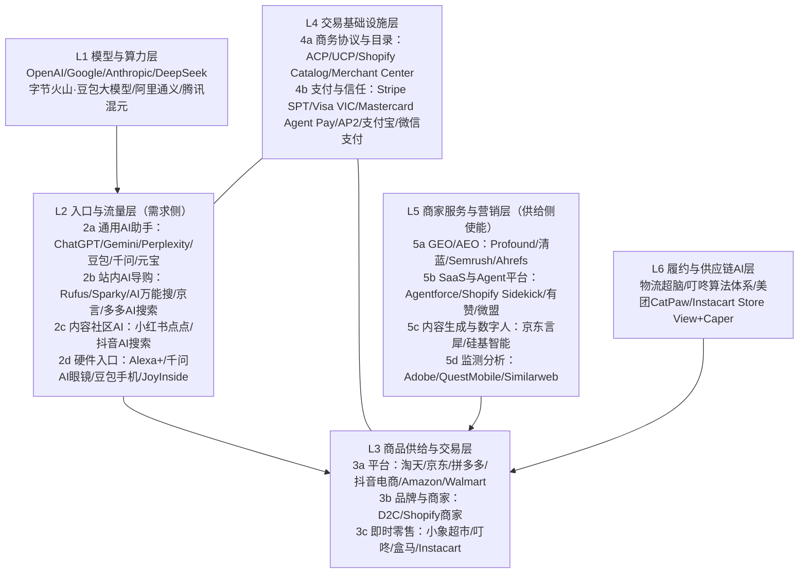

# 模块二：AI 电商产业链 MECE 分析框架

> 目标：回答 Q3——产业链上有哪些角色（不重不漏）、代表玩家是谁、做了什么、成本与收益是什么。
> 本文档给出：切分逻辑、六层角色档案（含初步填充，P2 阶段补齐测算）、利益流动图、三种竞合模式、待验证假设。结构化底表见 `data/value_chain.csv`。

---

## 一、MECE 切分逻辑

**切分维度**：按「一笔 AI 购物交易发生所必需的功能环节」纵向分为六层（L1–L6），层内按商业模式横向细分。检验标准：

- **不重**：每个玩家按「主要收入来源对应的层」归位，跨层玩家（如 Amazon 既是入口又是交易平台）在主层立档、其他层标注「兼任」；
- **不漏**：任何一笔 AI 导购交易的资金流/数据流所触达的主体都能落入某一层（用 3 个真实交易案例反向验证：豆包买抖音商品、ChatGPT 内用 Sparky 买沃尔玛商品、Kroger App 内用 Cart Assistant 建购物车）。

---

## 二、六层角色档案（初版，P2 补齐测算）

> 每层统一字段：角色职能 / 国内代表 / 海外代表 / 做了什么（关键动作）/ 收入模式 / 成本结构 / 关键数据 / 议价力与风险。

### L1 模型与算力层——「卖智能」

| 字段 | 内容 |
|---|---|
| 职能 | 提供导购所需的推理、多模态、Agent 编排能力（API 或自用） |
| 海外代表 | OpenAI（GPT 系）、Google（Gemini）、Anthropic（Claude）、亚马逊自研（Rufus 底座） |
| 国内代表 | 字节火山引擎/豆包大模型、阿里通义千问、腾讯混元、DeepSeek（点点曾接入）、京东 JoyAI |
| 关键动作 | 大模型电商化调优（商品理解、比价推理）、开放 Agent 框架、与电商语料结合（淘宝 40 亿商品库、抖音 3.4 万亿 GMV 商品池） |
| 收入模式 | API 调用费、云捆绑销售、C 端订阅（间接）、集团内战略价值（不直接收费） |
| 成本结构 | 训练资本开支 + 推理算力（导购场景高频调用、成本敏感）+ 人才 |
| 关键数据 | 国内生成式 AI 用户 5.15 亿（CNNIC 2025）；各家模型 API 价格战 |
| 议价力/风险 | 对入口层议价力强（能力稀缺期），但电商垂类能力正被平台自研替代；推理成本是站内导购全量铺开的最大约束 |

### L2 入口与流量层——「抢第一句话」（本研究重心）

**2a 通用 AI 助手（站外路径 A）**

| 字段 | 内容 |
|---|---|
| 职能 | 承接「下单前的第一句话」，做需求理解、方案生成、种草与（部分）闭环 |
| 海外代表 | ChatGPT（8~9 亿 WAU）、Gemini（6.5 亿+ MAU）、Perplexity（0.3~0.45 亿 MAU）、Copilot |
| 国内代表 | 豆包（3.83 亿 MAU）、千问（1.66 亿 MAU）、元宝、Kimi、DeepSeek |
| 关键动作 | 豆包：帮你选/买前问豆包，内嵌抖音电商闭环；千问：通淘宝全链路；元宝：通京东小程序；ChatGPT：Instant Checkout（收缩）→ 零售商 App + 发现优先；Perplexity：联盟分佣 + PayPal 结账 |
| 收入模式 | ①交易佣金/技术服务费（ChatGPT 约 4%；抖音将豆包纳入技术服务费结算与成交归因）②C 端订阅 ③导流 CPS/广告（潜在，均声称暂不做广告）④生态战略价值（把决策入口留在自家体系） |
| 成本结构 | 推理成本（大头，多轮长对话）+ 获客补贴（豆包依托字节流量池，获客成本低是核心优势）+ 商品数据接入与合规 |
| 关键数据 | ChatGPT 日均约 5000 万条购物查询；近 1.4 亿用户经千问首次体验 AI 购物；豆包渠道订单 2026-07-15 起被抖音电商正式归因 |
| 议价力/风险 | 对商家议价力随流量增长；风险：推荐公正性质疑、幻觉错购、监管（算法推荐/大数据杀熟）、自动下单的未成年人与盗刷风控 |

**2b 站内 AI 导购（路径 B）**

| 字段 | 内容 |
|---|---|
| 职能 | 在交易场内降低决策成本、提升转化与客单，防御决策入口外流 |
| 海外代表 | Amazon Rufus（3 亿用户/年，+60% 购买完成率，约 120 亿美元增量）、Walmart Sparky、Instacart Cart Assistant（白标） |
| 国内代表 | 淘宝 AI 万能搜 + 千问 AI 购物助手、京东京言（8000 万/季）、拼多多 AI 搜索、快手 AI 购物助手 |
| 收入模式 | 不直接收费；价值=转化率提升 × GMV 增量 + 时长留存 + 会员粘性 + 意图数据资产（反哺推荐与广告） |
| 成本结构 | 推理成本（Rufus 级别的量级下是数亿美元/年量级的算力投入，需测算）+ 研发 + 幻觉治理与人工兜底 |
| 关键数据 | Rufus/京言见上；淘宝搜索基线转化率 8.2% vs 行业 4.5%；官方称 AI 万能搜「暂无商业化」——商业化启动时点是关键观察信号 |
| 议价力/风险 | 对内是防御性必选项；风险：AI 结果挤压广告位（左右互搏——AI 答案页如何承载竞价广告是全行业未解题） |

**2c 内容与社区 AI**：小红书点点（生活决策 AI，UGC 语料壁垒）、抖音 AI 搜索。收入=广告与种草-交易闭环强化；风险=语料被站外大模型「白嫖」（种草在小红书、成交在别处）。

**2d 硬件与 OS 入口（新兴）**：Alexa+（6 亿设备）、千问 AI 眼镜、豆包手机、京东 JoyInside（千万台硬件）。观察点：语音天然适合复购型购物（生鲜/快消）。

### L3 商品供给与交易层——「货与履约的所有者」

| 字段 | 内容 |
|---|---|
| 职能 | 商品池、定价、交易系统、履约与售后；决定是否/如何向 AI 入口开放 |
| 海外代表 | Amazon、Walmart（Sparky 反向输出）、Target/百思买/家得宝等（接入 ACP 零售商 App）、Shopify 百万商家、Etsy |
| 国内代表 | 淘天（40 亿商品库开放给千问）、京东（自建 AI 全家桶 + 借力元宝）、抖音电商（豆包归因结算）、拼多多、品牌商家 |
| 关键动作 | 三种姿态：①深度绑定一个入口（抖音×豆包）②自建+多入口（沃尔玛 Sparky 进 ChatGPT/Gemini）③观望/防御（多数品牌） |
| 收入/成本 | 收入=AI 渠道增量 GMV（AI 流量 RPV +37%）；成本=佣金/技术服务费（ChatGPT 约 4%+通道费；对比 Amazon 市场佣金约 15%，AI 渠道费率目前更低——费率演化是核心跟踪指标）、商品 feed 改造、GEO 预算（+210%）、让渡用户关系与数据的隐性成本 |
| 议价力/风险 | Walmart 案例证明零售商可拿回主动权（拒绝平台代结账、输出自有 Agent）；风险=被 AI 入口「管道化」，品牌与用户关系被切断 |

### L4 交易基础设施层——「协议与支付的标准之争」

| 子层 | 玩家与动作 | 商业逻辑 |
|---|---|---|
| 商务协议 | **ACP**（OpenAI+Stripe，Apache 2.0，2025-09）：Checkout 会话规范，Target/家得宝等接入；**UCP**（Google，开放标准，0 平台费）：实时商品数据、购物车、会员整合；**Shopify Agentic Storefronts/Catalog**：商家目录可被代理发现、结账留店；MCP（工具调用通用层） | 标准免费开放换生态卡位；赢者通吃风险低但「多协议并存」推高商家适配成本（研究点：会否出现「协议聚合器」角色） |
| 支付与信任 | **Stripe**（共享支付令牌 SPT）；**Visa Intelligent Commerce**（2025-04 起，代理令牌+实时授权，2026-06 接入 OpenAI，100+ 伙伴）；**Mastercard Agent Pay**（2025）+ **AP4M 机器间支付**（2026-06，新加坡/马来西亚已商用）；**AP2**（Google + 60 伙伴，含万事达/AmEx/PayPal/Adyen/Coinbase：意图授权 Intent/Cart Mandate 加密凭证）；国内：支付宝（千问链路）、微信支付（元宝×京东）、抖音支付（豆包闭环） | 收入=交易通道费与令牌服务费；成本=风控与标准建设；核心命题：**「代理下单时，谁对错误交易负责」**——授权凭证（mandate）体系是信任基石，也是牌照与监管审查焦点 |

### L5 商家服务与营销层——「卖水人」

| 子层 | 代表 | 收入模式 / 关键数据 | 风险 |
|---|---|---|---|
| GEO/AEO 优化 | 海外：Profound（估值超 1 亿美元，监测 11 个 AI 面，含 Rufus；企业级 $2000+/月）、Peec、Otterly；SEO 转型：Semrush（被 Adobe 收购）、Ahrefs Brand Radar；国内：清蓝 PureblueAI（蓝色光标领投）、移山科技等 | 订阅 SaaS + 咨询服务；国内 GEO 市场 2026 预计 52 亿元（+73%）；Gartner：2028 年 50% 搜索流量转向 AI | 平台规则突变（AI 厂商自建广告位后，GEO 空间被压缩）；行业早期鱼龙混杂 |
| 电商 SaaS/Agent 平台 | Salesforce Agentforce（假日季支撑 6100 万单）、Shopify Sidekick、Adobe（Analytics+LLM Optimizer）；国内：有赞、微盟、快团团（AI 私域电商 0.65 万亿盘子的服务方） | 订阅 + 抽佣；自有 Agent 品牌商增速 6.2% vs 3.9% 是最强销售话术 | 与平台原生工具竞争 |
| 内容生成与数字人 | 京东言犀数字人（头部商家开播率 80%、成本 1/10）、硅基智能等；全球数字人直播电商 2026 预计 768 亿美元 | 按坐席/时长订阅 | 同质化、平台对数字人直播的政策收紧 |
| 监测分析 | Adobe、QuestMobile、Similarweb、网经社电数宝 | 数据订阅 | 口径公信力 |

### L6 履约与供应链 AI 层（生鲜模块重点展开）

代表：京东物流超脑、美团 CatPaw（全场景 Agent 平台）与配送调度、叮咚买菜「人货运仓」算法体系（预测降损耗、算法仓网规划）、Instacart Store View + Caper 智能购物车。收入=效率成本差；这是 AI 对生鲜零售 P&L 影响最直接的一层。

---

## 三、利益流动与竞合模式

### 3.1 资金流（P2 绘制桑基图 C12 的骨架）

- 消费者 → 商家：货款（AI 渠道 GMV）
- 商家 → 入口层：交易佣金/技术服务费（ChatGPT ~4%、抖音技术服务费、Perplexity 联盟佣金）
- 商家 → L5：GEO 服务费、SaaS 订阅、数字人坐席费
- 入口层/平台 → L1：API/算力费（自研则内部转移）
- 商家/入口 → L4：支付通道费、令牌服务费
- 平台 → 消费者：补贴（AI 入口冷启动期）

### 3.2 三种竞合模式（研究主线）

| 模式 | 定义 | 代表 | 优势 | 脆弱点 |
|---|---|---|---|---|
| 垂直自建闭环 | 模型、入口、交易同属一个生态 | 字节（豆包+抖音电商）、阿里（千问+淘宝）、Amazon（Rufus） | 数据与履约全链路、归因清晰、体验最顺 | 商品池封闭、比价不中立（豆包自认无法全网比价） |
| 联盟/插件 | 入口与交易分属两家，协议连接 | 腾讯元宝×京东、Walmart Sparky×ChatGPT/Gemini、零售商×ACP | 各保核心资产（腾讯要场景、京东要流量；沃尔玛保结账与会员） | 责任边界与体验断层、佣金谈判张力 |
| 中立第三方 | 不绑定交易方的独立导购 | Perplexity（联盟）、Google（UCP 0 费率，靠广告） | 全网比价的用户信任叙事 | 变现弱、供给数据质量依赖抓取；36 氪判断「中立导购 AI 并未出现」——是否为伪命题是本研究的核心辩题之一 |

### 3.3 待验证假设（访谈与数据检验）

- H1：站内导购（路径 B）短期 ROI 显著为正（Rufus 口径），但推理成本使中小平台跟进困难 → 形成新的规模壁垒。
- H2：站外入口（路径 A）的交易佣金率将向广告/竞价模式演化（AI 答案位竞价 = 新一代直通车），2026–2027 内出现首个规模化产品。
- H3：「中立比价代理」在国内因平台数据封闭而无法成立，在海外因 Google/OpenAI 的规模而被边缘化。
- H4：商家的 GEO 投入将在 2 年内从「营销预算的实验项」变成「类 SEO 的常设预算」，但服务商会经历一轮洗牌。
- H5：代理支付授权（mandate）标准将由卡组织+大模型厂商联盟定义，国内由支付宝/微信支付+入口双寡头定义。
