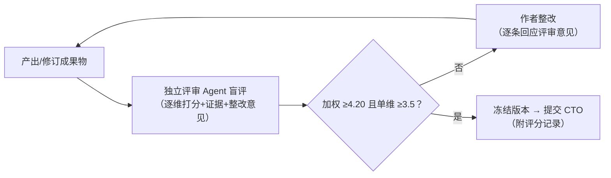

# 汇报评分标准与独立评审机制

> 适用对象：`report/` 目录下面向沃尔玛中国 CTO 的全部汇报成果物（预读文档 + PPT）。
> 目的：建立可重复的质量标尺，通过「独立评审 → 整改 → 复评」循环持续优化，直至达标。
> 评分与整改记录：`report/评分记录.md`。

---

## 一、评分维度与权重（加权满分 5.00）

| # | 维度 | 权重 | 考察内容 |
|---|---|---|---|
| D1 | 受众契合度 | 20% | 是否始终回答「沃尔玛中国 CTO 需要决定什么」：竞争威胁量化、全球资产（Sparky/供应链 AI）的在华复用、技术路线抉择、组织与预算含义。综述式内容多于决策式内容即扣分 |
| D2 | 数据可信度与口径纪律 | 20% | 数字是否全部带来源、时点、口径；「AI 影响 vs AI 成交」等口径是否隔离；**京东系数据是否全部降级标注且未进入主证据链**；自报与三方数据是否区分 |
| D3 | 结构与 MECE 逻辑 | 15% | 章节是否不重不漏、层层递进；产业链/矩阵切分是否经得起反例检验；单页/单节是否一个主张 |
| D4 | 洞察深度与独到性 | 15% | 是否超越资料搬运：有自建框架（如五级能力分级）、有反共识判断（如闭环收缩的解释）、有明确的「所以呢（so what）」 |
| D5 | 可执行性 | 15% | 建议是否落到试点方案：范围、依赖、KPI、门槛值、止损条件；Build/Partner/Ready 选择是否给出判据而非罗列 |
| D6 | 呈现质量 | 10% | 图表自明性（标题即结论、来源与置信度标注）、PPT 每页信息密度与标题句式、文档可 30 分钟读完、无错漏字 |
| D7 | 风险与合规覆盖 | 5% | 外资零售在华特有约束（算法备案、数据出境、生成式 AI 合规、未成年人、比价公正）是否覆盖并给出应对 |

### 评分锚点（每维 1~5 分）

- **5**：该维度可直接送 CTO，无需修改；有让评审「学到东西」的内容。
- **4**：达到专业咨询水准，存在少量可打磨点（不影响决策使用）。
- **3**：合格但平庸——信息正确、结构完整，但缺洞察或缺决策指向；需一轮整改。
- **2**：存在实质缺陷（口径混用、结构重叠、建议空泛），不可上会。
- **1**：该维度缺失或误导（如引用低置信数据作结论）。

**达标线：加权总分 ≥ 4.20，且无任何单维 < 3.5。** 未达标必须整改并进入下一轮评审；连续两轮同一维度不升分，须重写该部分而非修补。

---

## 二、评分独立性设计（硬性规则）

1. **作者—评审分离**：评审人不参与撰写，不查看作者的写作过程与草稿讨论，仅依据成果物与本标准评分（本项目实现方式：每轮由**全新独立评审 Agent** 执行，不携带作者上下文）。
2. **轮次盲评**：评审人不知道这是第几轮、也看不到上一轮分数与意见，防止锚定效应与「进步分」。
3. **逐维独立打分**：按 D1→D7 顺序逐维给分并各自写证据引用（指向具体文件/章节/页码），全部打完后才允许计算加权总分；禁止先定总印象再倒推分数。
4. **证据强制**：每个 ≤3 分的维度必须给出 ≥2 条可执行整改意见；每个 ≥4 分的维度必须引用 ≥1 处支撑证据。无证据的分数无效。
5. **利益与身份隔离**：评审人立场设定为「沃尔玛中国 CTO 办公室的挑剔幕僚」，不设「鼓励分」；评分不因工作量、篇幅、图表数量加分。
6. **记录不可篡改**：每轮分数、意见、整改动作按时间顺序追加写入 `report/评分记录.md`，保留全部历史，不得删改前轮记录。

---

## 三、持续优化流程

节奏约定：每轮评审输出后 24 小时内完成整改；最多 4 轮，若第 4 轮仍未达标，升级为结构性重写决策。汇报后追加一轮「真实反馈回填」：将 CTO 及听众的实际反馈映射回 D1~D7，校准评分锚点本身（评分标准也要被持续优化）。
