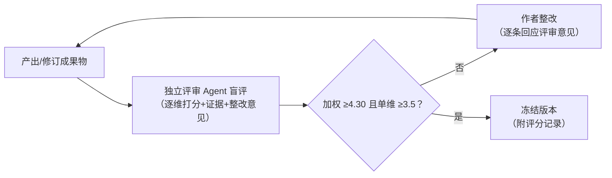

# 研究报告评分标准与独立评审机制

> 适用对象：`report/` 目录下的全部研究成果物（研究报告 + PPT）。
> 目的：建立可重复的质量标尺，通过「独立评审 → 整改 → 复评」循环持续优化，直至达标。
> 评分与整改记录：`docs/07_评分记录.md`。

---

## 一、评分维度与权重（加权满分 5.00）

| # | 维度 | 权重 | 考察内容 |
|---|---|---|---|
| D1 | 数据严谨性与口径纪律 | 25% | 数字是否全部带来源、时点、口径；「AI 影响的销售 vs AI 界面内成交」等口径是否隔离；未达置信度门槛的数据是否已从图表与结论中完全移除（而非降级展示）；内部口径数据是否与第三方数据隔离；口径异常（如留存单调性）是否被识别并校正 |
| D2 | 结论合理性与证据链 | 20% | 每条结论是否有明确证据支撑；观察性对比与因果效应是否区分；测算与实测是否区分；测算的假设、锚点与使用限制是否完整披露；是否存在假设堆叠得出的规模结论 |
| D3 | 结构与 MECE 逻辑 | 15% | 章节顺序是否有明确逻辑（已实现 → 待验证 → 可预测 → 模式 → 机会 → 结论）；分类框架是否不重不漏、经得起反例检验；单页／单节是否只讲一个主张 |
| D4 | 洞察深度与独到性 | 15% | 是否超越资料搬运：有自建框架、有基于数据的反直觉判断、有明确的「所以呢（so what）」；派生指标是否揭示了原始数据看不到的结论 |
| D5 | 可执行性 | 15% | 建议是否落到可操作动作：指标定义、改造方向、验证方式、优先级依据；是否给出判据而非罗列选项；是否说明如何验证建议的有效性 |
| D6 | 呈现质量与文体 | 10% | 图表自明性（标题即结论、来源与口径标注齐全）；PPT 每页信息密度与标题句式；文体是否为正式研究文体（无口语化、无空泛修饰、无与内容无关的定位表述）；无错漏字与版式溢出 |

### 评分锚点（每维 1~5 分）

- **5**：该维度可直接对外发布，无需修改；有让评审「学到东西」的内容。
- **4**：达到专业研究机构水准，存在少量可打磨点（不影响使用）。
- **3**：合格但平庸——信息正确、结构完整，但缺洞察或缺行动指向；需一轮整改。
- **2**：存在实质缺陷（口径混用、结构重叠、结论无证据、建议空泛），不可发布。
- **1**：该维度缺失或误导（如引用未达置信度门槛的数据作结论、把测算当预测引用）。

**达标线：加权总分 ≥ 4.30，且无任何单维 < 3.5。** 未达标必须整改并进入下一轮评审；连续两轮同一维度不升分，须重写该部分而非修补。

---

## 二、评分独立性设计（硬性规则）

1. **作者—评审分离**：评审人不参与撰写，不查看作者的写作过程与草稿讨论，仅依据成果物与本标准评分（本项目实现方式：每轮由**全新独立评审 Agent** 执行，不携带作者上下文）。
2. **轮次盲评**：评审人不知道这是第几轮，也看不到上一轮分数与意见，防止锚定效应与「进步分」。
3. **逐维独立打分**：按 D1→D6 顺序逐维给分并各自写证据引用（指向具体文件、章节或页码），全部打完后才允许计算加权总分；禁止先定总印象再倒推分数。
4. **证据强制**：每个 ≤3 分的维度必须给出 ≥2 条可执行整改意见；每个 ≥4 分的维度必须引用 ≥1 处支撑证据。无证据的分数无效。
5. **立场设定**：评审人立场为「挑剔的行业研究同行」，不设「鼓励分」；评分不因工作量、篇幅、图表数量加分。
6. **记录不可篡改**：每轮分数、意见、整改动作按时间顺序追加写入 `docs/07_评分记录.md`，保留全部历史，不得删改前轮记录。

---

## 三、持续优化流程

节奏约定：每轮评审输出后完成整改再进入下一轮；最多 4 轮，若第 4 轮仍未达标，升级为结构性重写决策。

---

## 四、常见扣分项清单（评审自查表）

| 类别 | 具体表现 | 涉及维度 |
|---|---|---|
| 口径 | 图表缺来源或缺口径说明 | D1 |
| 口径 | 不同统计窗口（WAU／MAU／年度用户）的数据被并列比较且未提示 | D1 |
| 口径 | 内部口径数据与第三方监测数据混排 | D1 |
| 口径 | 未达置信度门槛的数据以「低置信」形式仍然展示 | D1 |
| 结论 | 观察性对比被直接当作因果效应引用 | D2 |
| 结论 | 由多层假设相乘得出的规模数字被当作结论 | D2 |
| 结论 | 测算未标注假设与锚点，或被表述为「预测」 | D2 |
| 结构 | 章节顺序无逻辑，或摘要与正文结论不一致 | D3 |
| 结构 | 分类框架存在重叠或遗漏，找得到反例 | D3 |
| 洞察 | 通篇为公开资料转述，无派生分析与判断 | D4 |
| 执行 | 建议停留在「应当重视」层面，无指标、无验证方式 | D5 |
| 文体 | 出现口语化表达、空泛修饰、与研究内容无关的定位表述 | D6 |
| 版式 | PPT 文本溢出、图表标签重叠、页脚信息不一致 | D6 |
