# AI电商行业研究报告

**版本**：v3.5　**数据截至**：2026年7月

**编制说明**：本报告为AI电商行业研究，供业务判断与投入决策参考。全文数据分为公开可追溯数据、企业自报数据与内部运营口径数据三类并分别标注；未达置信度门槛的自报数据不予展示，亦不作为任何结论的依据，未采纳清单见附录B。所有测算均标注假设与锚点，并与实测数据区分呈现。

---

## 目录

- [摘要](#摘要)
- [研究说明与数据口径](#研究说明与数据口径)
- [一、市场变化与预测](#一市场变化与预测)
  - [1.1 站外AI引荐：流量与质量变化](#11-站外ai引荐流量与质量变化)
  - [1.2 站外AI引荐：假日季验证与企业分组对比](#12-站外ai引荐假日季验证与企业分组对比)
  - [1.3 代结账路径的已实现结果](#13-代结账路径的已实现结果)
  - [1.4 规模预测与口径差异](#14-规模预测与口径差异)
  - [1.5 市场底盘与入口规模对照](#15-市场底盘与入口规模对照)
  - [1.6 站内AI导购：运营指标实测（内部口径）](#16-站内ai导购运营指标实测内部口径)
  - [1.6.0 与Amazon Rufus的同口径对照（保真校验）](#160-与amazon-rufus的同口径对照保真校验)
  - [1.6.1 与传统电商导购的效率对照](#161-与传统电商导购的效率对照)
  - [1.7 站内AI导购：有效商品浏览量情景测算](#17-站内ai导购有效商品浏览量情景测算)
  - [1.8 分析小结](#18-分析小结)
- [二、主要业务模式分析](#二主要业务模式分析)
  - [2.1 模式分类框架](#21-模式分类框架)
  - [2.2 通用AI电商导购案例](#22-通用ai电商导购案例)
  - [2.3 零售商与平台自有AI导购案例](#23-零售商与平台自有ai导购案例)
  - [2.4 经验小结](#24-经验小结)
- [三、产业链结构](#三产业链结构)
- [四、零售与生鲜场景结合点](#四零售与生鲜场景结合点)
- [五、产品与技术机会](#五产品与技术机会)
- [六、结论与建议](#六结论与建议)
  - [6.1 结论](#61-结论)
  - [6.2 建议一至五](#62-建议一至五)
  - [6.3 行动优先级](#63-行动优先级)
- [附录A 图表与数据来源索引](#附录a-图表与数据来源索引)
- [附录B 数据置信度分级与未采纳数据](#附录b-数据置信度分级与未采纳数据)

---

## 摘要

**一、站外AI引荐渠道的质量指标已经反转，但反转的因果性未被证明。** 美国零售网站AI来源流量的转化率在一年内由低于非AI渠道38%转为高于42%，单次访问收入高出37%（Adobe Digital Insights）。需同时指出：这是渠道间的观察性对比，而同期该渠道的流量已大幅扩张（按Q1对Q1，定基指数由100升至493；按3月对3月，为上年同月的约3.7倍），访客构成必然发生大幅迁移，反转中有多少来自渠道本身、多少来自构成变化，公开数据无法区分。增速方面已明确放缓——同比增速由2025年12月的+1151%回落至2026年3月的+269%。

**二、「在通用AI对话内完成结账」这条路径已经历一轮失败，市场已收敛到「AI负责发现、商家保留交易」。** ChatGPT Instant Checkout于2025年9月29日上线、2026年3月5日下线，存续约5个月，峰值接入商家仅约12至30家。替代方案是通用AI界面内的商家自有应用与开放协议：商家保持Merchant of Record（记录商户）身份，自行运营结账、会员、税费与售后。该结论的支撑证据涉及四个主体、三类性质（产品决策、协议设计、司法判定），其中司法判定的独立性最强。**归因限定**：可确证的是商家侧供给未起量；消费者对「在AI界面内结账」的需求强度无可比基准，本报告不下判断。

**三、站内AI导购在「个体层相对效果」这一构造上只有一个公开数据点。** 在本报告的检索范围内（`docs/05` 所列的一手来源、第三方监测机构与严肃媒体，数据截至2026年7月），以「使用者对未使用者」为对照的效果数据仅有Amazon Rufus的「使用者购买完成率高约60%」（亚马逊2025Q4财报电话会，观察性对比）。亚马逊另披露的「增量年化销售近120亿美元」是绝对额、归因方法未完整披露，不可与其他案例横向比较，也不能替代相对效果证据。这既说明该方向的公开证据基础很薄，也说明自建随机对照实验是当前最可靠的识别途径；分阶段放量支撑的双重差分等准实验识别可作退路，但需额外的平行趋势假设。

**四、内部口径数据显示，站内AI导购的差距落在交互层，不在用户层——但这一结论有一个明确的成立边界。** 淘宝AI导购日活跃用户500万、人均商品详情页浏览0.11次；千问电商场景日活跃用户43万、人均商品详情页浏览1.00次。两侧的次日留存（10%对12%）与7日回访率（30%对33%）仅为1.10至1.20倍关系，而**每轮对话产出的商品浏览为0.085次对0.357次（4.22倍）**。

**成立边界（不可省略）**：该4.22倍受两个未消除的敞口影响——淘宝侧IPV可能被归因规则低估2至3倍（u），两侧人均日会话数之比最多2倍（s）。联合后交互层差距为 4.22÷(u×s)；**当 u×s 达到约3.5及以上时，该差距降至留存层差距（1.10至1.20倍）以下，本结论方向反转**（完整敏感度表见§1.6）。因此本结论及下一条建议只在 u×s ＜ 3.5 的范围内成立，必须先实测消除这两个敞口。

**五、由此得出核心建议：把人均IPV设为唯一首要考核指标，切入点是「每轮对话产出」而非「对话轮次」——但该切入点的排序有一个比第四条更严的门槛。** 按u＝1计算，提高每轮产出可使人均IPV达0.46次、增加轮次只到0.24次，前者的指标增益为后者的约2.8倍、按单位推理成本计约6倍。**该排序会反转，且反转点与第四条用的是同一个量 u×s**：路径A的终值为0.464÷s（把每轮产出换为千问水平，故含s不含u），路径B的终值为0.237u（轮次内乘数，故含u不含s），因此增益比只取决于乘积——u×s ≈ 1.96 起A的增益优势消失，u×s ≈ 2.75 起按单位推理成本计B反而更优，u×s ≥ 3.5 则第四条本身不成立。**三道门槛落在同一个量上，构成嵌套判据**（1.96／2.75／3.5，见§1.8分析五），均须由建议二的P0第1步实测 u 与 s 后方可据以投入。加上「推理成本近似不变」本身也是待验证假设，该前提亦列入建议二的次级指标。

**六、规模测算止于流量层，且流量层本身的不确定性尚未被压缩。** 情景测算只推演日活跃用户与浏览深度，区间跨度已达5.9倍；由浏览量折算至GMV还需详情页转化率与客单价，二者均无实测值、未纳入测算。因此当前区间衡量的是流量层自身的不确定性，真实的GMV不确定性会更大。压缩顺序应当是先用实验测出转化率与客单价，再回头收窄流量假设。

**七、相对传统搜索，站内AI导购的进商详效率仍差约一个数量级，且规模仅为App的约1%量级。** 传统搜索有点击率≥90%（P2下界），淘宝AI日度商详发生率仅≈10%（由人均IPV派生）；淘宝AI DAU约为App日活的1.2%。AI链路转化率两端均未取得，故不下「转化优于／劣于搜索」的判断。传统搜推仍在被大模型增强（相关性+20 PT、推荐CTR+10%），说明主链路未被放弃。「追赶千问」是阶段目标，终局对照应是传统搜索的进商详效率（§1.6.1、图10）。

---

## 研究说明与数据口径

### 研究范围

本报告所称「AI电商」，指以大模型或智能体技术介入消费者「需求唤起—决策—交易—履约—售后」链路，或介入商家经营链路的电商形态。研究重点为消费者侧导购与交易环节，商家侧经营提效作为产业链一层覆盖。

报告覆盖两类主体：

| 类型 | 定义 | 代表 |
|---|---|---|
| 通用AI导购 | 用户在通用AI助手内完成购物决策，随后在AI界面内或跳转商家体系成交 | ChatGPT、Gemini、Perplexity、豆包、千问、元宝 |
| 站内AI导购 | 电商或零售自有站点／App内嵌的AI辅助导购工具 | Amazon Rufus、淘宝AI导购、千问AI购物助手、Instacart Cart Assistant |

### 数据分级与采用规则

| 等级 | 定义（按**数据性质**而非披露渠道划分） | 使用方式 |
|---|---|---|
| P1 第三方与事实性披露 | 独立第三方监测机构数据；官方公告、协议文档与司法文件中的**事实性**内容（时间、条款、判决）；经审计财务数字 | 可作为结论主证据 |
| P2 企业自报运营数据 | 企业自行统计并披露的运营与效果数据，无论披露渠道为财报电话会、新闻稿或发布会 | 须标注「公司口径」，并说明归因方法的已知局限 |
| P3 内部口径 | 业务方提供、未公开披露、无第三方交叉验证 | 仅在报告内部对照使用，不与P1数据混排比较，不用于对外引用 |
| P4 未采纳 | 存在夸大风险、口径不明或无法交叉验证的自报数据 | **不作为任何结论的依据，不进入图表**；正文可在「为何不采用」的说明语境中引用其数值（如§1.3对意愿调查的处置），但不得据以推论。清单见附录B |

**关于预测数据的单独说明**：第三方机构的**预测值**（如图4的2030年规模预测、图5的2026—2030年渗透率预测）在来源可追溯性上属P1，但在数据性质上不是观测值。本报告在附录A中一律标注为「P1（第三方预测）」，与实测的P1区分，且不作为规模基数或折算依据使用。

### 四项贯穿全文的口径纪律

1. **区分「AI影响的销售」与「AI界面内完成的交易」。** 前者指AI参与推荐、客服或决策过程的订单，后者指在AI对话界面内结账。本报告**未取得同地域同周期的配对数据，因此不给出二者的倍数关系**；可得的量级参照是Salesforce全球2025假日季口径的「AI影响销售」2620亿美元与eMarketer美国2026全年口径的「AI平台内结账」预测206亿美元——两者地域与周期均不同，**不可相除**，但足以说明二者不在同一量级。两个口径不可混用（对比见图3与图4）。
2. **区分观察性对比与因果效应。** 「使用者相对未使用者提升X%」「AI渠道相对非AI渠道提升X%」均属观察性对比，在无随机对照实验的情况下应视为相关性上限。
3. **区分实测、机构预测与本报告测算。** 三者在图注与附录A中分别标注；本报告测算已列出全部假设与锚点，不得引用为机构预测。
4. **区间不取单点。** 来源给出区间的数据（Perplexity月活0.3～0.45亿、Instant Checkout峰值商家约12至30家、Adobe与Shopify的转化优势约+42%～+54%）在全文一律保留区间；图表因绘图需要取端点时，标签保留原始区间并在图注说明。

### 能力分级与模式编号的交叉使用

报告使用两套坐标：能力分级A1—A5（做到什么程度）与模式编号M1—M5（交易结构如何，定义见§2.1）。二者在§2.2.7与§2.3的案例表中交叉标注，用于回答「同一能力级别下，交易结构差异带来什么后果」。

| 级别 | 名称 | 特征 | 当前状态 |
|---|---|---|---|
| A1 | 站内问答辅助 | 答疑、参数比较、内容摘要，不改变交易流程 | 已规模化 |
| A2 | 站外发现导流 | AI推荐后跳转商家或平台完成交易 | 已规模化 |
| A3 | 对话内闭环 | 选品、下单、支付在对话界面内完成 | 生态内闭环已落地；跨生态代结账已收缩 |
| A4 | 授权代理执行 | 用户授权下执行盯价自动购买、周期补货等任务 | 试点阶段 |
| A5 | 自主代理 | 长期授权下的跨平台自动采购 | 未规模化，且存在法律争议 |

---

## 一、市场变化与预测

本章按「先看已实现、再看可预测、最后看内部实测」的顺序组织：

| 小节 | 性质 | 内容 |
|---|---|---|
| 1.1–1.3 | 已实现（公开数据） | 站外AI引荐的流量与质量变化、假日季验证、代结账路径的实际结果 |
| 1.4 | 机构预测 | 代理式商务规模预测及其口径差异，以及与1.3的张力 |
| 1.5 | 底盘（公开数据） | 中国市场底盘与主要AI入口规模对照 |
| 1.6 | 已实现（内部口径） | 站内AI导购的运营指标实测、派生指标与三点可比性限制 |
| 1.6.1 | 对照（公开＋内部） | 相对传统搜索的进商详效率、规模与转化锚点（图10） |
| 1.7 | 本报告测算 | 有效商品浏览量情景测算及其两层使用限制 |
| 1.8 | 分析小结 | 八点分析；据此形成的五条建议集中于第六章，不在本章展开 |

### 1.1 站外AI引荐：流量与质量变化

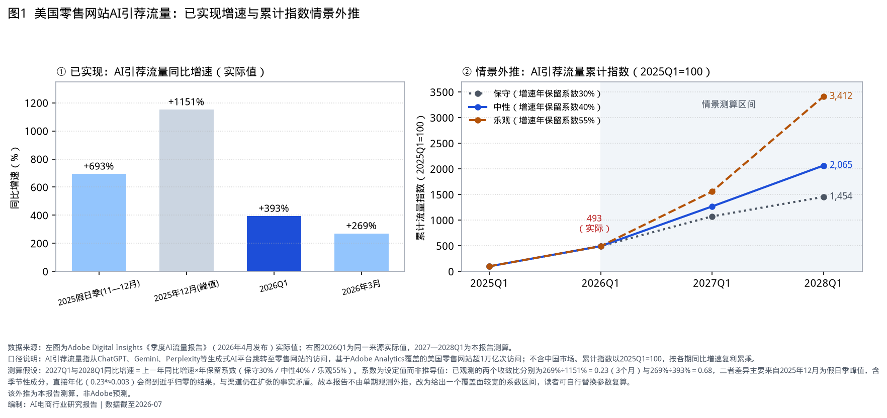

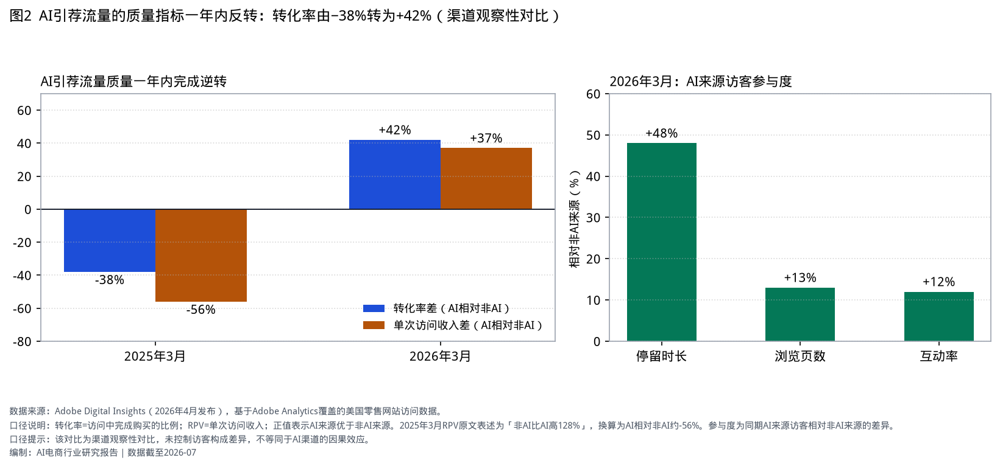

| 指标 | 数值 | 数据来源 | 口径 |
|---|---|---|---|
| AI引荐流量同比增速 | 2025假日季 +693%；2025年12月 +1151%（峰值）；2026Q1 +393%；2026年3月 +269% | Adobe Digital Insights《季度AI流量报告》（2026-04发布），P1 | 从生成式AI平台跳转至零售网站的访问；基于Adobe Analytics覆盖的**美国**零售网站超1万亿次访问，不含中国市场。四个窗口互有嵌套（假日季含12月、2026Q1含3月），不构成独立时点序列 |
| 行业对比（2026Q1） | 零售 +393% ＞ 旅游 +233% ＞ 金融服务 +158% ＞ 媒体娱乐 +84% ＞ 科技软件 +63% | 同上 | 同上 |
| 转化率（AI相对非AI） | 2025年3月 −38% → 2026年3月 +42% | 同上 | 访问中完成购买的比例之差；渠道间观察性对比 |
| 单次访问收入（AI相对非AI） | 2025年3月 约−56% → 2026年3月 +37% | 同上 | 2025年3月原文表述为「非AI比AI高128%」，换算得约−56% |
| 参与度（2026年3月） | 停留时长 +48%；浏览页数 +13%；互动率 +12% | 同上 | AI来源访客相对非AI来源 |
| 转化率优势（交叉验证） | +54% | Shopify公开披露（2026-05），P2 | Shopify商家AI引荐流量转化率相对非AI引荐的优势。样本以中小与DTC商家为主，公司未披露完整方法。与Adobe的+42%测量同一构造但相差12个百分点，差异来自面板不同，两者应作为区间理解（约+42%～+54%） |
| 消费者态度 | 39%用过AI购物，其中85%称体验改善；66%信任AI结果 | Adobe配套消费者调查，样本约5000人 | 自述型调查，非行为数据 |

**关于质量反转的因果性**：转化率由−38%转为+42%是过去一年最实质的变化，但它是渠道间的观察性对比。同期该渠道的流量已大幅扩张（按Q1对Q1，定基指数由100升至493；按3月对3月，为上年同月的约3.7倍）（下表），访客构成必然发生大幅迁移——早期AI购物用户与规模化后的用户在购买意向上并不相同。反转中来自渠道效率提升与来自访客构成变化的比例，公开数据无法区分。因此本报告的表述是「质量指标已反转」，而非「AI渠道更有效」。

**关于图1右侧的情景外推**：以2025Q1=100构建**定基水平指数**（按各期同比增速复利累乘得到各期的流量水平，不是流量累计总量），2026Q1为Adobe实际值（指数493）。2027与2028年按「本年同比增速＝上年同比增速×年保留系数」外推：

| 情景 | 年保留系数 | 2027Q1同比 | 2027Q1指数 | 2028Q1同比 | 2028Q1指数 |
|---|---|---|---|---|---|
| 保守 | 30% | +118% | 1074 | +35% | 1454 |
| 中性 | 40% | +157% | 1268 | +63% | 2065 |
| 乐观 | 55% | +216% | 1559 | +119% | 3412 |

**保留系数是设定值，不是推导值。** 已观测到的两个收敛比分别为269%÷1151%＝0.23（跨3个月）与269%÷393%＝0.68（同季度内），二者差异悬殊，主要因2025年12月为假日季峰值、包含季节性成分。若按0.23直接年化（0.23⁴≈0.003）将得到增速近乎归零的结果，与该渠道仍在扩张的事实矛盾。因此本报告不由单期观测外推，改为给出一个覆盖面较宽的系数区间；读者可自行替换参数复算（`data/ai_referral_traffic.csv`）。

该外推说明的是量级：即便按中性档，AI引荐流量到2028Q1约为2025Q1的20倍，但年度同比增速将回落至两位数至低三位数区间——高增速阶段的窗口期约在两年内关闭。

### 1.2 站外AI引荐：假日季验证与企业分组对比

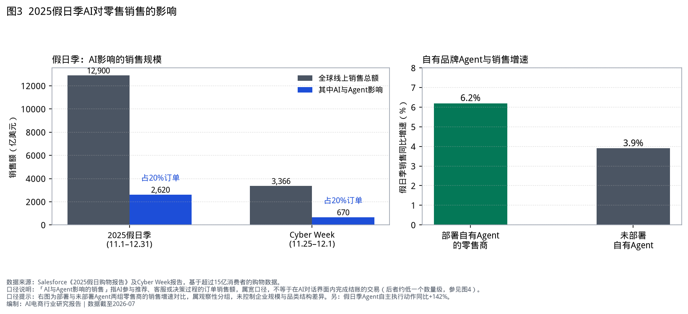

| 指标 | 数值 | 数据来源 | 口径 |
|---|---|---|---|
| 2025假日季全球线上销售 | 12900亿美元（同比+7%） | Salesforce《2025假日购物报告》，基于超15亿消费者购物数据，P1 | 全球线上零售销售 |
| 其中AI与Agent影响 | 2620亿美元，占销售额20.3% | 同上 | **宽口径**：AI参与推荐、客服或决策过程的订单，不等于AI界面内结账。Salesforce另按**订单**口径给出「约20%订单」，两个口径数值接近但不等价 |
| Cyber Week AI影响 | 670亿美元，占销售额19.9% | 同上 | 同上 |
| 部署自有品牌Agent的零售商 | 假日季销售同比+6.2%，未部署为+3.9% | 同上 | **第三种对照构造**：企业层分组对比，未控制企业规模与品类结构差异。「自有品牌Agent」为企业侧Agent的宽口径，不等同于站内AI导购工具，故未纳入图9 |
| Agent自主执行动作 | 同比+142% | 同上 | 自动化动作次数 |

**本节的口径提示**：Salesforce的三项数据分属三个不同层级——销售额（宽口径的AI影响）、订单占比（另一口径）、企业分组增速（企业层对比）。它们支持「AI已在规模化影响零售订单」这一方向性判断，但都不能用于测算单个零售商部署AI导购后的收益。

### 1.3 代结账路径的已实现结果

1.1节的流量数据容易造成规模误判，因此必须与「在AI界面内代为结账」这条路径的实际结果并列观察。目前唯一可得的规模化尝试结果如下（P1，均为事实性披露与媒体交叉核实）：

| 事项 | 数据 | 数据来源 |
|---|---|---|
| ChatGPT Instant Checkout 上线 | 2025年9月29日，首批为美国Etsy商家，Shopify商家标注为「即将开放」 | OpenAI与Stripe官方公告 |
| 底层协议 | Agentic Commerce Protocol（ACP），OpenAI与Stripe共同开发并开源，支付服务商中立 | Stripe官方新闻稿 |
| 下线时间 | 2026年3月5日，存续约5个月 | The Information 报道（2026-03-05）；OpenAI发言人对Skift的回应；多家媒体交叉 |
| 峰值接入商家数 | 约12至30家（不同复盘口径不一，本报告保留区间） | 第三方复盘（Webinterpret等）；OpenAI未披露官方数字 |
| 消费者试用率 | 首月约8%的美国成年ChatGPT用户尝试过 | 第三方复盘（Webinterpret口径） |
| 替代方案 | 2026年3月下旬起改为ChatGPT内的零售商应用（Instacart、Target、Expedia、Booking.com等），商家自行运营结账与支付，OpenAI保留发现层；ACP继续作为底层协议 | OpenAI公开回应与媒体报道 |

**口径提示**：本节没有成交金额数据——OpenAI从未披露Instant Checkout的GMV。可得的是三类间接量度：存续时长、商家侧覆盖面（12至30家）、消费者侧试用率（约8%）。后两项来自第三方复盘而非官方披露，用于说明量级而非精确值。

这组数据与1.1节的流量数据构成同一现象的两面，但两侧的证据强度不同，必须分开表述：

| 侧面 | 结论 | 证据强度 |
|---|---|---|
| 商家供给 | **明确不足**——存续5个月、峰值接入商家约12至30家 | 强：商家数是可核对的事实，且与OpenAI改走商家自有应用的路线调整一致 |
| 消费者对「在AI里研究商品」的需求 | **明确存在**——见§1.1的流量与转化数据 | 强 |
| 消费者对「在AI界面内结账」的需求强度 | **无可比基准，本报告不下判断** | 弱：唯一行为数据是首月约8%试用率，来自第三方复盘且本节已限定其「用于说明量级而非精确值」。**关于基准**：公开可得的只有自述型意愿调查（如美国约14%信任全自动结账、国内37%~48%接受直接购买建议），它们与「在AI界面内结账的实际需求强度」不是同一构造，且各调查问法不一致、无法互相校准，因此本报告不用其回答「多少算足够」（处置见附录B.1） |

因此本报告的归因是：**可确证的是商家侧供给未起量，消费者侧的结账需求强度不可判断**。公开复盘给出的机制性解释是单件即时结账缺少购物车、优惠码、会员权益、税费计算与实时库存同步能力，以及商家不愿让出Merchant of Record身份——前者是产品能力问题，后者是交易结构问题，两者都在供给侧。

### 1.4 规模预测与口径差异

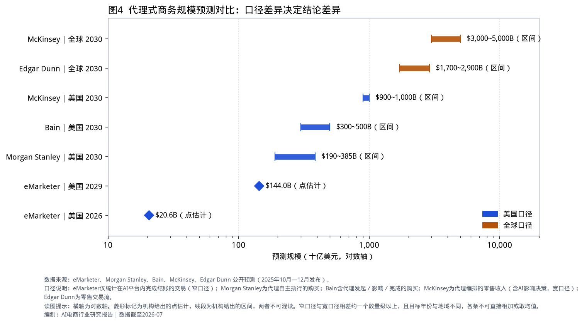

| 机构 | 范围与时点 | 预测值 | 类型 | 口径宽窄 |
|---|---|---|---|---|
| eMarketer | 美国，2026 | 约206亿美元 | 点估计 | **窄**：仅AI平台内完成结账的交易 |
| eMarketer | 美国，2029 | 约1440亿美元 | 点估计 | 窄 |
| Morgan Stanley | 美国，2030 | 1900～3850亿美元 | 区间 | 中：代理自主执行的购买 |
| Bain | 美国，2030 | 3000～5000亿美元 | 区间 | 宽：代理发起、影响或完成的购买 |
| Edgar Dunn | 全球，2030 | 17000～29000亿美元 | 区间 | 混合：零售交易流（窄／宽两个口径） |
| McKinsey | 美国，2030 | 9000～10000亿美元 | 区间 | **宽**：代理编排的零售收入，含AI影响决策 |
| McKinsey | 全球，2030 | 30000～50000亿美元 | 区间 | 宽 |

以上全部为机构预测值，附录A标注为「P1（第三方预测）」，不作为规模基数使用。

**读法**：口径宽窄造成的差距大于机构之间的差距，但**倍数须按可比配对给出**：

- **同地域同年份（美国2030年）**：表中无窄口径数据点，可比的是中口径下限1900亿至宽口径上限10000亿，相差约**5.3倍**。
- **窄口径对宽口径**：需跨年份——eMarketer美国2029年1440亿对McKinsey美国2030年9000至10000亿，相差约**6.3至6.9倍**。

因此本报告不使用「相差一个数量级」这一表述。各条目标年份与地域不同，不可相加或取均值。

**与§1.3的张力**：eMarketer的窄口径预测（美国2026年约206亿美元）与1.3节的实际情况之间是**张力关系，不是相互印证**。窄口径统计的正是「AI平台内完成结账」，而该路径唯一的规模化产品在2026年3月已下线，峰值商家不足30家。要让206亿美元成立，需要在2026年内由新的M2类方案（商家自有应用与协议接入，见§2.1）迅速补上量。因此这一预测的实现路径已经改变，其口径定义也随之模糊——「在AI界面内点击购买、但由商家系统完成结账」是否计入，各方尚无统一处理。引用该预测时应说明这一不确定性。

### 1.5 市场底盘与入口规模对照

#### 1.5.1 中国市场底盘

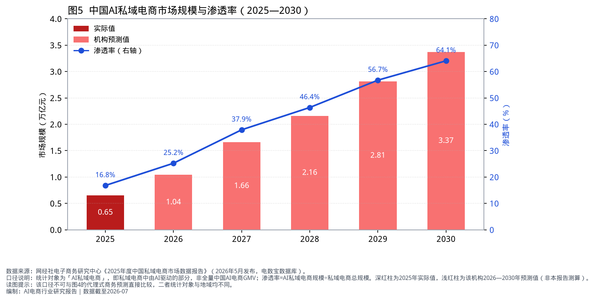

| 指标 | 数值 | 数据来源 | 口径 |
|---|---|---|---|
| 中国电商总规模（2025） | 59.2万亿元（同比+5.0%） | 网经社《2025年度中国电子商务市场数据报告》，P1 | 全口径电商交易额 |
| 生成式AI用户 | 5.15亿人，普及率37% | CNNIC（2025），P1 | 使用过生成式AI产品的网民 |
| 2026年618全网GMV | 9340亿元（同比+4%） | 星图数据，P1 | 综合电商＋直播电商。**用途**：大盘增速已降至个位数，说明AI导购带来的不是新增总量而是份额再分配——这是§6.2建议一以「份额相关指标（人均IPV）」而非「总量指标」作为首要考核的背景 |
| AI私域电商规模 | 2025年0.65万亿元、渗透率16.8%（实测）；该机构预测2030年3.37万亿元、渗透率64.1% | 网经社《2025年度中国私域电商市场数据报告》（2026-05发布） | **私域子集**，非全量AI电商GMV；渗透率＝AI私域电商÷私域电商总规模 |
| 零售企业AI采用 | 94%已使用AI Agent提效；52%用于预测补货 | 艾瑞《2025中国零售消费行业生成式AI报告》，P2 | 企业问卷。**用途**：企业侧采用已近饱和且以供应链场景（补货预测）为主，对应§3的L6履约供应链AI层；这说明差异化空间已不在「是否用AI」而在消费者侧导购的L2层 |

**对图5的两点保留与一处自洽性反算**：

1. **「AI驱动」未操作化定义。** 该机构未公开何种参与程度计入「AI驱动」，属宽口径，与本报告批评的「AI影响」类口径同类问题。因此该数据只能用于观察趋势方向，不宜作为规模基数或折算依据。
2. **虚假精度。** 原始来源以两位小数给出16.79%（2025年实测）与64.07%（2030年预测），本报告一律按一位小数复述；同一机构的电商总规模59.23万亿元、+4.96%亦按一位小数复述。
3. **自洽性反算。** 以该机构的规模与渗透率两列可反算隐含的私域电商总盘：2025年＝0.65÷16.8%≈3.87万亿元，2030年＝3.37÷64.1%≈5.26万亿元，五年复合增速约6.3%；且3.87万亿元仅为其自身口径中国电商总规模59.2万亿元的约6.5%。也就是说，该预测隐含「AI渗透率升至约3.8倍，而私域电商底盘五年只增约36%」。这一组合在逻辑上并非不可能（AI替代私域内的非AI部分），但读者应据此自行判断其可信度，而不应把3.37万亿元当作AI电商的规模基数。

#### 1.5.2 主要AI入口规模对照（中国与海外）

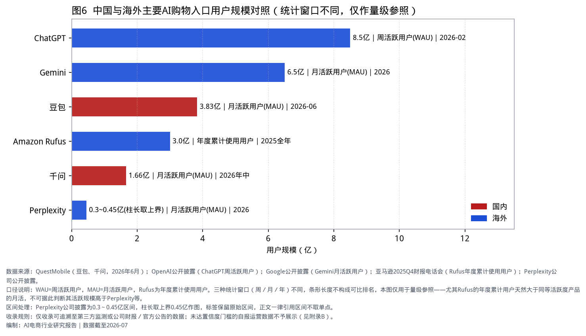

| 产品 | 用户规模 | 口径与时点 | 数据来源 |
|---|---|---|---|
| ChatGPT | 约8.5亿 | 周活跃用户，2026-02 | OpenAI公开披露（P2） |
| Gemini | 约6.5亿 | 月活跃用户，2026 | Google公开披露（P2） |
| 豆包 | 3.83亿 | 月活跃用户，2026-06 | QuestMobile（P1） |
| Amazon Rufus | 超3亿 | 年度累计使用用户，2025全年 | 亚马逊2025Q4财报电话会（P2） |
| 千问 | 1.66亿 | 月活跃用户，2026年中 | QuestMobile（P1） |
| Perplexity | 0.3～0.45亿 | 月活跃用户，2026 | 公司公开披露（P2） |
| 元宝 | 不列示 | 无权威第三方或官方披露 | — |

**口径提示**：上表三种统计窗口（周／月／年）并存，条形长度不构成可比排名，仅用于量级参照。尤其Rufus的年度累计用户天然大于同等活跃度产品的月活，不可据此判断其活跃规模高于Perplexity等。元宝因缺少可追溯的用户规模披露，按数据采用规则不列数值，仅在第二章记录其模式进展。

### 1.6 站内AI导购：运营指标实测（内部口径）

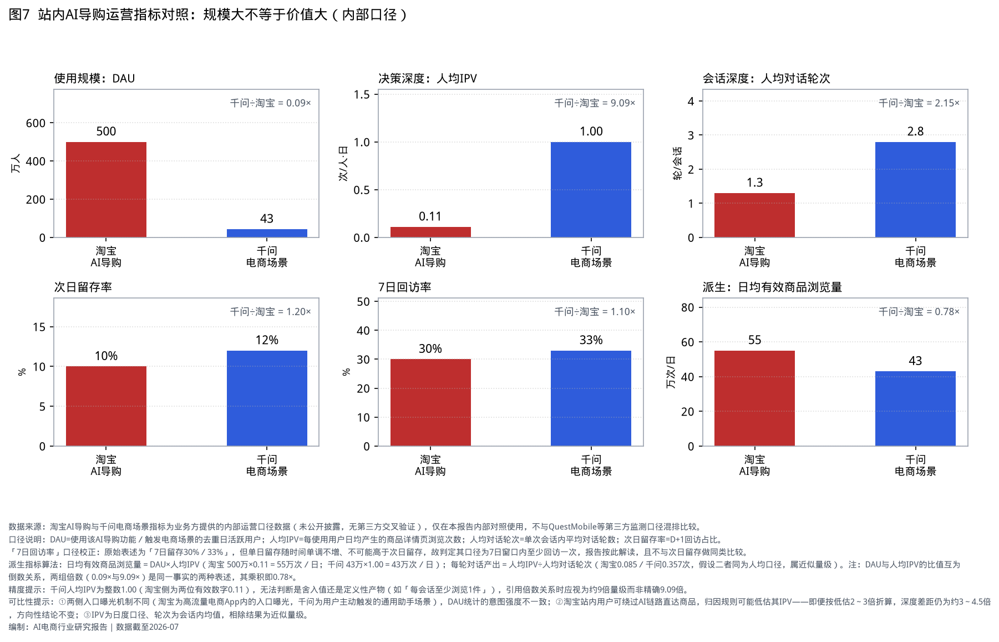

**数据性质（P3）**：以下指标由业务方提供，属内部运营口径，未公开披露，无第三方交叉验证。仅用于两者之间的内部对照，不与1.5节的第三方监测数据混排比较，不作为对外引用依据。

| 指标 | 淘宝AI导购 | 千问电商场景 | 口径定义 |
|---|---|---|---|
| DAU | 500万人 | 43万人 | 使用该AI导购功能／触发电商场景的去重日活跃用户 |
| 次日留存率 | 10% | 12% | 首次使用后次日（D+1）回访并再次使用的用户占比 |
| 7日回访率 | 30% | 33% | 首次使用后7日窗口内至少回访一次的用户占比 |
| 人均IPV | 0.11次/人·日 | 1.00次/人·日 | 每使用用户日均经该链路产生的商品详情页浏览次数 |
| 人均对话轮次 | 1.3轮/会话 | 2.8轮/会话 | 单次会话内的平均对话轮数 |

**口径校正**：原始表述为「7日留存30%／33%」。单日留存率随时间单调不增，不可能出现第7日留存（30%）高于次日留存（10%）的情形，因此该指标的口径应为「7日窗口内至少回访一次」，即7日回访率。报告按此口径解读，并在后续分析中避免将其与次日留存做同类比较。这一点在跨团队沟通中容易造成误读，建议统一命名。

**派生指标（本报告计算）**

| 派生指标 | 淘宝AI导购 | 千问电商场景 | 倍数关系（千问÷淘宝） | 计算方式 |
|---|---|---|---|---|
| **每轮对话产出的商品浏览** | **0.085次** | **0.357次** | **≈4.22×** | 人均IPV ÷ 人均对话轮次 |
| 日均有效商品浏览量 | 55万次/日 | 43万次/日 | ≈0.78× | DAU × 人均IPV |
| DAU | 500万 | 43万 | ≈0.09×（淘宝为千问的11.63倍） | — |
| 人均IPV | 0.11 | 1.00 | 约9倍量级（见精度提示） | — |
| 次日留存率 | 10% | 12% | ≈1.20× | — |
| 7日回访率 | 30% | 33% | ≈1.10× | — |

**读法**：DAU与人均IPV的两组倍数（约0.09×与约9倍）方向相反、量级相近，因而**几近相互抵消**，其乘积为0.78×（即日均有效商品浏览量之比）。二者不是倒数关系——0.09的倒数为11.11。这意味着「淘宝侧DAU为千问侧的11.63倍而有效浏览量仅为1.28倍」与「人均IPV约差9倍」是同一事实的两种表述，前者只是把差距换到了业务可直接理解的尺度上，并未提供额外信息。

**真正提供额外信息的派生量是「每轮对话产出」**：0.085次对0.357次。它把差距从「用户层」下沉到「交互层」——不是淘宝侧的用户不愿意用，而是每一轮对话没有推进到商品。淘宝侧约12轮对话才产出1次商品详情页浏览，千问侧约2.8轮。这个指标是§6.2建议一的直接依据。

**精度提示与失效分支**：千问人均IPV为整数1.00，而淘宝侧为两位有效数字0.11。无法判断1.00是舍入值还是定义性产物（例如统计规则为「每会话至少浏览1件」）。两种情形的后果**不同量级**，必须分开处理：

| 情形 | 后果 | 处理 |
|---|---|---|
| 1.00 为舍入值（如实际0.95至1.05） | 深度倍数在8.6至9.5之间，结论不变 | 全文倍数一律表述为「约9倍量级」，图表加约等号 |
| 1.00 为定义性产物（每会话至少计1件） | 该值不是行为观测量而是统计规则的产物，**以下结论全部失效而非精度下降**：每轮对话产出0.357次、4.22倍、路径A的0.46次上限、§1.7的追赶上限、建议一的1.00次长期参照 | 需先核查后使用 |

**成本极低的核查方式**：取千问侧「每会话商品详情页浏览次数」的分布，看众数是否恰为1、且分布是否在1处截断。若是，则1.00为定义性产物，上述结论须撤回并改用「每会话至少浏览1件的会话占比」作为深度指标。**本核查应在建议二的实验开跑之前完成**，与「明确归因规则」同属P0第1步。

**三点可比性限制**（须与上述数字同时引用）：

1. **入口曝光机制不同。** 淘宝侧入口位于高流量电商App内，DAU中包含由入口曝光触发的低意图使用；千问侧为用户在通用助手内主动触发的电商场景，意图强度更高。两侧DAU所代表的意图强度不一致——这意味着深度差距中有一部分来自意图构成而非产品形态，两者需通过分层实验区分（见§6.2建议一的证伪条件）。
2. **归因规则可能低估淘宝侧IPV。** 淘宝站内用户可以绕过AI链路直达商品详情页，若归因规则仅统计AI链路内的跳转，淘宝侧人均IPV会被系统性低估。该规则未在提供的数据中说明，属已知敞口。**敏感度（须用交互层的量而非用户层的量来检验）**：支撑「差距落在交互层」的是**每轮对话产出之比**，而非人均IPV之比。按u＝2、3折算，每轮产出之比由4.22倍降至2.11与1.41倍——仍高于留存层差距（1.10至1.20倍），故方向性结论在u≤3、s＝1时不变；但余量已由3.5倍压缩到约1.2倍。**须注意**：u与s以乘积形式进入该比值，且同一乘积还决定§1.8分析五的路径排序，只是阈值更低（1.96与2.75，而方向性阈值为3.5）。
3. **对话轮次与IPV的口径未完全对齐，且已量化其敏感度。** 人均IPV为人均日度口径，人均对话轮次为会话内均值，因此「每轮对话产出」只在「每人每日约1个会话」时才严格成立。**单项敏感度**：该倍数＝(1.00÷0.11)×(1.3÷2.8)×(淘宝侧人均日会话数÷千问侧)；若千问侧的人均日会话数为淘宝侧的1.5倍，则4.22倍降至约2.81倍；若为2倍，降至约2.11倍。

**联合敏感度（必须与单项敏感度同时看）**：限制②与限制③是两个独立敞口，联合后的倍数为 4.22 ÷ (u × s)，其中 u 为淘宝侧IPV被低估的倍数（限制②区间2至3），s 为两侧人均日会话数之比（限制③上限2）。

| u（IPV低估） | s＝1 | s＝1.5 | s＝2 |
|---|---|---|---|
| 1（不低估） | 4.22 | 2.81 | 2.11 |
| 2 | 2.11 | 1.41 | **1.06** |
| 3 | 1.41 | **0.94** | **0.70** |

**当 u×s 达到约3.5及以上时，交互层差距降至留存层差距（1.10至1.20倍）以下，「差距落在交互层」这一中心结论方向反转**（表中加粗格）。该边界的含义是：在两个敞口被实测消除之前，建议一的依据只在 u×s ＜ 3.5 的范围内成立。这正是建议二把「明确归因规则」列为P0第1步、并要求实验同时采集人均日会话数的原因——**先消除这两个敞口，再切换首要指标**。

**跨等级的量级参照（P1×P3混算，仅供内部使用）**：千问月活跃用户1.66亿（P1，见§1.5.2）与本节的千问电商场景日活跃用户43万（P3）分属不同口径，不可直接相除。若按日活占月活15%～30%的常见区间估算千问日活约2500万至5000万，则电商场景的日度触发率约为0.9%～1.7%。该测算同时混用两个数据等级并引入了一个未验证假设，因此**不进入本报告的证据链，不可对外引用**，仅作为内部量级参照记录于此：通用AI助手中购物意图的日度触发率仍在1%量级，说明千问侧的规模空间尚未饱和。

#### 1.6.0 与Amazon Rufus的同口径对照（保真校验）

图7的七项指标（含两项派生）能否扩展到Amazon Rufus？独立校验结论：**不能**——七项同口径公开值均未取得，空位不填数。

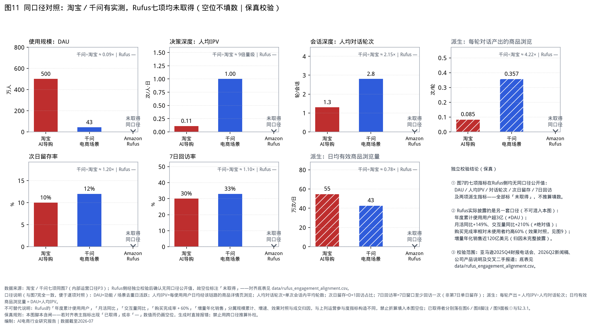

| 指标（与图7同定义） | 淘宝AI导购 | 千问电商场景 | Amazon Rufus同口径 | 校验结论 |
|---|---|---|---|---|
| DAU | 500万人 | 43万人 | **未取得** | 公开仅有2025全年累计使用用户超3亿（≠去重日活） |
| 人均IPV | 0.11次/人·日 | 1.00次/人·日 | **未取得** | 无「经Rufus链路的人均商品详情页浏览」披露 |
| 人均对话轮次 | 1.3轮/会话 | 2.8轮/会话 | **未取得** | 仅有交互量同比+210%，≠单次会话平均轮数 |
| 次日留存率 | 10% | 12% | **未取得** | 无D+1功能回访占比 |
| 7日回访率 | 30% | 33% | **未取得** | 无7日窗口回访占比 |
| 派生：每轮对话产出 | 0.085次/轮 | 0.357次/轮 | **不可派生** | 分子、分母均未取得 |
| 派生：日均有效商品浏览量 | 55万次/日 | 43万次/日 | **不可派生** | 分子、分母均未取得 |

**独立校验范围**：亚马逊2025Q4财报电话会、2026Q2业绩新闻稿（Alexa for Shopping／Rufus合并表述）、公司产品说明，以及交叉二手报道。对齐底表见 `data/rufus_engagement_alignment.csv`；图11生成脚本含保真闸——若对齐表主指标被误填「已取得」数值而仍画空位，生成时直接报错。

**Rufus已披露但不可填入本表的指标**（口径不同，已分别落位）：

| Rufus披露 | 数值 | 为何不可填入图7／图11 | 本报告落位 |
|---|---|---|---|
| 年度累计使用用户 | 超3亿（2025全年） | 累计使用≠去重日活 | 图6量级参照；§2.3.1 |
| 月活跃用户同比 | +149% | 增速≠DAU绝对值 | 图8乐观档跨口径借用（已知弱点）；图9面板③ |
| 交互量同比 | +210% | 总次数增速≠人均轮次 | 同上 |
| 使用者购买完成率 | 相对未使用者约高60% | 效果对照构造，非运营参与度 | 图9面板①；§2.3.1 |
| 增量年化销售 | 近120亿美元 | 成交归因≠浏览参与度；归因方法未完整披露 | §2.3.1（公司口径估算） |

**结论**：站内AI导购的「交互层差距」分析（每轮产出、留存层对照、u×s边界）目前只能在淘宝／千问两侧内部口径上成立；Rufus提供的是效果与规模另一套证据，二者不可同图混排，亦不可用累计用户或同比增速反推填空。

#### 1.6.1 与传统电商导购的效率对照

图7回答的是「两侧AI导购彼此差在哪」；本节回答「相对已经跑通的传统电商导购，AI导购效率处在什么位置」。传统电商导购在此操作化为**淘宝传统搜索（含搜推Hybrid）**——这是国内意图购物的主入口；直播带货与人工客服因缺少与AI导购同构造的平台级公开效率数据，不纳入本对照（未采纳说明见附录B）。

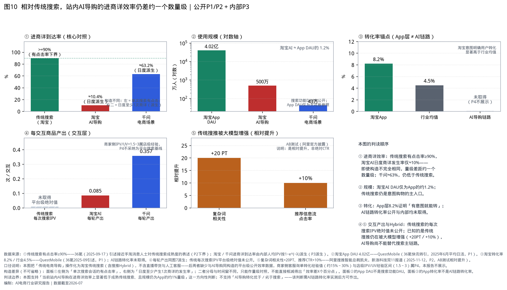

| 对照维度 | 传统搜索／App层 | 淘宝AI导购 | 千问电商场景 | 来源与等级 |
|---|---|---|---|---|
| 进商详到达率 | ≥90%（有点击率下界） | ≈10.4%（日度派生） | ≈63.2%（日度派生） | 传统：36氪2025-09引述接近手淘消息人士（P2下界）；AI两侧：由人均IPV按 1−e^(−λ) 派生（P3派生） |
| 使用规模 | App DAU 4.02亿（2025-06均） | 功能DAU 500万（≈App的1.2%） | 功能DAU 43万 | QuestMobile（P1）；AI为P3内部 |
| 转化率 | App层8.2%；行业均值4.5% | AI链路转化率**未取得** | 同左 | QuestMobile（P1）；AI链路空缺属已知敞口 |
| 每交互商品产出 | 平台级「每次搜索IPV」绝对值**未公开** | 0.085次／轮 | 0.357次／轮 | AI为图7派生；传统绝对值不采纳商家侧经验冒充 |
| 传统搜推被大模型增强 | 复杂词相关性+20 PT；推荐信息流CTR+10% | — | — | 阿里搜推智能总裁凯夫，新浪科技2025-11-12（P2，AB测试相对提升） |

**构造差异（不可省略）**：表中「进商详到达率」左侧为单次搜索会话的有点击率，右侧为日度至少产生1次商详的发生率——分母与时间窗不同，**只能作量级对照，不能直接相减得出「效率差X个百分点」**。App DAU不是搜索功能DAU；App转化率不是AI链路转化率。

**四条判读**：

1. **进商详效率：传统搜索仍高出约一个数量级。** 成熟传统搜索的有点击率≥90%；淘宝AI由人均IPV派生的日度商详发生率仅≈10%。构造不完全相同，但量级差距足以支持方向性判断——当前站内AI导购在「把用户推进到商品详情页」这一环节上，显著弱于已经跑通的传统搜索。千问≈63%，仍低于传统搜索下界。
2. **规模：AI导购仍是App的约1%量级入口。** 淘宝AI DAU 500万约为App日活的1.2%；传统搜索虽未披露功能级DAU，但是意图购物的主入口（QuestMobile与多家严肃媒体对「主动搜索购物心智」的定性一致）。规模上AI导购尚未构成替代。
3. **转化：App层证明「有意图就能转」，AI链路转化率两端均未取得。** 淘宝App转化率8.2%、显著高于行业4.5%（QuestMobile），说明平台在「意图→成交」上本就有效；但AI导购链路的详情页→成交转化率公开与内部均未取得，因此**本报告不下「AI导购转化优于／劣于搜索」的判断**——该判断须在建议二的实验中同步采集后方可作出。
4. **传统搜推仍在被大模型增强，说明主链路未被放弃。** 复杂词相关性+20 PT、推荐CTR+10%均为相对提升（AB测试），不是绝对CTR基线；其含义是平台把大模型能力首先用于强化既有搜推，而非用对话式AI导购替换搜索。这与「AI导购尚不能替代搜索主链路」同向。

**对建议一的含义**：图7把改造重点压在「每轮对话产出」；图10进一步说明，即便把每轮产出提到千问水平（0.357次／轮），派生的日度商详发生率在「日会话≈1」假设下约为 1−e^(−0.357×1.3)≈37%，仍显著低于传统搜索的≥90%下界。因此「追赶千问」是阶段目标，不是终局标杆——终局对照应是传统搜索的进商详效率，但该对照的精确差值须在统一时间窗与分母后用同链路实验测量。

### 1.7 站内AI导购：有效商品浏览量情景测算

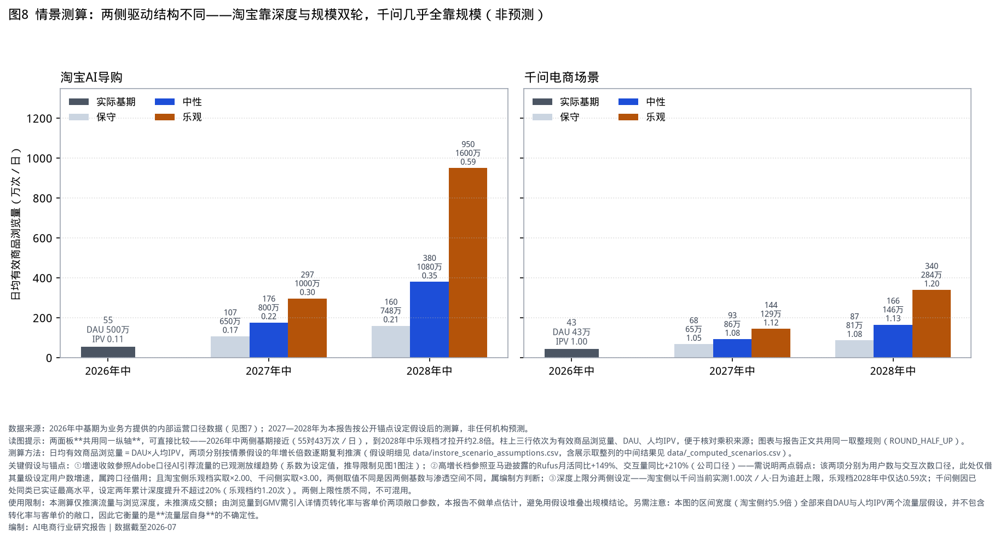

**测算方法**：日均有效商品浏览量 ＝ DAU × 人均IPV。「有效」的操作化定义是：**经AI导购链路归因的**商品详情页浏览，即已剔除用户绕过AI链路直达商品的浏览（该归因规则的口径正是§1.6可比性限制②所指的敞口 u）。以2026年中的实测值为基期，对DAU与人均IPV分别设定年增长倍数，逐期复利推演至2028年中。假设明细存放于 `data/instore_scenario_assumptions.csv`，含展示取整列的中间结果输出至 `data/_computed_scenarios.csv`；图表与本节表格共用同一取整规则（ROUND_HALF_UP），可复算。

**三项假设锚点及其弱点**：

1. **增速收敛**参照Adobe口径AI引荐流量的已观测放缓趋势。该系数为设定值而非推导值，推导限制见§1.1。
2. **高增长档**参照亚马逊披露的Rufus月活跃用户同比+149%、交互量同比+210%（公司口径）。**两处弱点须明示**：其一，这两项分别是用户数与交互次数口径，此处仅借其量级设定用户数增速，属跨口径借用；其二，淘宝侧乐观档实取×2.00、千问侧实取×3.00，两侧取值不同，理由是两侧基数与渗透空间不同（淘宝侧DAU已达500万、入口曝光接近饱和；千问侧43万、场景触发率仍在1%量级），属编制方判断而非外部依据。
3. **深度上限分两侧设定。** 淘宝侧以千问当前实测的1.00次/人·日为**追赶上限**，乐观档在2028年中仅达0.59次，未突破该上限；千问侧因人均IPV已处于同类产品已实证的最高水平、提升空间有限，设定两年累计深度提升不超过20%（乐观档2028年中约1.20次）。两侧上限的性质不同，不可混用。

**测算结果**（DAU单位：万人；有效商品浏览量单位：万次/日）

**取整说明**：下表与图8的三个数值（浏览量、DAU、人均IPV）各自独立取整，因此「展示DAU × 展示IPV」不必然复现「展示浏览量」（例：650×0.17＝110.5 而表内为107，差异来自IPV实际值0.165）。可复算的对象是 `data/_computed_scenarios.csv` 中的未取整列。

| 产品 | 情景 | 2026年中（实测） | 2027年中 | 2028年中 |
|---|---|---|---|---|
| 淘宝AI导购 | 保守 | 55（DAU 500／IPV 0.11） | 107（DAU 650／IPV 0.17） | 160（DAU 748／IPV 0.21） |
| 淘宝AI导购 | 中性 | 55（DAU 500／IPV 0.11） | 176（DAU 800／IPV 0.22） | 380（DAU 1080／IPV 0.35） |
| 淘宝AI导购 | 乐观 | 55（DAU 500／IPV 0.11） | 297（DAU 1000／IPV 0.30） | 950（DAU 1600／IPV 0.59） |
| 千问电商场景 | 保守 | 43（DAU 43／IPV 1.00） | 68（DAU 65／IPV 1.05） | 87（DAU 81／IPV 1.08） |
| 千问电商场景 | 中性 | 43（DAU 43／IPV 1.00） | 93（DAU 86／IPV 1.08） | 166（DAU 146／IPV 1.13） |
| 千问电商场景 | 乐观 | 43（DAU 43／IPV 1.00） | 144（DAU 129／IPV 1.12） | 340（DAU 284／IPV 1.20） |

两侧的驱动结构不同：淘宝侧的增长同时来自规模与深度（乐观档DAU为基期的3.2倍、IPV为5.4倍），千问侧几乎全部来自规模（乐观档DAU为基期的6.6倍、IPV仅为1.2倍）。这与§1.6的跨口径参照一致——两侧的瓶颈分别在深度与规模。

**两层使用限制**：

1. **本测算只覆盖流量层，且该层本身高度不确定。** 淘宝侧2028年中的区间为160万至950万次/日，跨度5.9倍；该跨度全部来自DAU与人均IPV两个假设，因此它衡量的是**流量层自身**的可预测性，而不是流量之后环节的不确定性。
2. **GMV层的敞口未纳入测算。** 由有效商品浏览量折算至GMV需引入详情页转化率与客单价，二者在提供的数据中均无实测值。这意味着真实的GMV不确定性会**大于**上述5.9倍，而非小于。若强行代入行业假设，将出现三层假设相乘的结果，误差区间会大于结论本身的信息量。本报告因此不给出GMV单点估计。

**压缩不确定性的正确顺序**：先用§6.2建议二的实验框架测出详情页转化率与客单价（这两项可在两周内测得），再回头用实测的转化率约束流量假设——而不是先花时间收窄流量假设。

### 1.8 分析小结

**第一，站外AI引荐的质量指标已反转，但因果性未被证明，且增速窗口正在关闭。** 转化率由−38%转为+42%是过去一年最实质的变化，但同期渠道流量大幅扩张（Q1对Q1为4.93倍，3月对3月为约3.7倍），访客构成必然迁移，反转的归因无法从公开数据中分离。增速方面已由+1151%回落至+269%。合理的姿态是低成本占位与监测，而不是按外推规模做重投入。

**第二，「对话内代结账」已经历一轮明确的失败，行业已收敛到分工方案。** Instant Checkout以约5个月、峰值约12至30家商家的成绩收场，其替代方案（通用AI界面内的商家自有应用、Google UCP保留商家Merchant of Record身份）指向同一结论：AI适合承担发现与决策辅助，交易、会员、税费与售后应留在商家体系。该结论有多条证据支持，但需如实说明其独立性程度：涉及**四个主体、三类性质**（见§2.4一）。

**第三，站内AI导购在「个体层相对效果」这一构造上只有一个公开数据点（限于本报告检索范围）。** 图9面板①只有Rufus一根柱。检索范围为 `docs/05` 所列来源，数据截至2026年7月；本报告未做穷尽性文献检索，故该判断是有界的。其余可得数据分属另两种对照构造：Salesforce为企业分组、Adobe与Shopify为渠道对比，均不能替代。亚马逊另披露的「增量年化销售近120亿美元」是绝对额而非相对效果，且归因方法未完整披露，不可跨案例比较。这意味着任何关于站内AI导购收益的量化判断，目前只能靠自建实验获得。

**第四，内部口径数据显示差距落在交互层，但存在两个竞争性解释，需分层实验区分。** 两侧的次日留存（10%对12%）与7日回访率（30%对33%）差异仅1.10至1.20倍，而每轮对话产出差4.22倍。用户「是否愿意再来」两侧接近，「每一轮对话是否推进到商品」差别巨大。两个解释：

- **解释A（产品形态）**：答案中是否直接给出可交易的商品对象、每轮对话是否有明确的下一步动作、对话是否被设计为收窄选项而非仅提供信息。淘宝侧人均对话轮次仅1.3轮且每轮产出0.085次，与「单轮问答后即结束、未进入选品」的形态一致。
- **解释B（意图构成）**：淘宝侧DAU中含大量由入口曝光触发的低意图使用（见§1.6可比性限制①），千问侧为用户主动触发，意图强度更高。

留存接近这一事实**降低了但未排除**解释B——留存衡量的是「是否愿意再来」，与「本次使用时的购买意图强度」是不同构造，且两侧留存均处10%至12%的低位，区分力有限。报告倾向解释A为主因，依据是差距集中在**每轮对话产出**这个交互层指标上，而非用户层指标；但两者必须通过分层实验区分，证伪条件见建议一。

**第五，两条提升路径的成本结构不同，但优劣排序对归因敞口高度敏感，使用时须先确认 u×s 落在哪一区间。**

| 路径 | 做法 | 结果人均IPV | 推理成本变化 |
|---|---|---|---|
| A：提高每轮对话产出 | 轮次保持1.3轮，把每轮产出由0.085提到千问侧的0.357次 | 0.46次（**不随u变化**） | 单会话推理调用次数不变，近似不变 |
| B：增加对话轮次 | 每轮产出保持当前水平，把轮次由1.3提到千问侧的2.8轮 | 0.24u次 | 随轮次近似线性上升，约为原来的2.15倍 |

按u＝1（即归因规则不低估）计算：路径A的指标增益（+0.35次）为路径B（+0.13次）的约2.8倍，按单位推理成本计效率约为6倍。

**但该排序会反转，且反转点与「差距落在交互层」用的是同一个量 u×s。** 关键在于：路径A把淘宝侧的每轮产出替换为千问侧水平，而千问侧的每轮产出（0.357次）本身已被 s 影响——按§1.6限制③，0.357 是 s＝1 归一化下的值。设 u 为淘宝侧IPV低估倍数、s 为两侧人均日会话数之比：

- 基线 ＝ 0.11u
- 路径A终值 ＝ 0.464 ÷ s（轮次仍1.3，每轮产出换为千问真实水平，故含 s 而不含 u）
- 路径B终值 ＝ 0.11u × 2.8 ÷ 1.3 ＝ 0.237u（轮次内乘数，故含 u 而不含 s）

两条路径的增益比 ＝ (0.464÷s − 0.11u) ÷ (0.127u)，**只取决于乘积 u×s**（例如 u＝2、s＝1 与 u＝1、s＝2 给出完全相同的结果）：

| u×s | 路径A增益 | 路径B增益 | 增益比 | 按单位推理成本计的效率比 |
|---|---|---|---|---|
| 1.0（本报告采用值） | +0.354 | +0.127 | 2.79 | 6.01 |
| 1.5 | +0.299 | +0.190 | 1.57 | 3.39 |
| **1.96（临界点一）** | +0.249 | +0.249 | **1.00** | 2.15 |
| 2.0 | +0.244 | +0.254 | 0.96 | 2.07 |
| **2.75（临界点二）** | +0.162 | +0.349 | 0.46 | **1.00** |
| 3.0 | +0.134 | +0.381 | 0.35 | 0.76 |

**表的生成规则（避免误读）**：增益比与效率比只随乘积 u×s 变化，可由闭式解直接得出——增益比 ＝ 3.658÷(u×s) − 0.866。但两列**增益的绝对值**随 (u, s) 的具体组合而异，因此本表统一按 s＝1（即 u＝u×s）计算绝对值；若换成 u＝1、s＝2，乘积同为2.0、增益比同为0.96，但绝对增益变为 +0.122 与 +0.127。引用时请只跨表比较后两列。

**三道门槛因此落在同一个量上，构成嵌套判据**：

| u×s 区间 | 可以据以做什么 |
|---|---|
| ＜1.96 | 「差距落在交互层」成立；「优先提高每轮产出」的排序成立（指标增益与单位成本效率双优） |
| 1.96 至 2.75 | 「差距落在交互层」成立；但两条路径的指标增益已接近或反转，只能按单位推理成本择优（此区间内路径A仍占优） |
| 2.75 至 3.5 | 「差距落在交互层」仍成立；但**按单位推理成本计应改为优先增加对话轮次** |
| ≥3.5 | 「差距落在交互层」本身不成立，须转入§1.6限制①的意图构成检验 |

这四段区间说明一件容易被忽略的事：判断「差距在哪一层」与判断「先改哪一条」用的是同一个量 u×s，只是刻度不同（3.5 与 1.96／2.75）。因此不需要分别测两个量，只需测 u 与 s 各一次。

**说明**：本对比只比较两条路径的相对成本结构，不构成绝对成本估计——单会话推理成本的绝对水平需业务方提供token单价与单会话平均token数，本报告不做估计，将其列为待补输入。此外，路径A「推理成本近似不变」本身是待验证假设（每轮塞入可加购商品卡与检索会推高单轮token），已列为§6.2建议二的次级指标。

**第六，所有可得的公开效果数据都是观察性的。** Rufus的「+60%」是使用者对未使用者，Adobe与Shopify的是AI渠道对非AI渠道，Salesforce的是部署与未部署企业分组——三种对照构造，全部为观察性对比（图9按此分面板）。这些数字可用于判断方向，不能用于测算收益。

**第七，规模判断有两层不确定性，且都未被压缩，压缩顺序不可颠倒。** 第一层在流量本身：§1.7的情景离散度已达5.9倍，全部来自DAU与人均IPV两个假设；第二层在流量之后：详情页转化率与客单价均无实测值、未纳入测算，因此真实的GMV不确定性会**大于**5.9倍。正确的压缩顺序是先用实验测出转化率与客单价（两周内可得），再回头用实测值约束流量假设——反之则是用更宽的假设去收窄更窄的假设。

**第八，相对传统搜索，站内AI导购在进商详效率上仍差约一个数量级，且尚未构成规模替代。** 图10显示：传统搜索有点击率≥90%，淘宝AI日度商详发生率≈10%，千问≈63%；淘宝AI DAU仅为App的约1.2%。AI链路转化率两端均未取得，故不下转化优劣判断。即便追赶到千问的每轮产出水平，派生日度商详发生率在日会话≈1时仍约37%，显著低于传统搜索下界——「追赶千问」是阶段目标，终局对照应是传统搜索（精确差值须同链路实验测量）。传统搜推仍在被大模型增强（+20 PT／+10%），说明主链路未被放弃。

---

## 二、主要业务模式分析

### 2.1 模式分类框架

现有案例可按三个主维度划分：**结账界面在哪一侧**（AI侧／商家侧）、**Merchant of Record（记录商户）身份归谁**（AI平台或协议方／商家）、**AI入口与交易主体是否同属一个集团**（跨主体／同一集团；M5的「同一主体」是「同一集团」的特例）。前两个维度决定收入归属与售后责任，第三个维度决定谈判结构与数据边界。

**「结账界面在哪一侧」的判定规则**：以**渲染结账页的宿主应用**为准。在ChatGPT内的零售商应用中完成支付，结账页由ChatGPT宿主渲染，计入AI侧；元宝对话中跳转至微信内的京东小程序完成支付，结账页由京东小程序渲染，计入商家侧。

| 编号 | 模式 | 结账界面 | Merchant of Record | 入口与交易主体 | 代表案例 | 能力级别 | 现状 |
|---|---|---|---|---|---|---|---|
| M1 | 通用AI代结账 | AI侧 | AI平台／协议方 | 跨主体 | ChatGPT Instant Checkout | A3 | **已下线**（2026-03） |
| M2 | 通用AI内的商家应用 | AI侧 | 商家 | 跨主体 | ChatGPT零售商应用、Shopify Agentic Storefronts、Google UCP原生结账 | A3 | 扩张中 |
| M3a | 通用AI导流跳转（用户本人下单） | 商家侧 | 商家 | 跨主体 | Perplexity联盟分佣、元宝×京东、Google UCP嵌入式结账 | A2 | 常态 |
| M3b | 第三方代理代为下单 | 商家侧 | 商家 | 跨主体 | Perplexity Comet 代理在他方站内下单 | A4／A5 | 未获授权者受禁令限制 |
| M4 | 生态内垂直闭环 | AI侧 | 集团内电商主体 | 同一集团 | 豆包×抖音电商、千问×淘宝 | A3（部分A4） | 国内主流 |
| M5 | 站内自有AI导购 | 商家侧（自有站点／App） | 自有 | 同一集团（且为同一主体） | Amazon Rufus、淘宝AI导购、Instacart Cart Assistant | A1→A4 | 效果最可验证 |

**M3 拆分为 M3a / M3b 的理由**：三个主维度无法区分「AI给出商品卡、用户自己去商家站点下单」与「AI代理登录用户账号在商家站点下单」——两者在三维上完全同格。但这两者的法律与商业后果截然不同（见§2.2.3），因此需引入第四个维度：**下单动作的执行方（用户本人／AI代理）及其是否经交易场授权**。这一维度只在M3内部产生分化，故以子编号处理而不重构主表。

**MECE检验（三个主维度，8格）**：上表M1、M2、M3（含a、b）、M4、M5占据5格。其余3格为空，原因如下：

| 空缺组合 | 为何不存在 |
|---|---|
| 商家侧结账＋AI平台为MoR＋跨主体 | 结账在商家系统内完成却由第三方作记录商户，结算权责与退款责任相互矛盾 |
| AI侧结账＋AI平台为MoR＋同一集团 | 同一集团内AI平台与电商主体的MoR归属无对外区分意义，实质等同于M4 |
| 商家侧结账＋AI平台为MoR＋同一集团 | 同时具备上述两项矛盾 |

**框架的判别价值**：M1与M2的结账界面位置相同（都在AI侧），差别只在Merchant of Record归属——而这一处差别决定了M1退场、M2扩张。M4与M2的区别不在界面或MoR形式，而在第三维度：同集团内不存在真正的谈判与数据让渡，因此M4的落地速度快于M2，但比价中立性也更受限。

### 2.2 通用AI电商导购案例

#### 2.2.1 OpenAI／ChatGPT：代结账的完整试错样本（M1→M2）

| 维度 | 内容 | 数据来源 |
|---|---|---|
| 入口规模 | 周活跃用户约8.5亿（2026-02）；购物相关查询日均约5000万条（2026年上半年，媒体汇总口径，非OpenAI官方分品类披露） | OpenAI公开披露；媒体交叉 |
| 路线一（M1） | 2025-09-29 Instant Checkout上线，首批为美国Etsy商家，Shopify商家标注为「即将开放」；底层为ACP协议（与Stripe共同开发、开源、支付服务商中立） | OpenAI与Stripe官方公告 |
| 路线一结果 | 2026-03-05下线，存续约5个月；峰值接入商家约12至30家；首月约8%美国成年ChatGPT用户尝试 | 媒体报道；第三方复盘（Webinterpret等） |
| 路线二（M2） | 2026-03下旬起改为ChatGPT内的零售商应用，首批含Instacart、Target、Expedia、Booking.com等；商家自运营结账与支付，OpenAI保留发现层；ACP继续作为底层协议 | OpenAI公开回应与媒体报道 |
| 变现 | 交易佣金约4%加支付通道费（公开报道口径） | 媒体报道 |

**分析**：这是目前唯一从上线到下线、有完整证据链的代结账样本，其可核对性高于任何预测。失败原因**不在「研究商品」这一需求端**——§1.1的流量与转化数据表明用户确实在AI里研究商品；**而「在AI界面内结账」这一具体需求的强度缺少可比基准，本报告不下判断**（见§1.3的证据强度分解）。可确证的是供给侧：单件即时结账无法承载真实电商所需的购物车、优惠码、会员权益、税费计算与实时库存同步，且商家不愿让出Merchant of Record身份。OpenAI下线的是产品而非协议：ACP作为底层协议保留，并成为替代方案的技术基础。

**可迁移经验**：判断一条AI电商路径是否可行，先看它要求商家让渡什么。要求让渡Merchant of Record的方案，商家侧供给无法起量，产品就失去验证需求的前提。

#### 2.2.2 Google／Gemini与AI Mode：以协议中立性换生态位（M2＋M3a）

| 维度 | 内容 | 数据来源 |
|---|---|---|
| 入口规模 | Gemini月活跃用户约6.5亿 | Google公开披露 |
| 协议 | Universal Commerce Protocol（UCP），开放标准；与AP2（代理支付协议）、A2A、MCP互通 | Google开发者文档与官方博客 |
| 关键设计 | **商家保持Merchant of Record身份**；提供两条接入路径——原生结账（结账界面在Google的AI Mode／Gemini内，属M2）与嵌入式结账（商家保留完全自定义的结账流程，属M3a） | Google开发者文档 |
| 接入门槛 | 需有效Merchant Center账号，并对拟开放结账的商品标记 `native_commerce` 属性（商品级开关，不影响既有购物广告与免费列表） | Google Merchant Center帮助文档 |
| 进展 | 2026-03更新，新增购物车与商品目录能力，并简化Merchant Center接入流程；结账能力目前限美、加、澳合格商家的早期访问计划；支付为Google Pay与Google Wallet，PayPal待上线 | Google官方文档；Semrush解读 |

**分析**：UCP与ACP在关键设计上已趋同——都把Merchant of Record留给商家，都以开放协议而非独占接口扩张。差别在Google把结账能力与既有的Merchant Center商品数据体系绑定，商家的接入成本主要落在商品feed属性与接口实现，而非交易关系让渡。这降低了接入阻力，也意味着**商品数据结构化是跨协议共用的前置投入**。

#### 2.2.3 Perplexity：M3a与M3b的分水岭

| 维度 | 内容 | 数据来源 |
|---|---|---|
| 入口规模 | 月活跃用户约0.3至0.45亿 | 公司公开披露 |
| 机制 | 联盟分佣变现（M3a）；Comet浏览器内的代理可代用户在第三方站点下单（M3b） | 公司披露 |
| 争议起点 | 2024-11亚马逊要求其停止部署可在亚马逊站内下单的AI代理，Perplexity当时配合；2025-07-09 Comet发布后重新在亚马逊站内部署代理；2025-08-19亚马逊设置技术屏蔽，Comet发布新版本规避 | 亚马逊起诉书（2025-11-04） |
| 诉讼 | 2025-11-04亚马逊在美国加州北区联邦法院起诉，主张违反《计算机欺诈与滥用法》（CFAA）及加州计算机数据访问与欺诈法，指其将代理伪装为Chrome浏览器、未透明标识自动化活动、未经授权访问用户账户 | 起诉书；路透社、彭博社报道 |
| 结果 | 2026-03联邦法院授予亚马逊初步禁令，认定其在CFAA主张上具备胜诉可能 | Amazon.com Servs. LLC v. Perplexity AI, Inc.，美国加州北区联邦法院（旧金山），2025-11-04起诉书；2026-03初步禁令。**案号未取得**，引用时应注明 |

**分析**：同一家公司同时运行M3a与M3b两种模式，而结果截然不同——联盟分佣的导流从未受阻，代理代为下单被禁令阻止。区分二者的正是「下单动作由谁执行、是否经交易场授权」这一维度。同一时期，ACP与UCP通过公开协议、显式授权、透明标识的方式让代理进入商家交易场并获得接纳；Comet采用伪装身份、规避技术屏蔽的方式进入。平台服务条款也在同步修订，明确要求AI代理透明标识自身。

**可迁移经验**：对外部代理，交易场的准入应当协议化和显式化；对自有体系，应当尽早在服务条款中定义AI代理的识别与准入规则——本案的CFAA主张之所以成立，很大程度上得益于亚马逊条款中已明确规定自动化与AI代理的行为要求。

#### 2.2.4 字节跳动／豆包×抖音电商：生态内闭环，代理型交互（M4）

| 维度 | 内容 | 数据来源 |
|---|---|---|
| 入口规模 | 月活跃用户3.83亿（2026-06） | QuestMobile |
| 进展 | 2025-10接入抖音商城；2025年双11首次接入时仍需跳转；2026-04起电商功能完成迭代，用户无需离开豆包App即可完成需求表达、商品匹配到支付下单，订单查询在App内完成；2026-05正式上线「帮你选」AI购物功能，与抖音电商全链路打通 | 钛媒体、每日经济新闻报道 |
| 交易结构 | 下单支付在豆包内完成，商品详情、交易系统与售后履约由抖音电商承接 | 千问回应媒体提问时的表述（竞对口径）；与公开产品形态一致——媒体实测显示豆包内可完成下单支付而订单查询仍在App内，跳转基本只到抖音商城 |
| 已知局限 | 不支持真正的全网实时比价，仅能查询抖音电商与部分公开价格，无法跨淘宝、京东、拼多多实时比价下单；比价结果不附带可点击商品链接 | 每日经济新闻实测 |
| 交互定位 | 更接近「代理人」：直接推荐明确品牌，替用户完成大部分决策，体验流畅但推荐依据（用户偏好、商家投放权重、销量排序）对用户不可见 | 钛媒体分析 |

**来源说明**：「下单支付在豆包内、交易系统由抖音电商承接」这一结构的唯一直接表述来自竞对（千问）回应媒体提问，本报告标注为竞对口径。可交叉印证的是媒体实测所见的产品形态（豆包内完成支付、跳转只到抖音商城）。该结构在§2.1中用于区分M4与M2，读者应知其证据强度低于本报告的其他框架判断。

#### 2.2.5 阿里巴巴／千问×淘宝：生态内闭环，导购型交互（M4）

| 维度 | 内容 | 数据来源 |
|---|---|---|
| 入口规模 | 月活跃用户1.66亿 | QuestMobile |
| 进展 | 2026-05-11与淘宝全面打通：千问App内可完成淘宝商品的挑选、对比与下单；淘宝App「消息」栏内上线「千问AI购物助手」，提供AI问答、AI试穿、AI算优惠、AI低价帮抢，以及一句话下单、一句话帮抢、一句话退换货 | 新华网、每日经济新闻（2026-05-11） |
| 生态前置 | 此前千问已陆续接入淘宝闪购、飞猪、高德、支付宝等阿里生态内消费服务 | 同上 |
| 交易结构 | 依托淘宝既有的商品匹配、订单管理、物流履约与售后能力，完成从需求理解到售后的全流程 | 同上 |
| 已知局限 | 尚不支持跨平台全网实时比价 | 每日经济新闻实测 |
| 交互定位 | 更接近「导购助手」：收窄选项、最终决策权留给用户，列表页逻辑接近传统搜索 | 钛媒体分析 |
| 内部口径实测 | 电商场景DAU 43万、人均IPV 1.00次/人·日、人均对话轮次2.8轮、每轮对话产出0.357次（见§1.6与图7） | 业务方提供（P3） |

**豆包与千问的对照结论**：两者同属M4，代表两种交互取向——代理型（替用户决策，体验流畅但透明度低）与导购型（收窄选项，保留用户决策权）。§1.6的内部数据为这一取向差异提供了量化侧写：千问电商场景人均2.8轮对话、每轮产出0.357次商品浏览，与「多轮收窄后进入选品」的形态一致。两者共同的未解问题是跨平台比价——在生态内闭环的结构下，比价的中立性天然受限，而这恰是消费者对AI导购的核心期待之一。

#### 2.2.6 腾讯／元宝×京东：生态联盟（M3a）

| 维度 | 内容 | 数据来源 |
|---|---|---|
| 入口规模 | 不列示（无权威第三方或官方披露） | — |
| 机制 | 对话中输出商品卡，跳转微信内的京东小程序完成成交；结账页由京东小程序渲染，按§2.1的判定规则属商家侧，故归M3a | 腾讯与京东联合官宣 |

**分析**：这是国内唯一的跨集团联盟样本。相对M4的生态内闭环，M3a的优势是双方无需让渡核心资产、谈判门槛低；代价是体验存在跳转断层，且责任边界与分佣比例需持续谈判。

小程序生态在国内承担了ACP／UCP在海外的部分角色——但仅限于**Merchant of Record与会员归属留在商家**这一维度；在结账界面位置上，小程序方案属商家侧（M3a），而ChatGPT零售商应用属AI侧（M2）。这一差别的实际后果是：小程序方案的跳转断层更明显，但商家对结账页的控制权更完整。

#### 2.2.7 横向对照

| 案例 | 模式 | 能力级别 | 入口规模（口径） | 交易归属 | 变现机制 | 主要约束 |
|---|---|---|---|---|---|---|
| ChatGPT | M1→M2 | A3 | 8.5亿周活跃 | 曾为平台，现为商家 | 约4%佣金＋通道费 | 代结账已证伪；改走商家应用 |
| Gemini／AI Mode | M2＋M3a | A3／A2 | 6.5亿月活跃 | 商家（保留MoR） | 未公开结账佣金安排 | 早期访问限美加澳；需Merchant Center |
| Perplexity（联盟） | M3a | A2 | 0.3～0.45亿月活跃 | 商家 | 联盟分佣 | 变现率低 |
| Perplexity（Comet代理） | M3b | A4／A5 | 同上 | 商家 | 同上 | 未获授权者受禁令限制 |
| 豆包 | M4 | A3 | 3.83亿月活跃 | 抖音电商 | 生态内归因结算 | 不支持跨平台实时比价 |
| 千问 | M4 | A3（部分A4） | 1.66亿月活跃 | 淘宝 | 生态内归因结算 | 同上 |
| 元宝×京东 | M3a | A2 | 不列示 | 京东 | 未公开 | 跳转体验断层 |

**能力级别与模式的交叉观察**：同为A3（对话内闭环），M1（跨主体代结账）已退场，M2与M4在扩张——**能力级别相同而交易结构不同，结果完全不同**。由此可见，决定成败的不是AI做到哪一步，而是交易结构要求各方让渡什么（§2.1框架的判别依据）。A4及以上（授权代理）在M4与M5内部已落地（千问的一句话帮抢、Rufus的到价自动买）；跨主体的M3b并非不能落地——Amazon Buy for Me 即是一例（见§2.3.1的框架裁决），受阻的是**未获授权且规避技术屏蔽的**M3b。

### 2.3 零售商与平台自有AI导购案例

#### 2.3.1 Amazon Rufus：目前效果证据最完整的样本（M5，A1→A4）

**时间线**

| 时点 | 事件 | 数据来源 |
|---|---|---|
| 2024-02 | 在美国App内开启beta测试 | 亚马逊公告 |
| 2024-07 | 向全部美国用户开放 | 亚马逊公告 |
| 2025全年 | 累计超50项技术升级：账户级记忆、盯价自动购买、视觉搜索、跨服务集成、Buy for Me（可在其他线上商店代为购买数千万商品，**该能力在本报告框架中属M3b，见下文裁决**） | 亚马逊产品发布说明与财报材料 |
| 2026-02 | 2025Q4财报电话会，CEO在表述中将Rufus定位为「the AI agent」 | 亚马逊2025Q4财报电话会 |

**规模与效果（P2，公司口径，均来自亚马逊财报电话会）**

| 指标 | 2025Q3披露 | 2025Q4／全年披露 |
|---|---|---|
| 累计使用用户 | 2.5亿 | 超3亿 |
| 月活跃用户同比 | — | +149% |
| 交互量同比 | — | +210% |
| 增量年化销售 | 约100亿美元（按年化节奏） | 近120亿美元 |
| 使用者购买完成率 | — | 约高60%（相对未使用者） |

**来源统一说明**：「使用者购买完成率约高60%」在2025Q4财报电话会中由CEO明确表述，本报告、`data/effect_scorecard.csv` 及图9统一标注为2025Q4财报电话会。部分二手报道将其归于Q3，本报告不采用该归属。

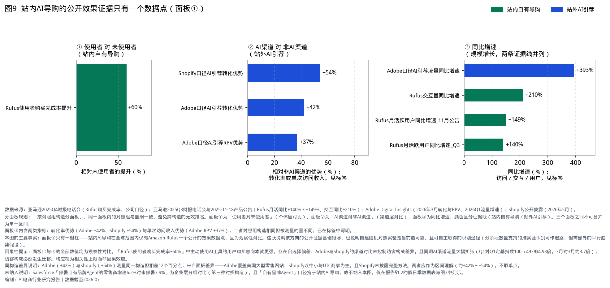

**归因口径与两处必须说明的局限**

1. **「增量年化销售」是incremental口径，不是Rufus用户的总销售额。** 亚马逊试图剔除「本来也会发生」的购买。第三方分析指出其采用7日滚动归因窗口的「下游影响」方法，按对话主题与最终购买之间的语义相关性分配部分权重，并以无Rufus访问权限的相似用户构造对照组。**该方法细节未经亚马逊官方完整披露**，第三方描述仅供理解口径，引用该数字时应标注为公司口径估算。
2. **「购买完成率高约60%」为观察性对比，对照构造是「使用者对未使用者」，存在自选择偏差。** 主动使用AI导购工具的用户购买意向本就更强，该数值在缺少随机对照实验的情况下应视为相关性上限，而非Rufus的因果效应。注意：这与上一条中「增量销售」所用的对照组构造不是同一件事，二者不可互相印证。

**四条可迁移假设（不是已验证的规律）**

以下四条来自Rufus单一案例的观察，样本量为1、无对照，因此是**待验证的可迁移假设**而非已证规律。每条附一句可证伪条件。

| 假设 | 观察到的事实 | 证伪条件 |
|---|---|---|
| **嵌入既有动线优于新建独立入口** | Rufus嵌入搜索与商品详情页，而非独立标签页；自2024年7月全量美国到2025年全年累计超3亿用户，历时约一年半（自2024年2月beta约两年）。**这是与快速触达相一致的设计选择，不是已证明的因果原因**——样本量为1、无反事实，且Rufus位于全美最大电商App内，3亿用户中有多少来自母体流量、多少来自设计选择，公开数据无法区分 | 若在同一App内以独立入口与嵌入式入口做分流实验，两者的功能触达率差异不足30%，则该假设不成立 |
| **答案内直接给出可交易对象优于仅给文字建议** | Rufus回答中直接呈现商品；与§1.8关于每轮对话产出的分析同向 | 即建议一的证伪条件（人均IPV相对提升的95%CI上界低于+30%） |
| **复用自有语料是质量差异化来源** | 商品评论与问答内容为站内导购独有，站外通用AI难以等量获得 | 若在盲测中屏蔽自有评论语料后，导购答案的用户采纳率下降不足10%，则该假设不成立 |
| **沿既有账户与支付关系推进能力升级** | Rufus由A1问答演进至A4授权代理（盯价到价自动买、跨站代购），未要求用户新建信任关系 | 若A4功能的授权开启率与「是否已有支付绑定」无显著相关（95%CI含0），则该假设不成立 |

**框架反例的裁决：Buy for Me 属 M3b，亚马逊同时是 M3b 的原告与实施者。**

Rufus 整体归 M5（入口与交易主体同一），但其 Buy for Me 能力是「代用户在他方线上商店下单」，在三个主维度上是「结账界面在商家侧＋MoR归商家＋跨主体」，加上第四维度「下单动作由AI代理执行」，因此该能力属**M3b**。这构成对§2.4二的一处反例，必须回应：

| 对比项 | Amazon Buy for Me | Perplexity Comet |
|---|---|---|
| 模式 | M3b | M3b |
| 是否经交易场授权 | 目标商店的准入安排未公开，但亚马逊未被任何交易场以未授权访问为由起诉 | 亚马逊明确未授权，且曾要求停止后重新部署 |
| 是否透明标识代理身份 | 未见公开争议 | 起诉书指其伪装为Chrome浏览器、未标识自动化活动 |
| 是否规避技术屏蔽 | 未见公开争议 | 起诉书指其在屏蔽后发布新版本规避 |
| 结果 | 持续运营 | 2026-03获初步禁令阻止 |

**裁决结论**：区分二者的不是「是否为代理」（两者都是M3b），而是**是否经授权、是否透明标识、是否规避屏蔽**——即§2.1的第四维度中「是否经交易场授权」这一半。因此§2.4二的准确表述是「未获授权且规避屏蔽的代理进入他人交易场会被阻止」，而非「外部代理不能进入」。据此，A4及以上并非只在M4与M5内部落地——Buy for Me 就是一个跨主体的A4实例（§2.2.7已按此表述）。

**战略配套**：亚马逊在自建站内代理（M5）的同期，以法律手段限制**未获授权且规避屏蔽的**外部代理进入自有交易场（2025-11起诉Perplexity并于2026-03获初步禁令），同时自己以M3b形式进入他方交易场。这不是自相矛盾，而是说明约束条件在「授权与透明标识」而非「代理本身」。

#### 2.3.2 Instacart：把导购能力SaaS化（M5＋M2）

| 维度 | 内容 | 数据来源 |
|---|---|---|
| 自有产品 | Ask Instacart、Cart Assistant，覆盖膳食规划与对话式建车（M5，A1—A3） | Instacart官方新闻稿（2025-11） |
| 白标输出 | 企业级AI套件输出给Kroger、Sprouts等区域零售商 | 同上 |
| 通用AI入口占位 | 2026-03起成为ChatGPT内零售商应用的首批合作方之一（M2） | OpenAI公开回应与媒体报道 |

**分析**：Instacart同时走了M5与M2两条路，并额外开辟了第三条——把已建成的导购能力作为白标SaaS卖给没有自研能力的区域零售商。对生鲜与杂货这类低毛利业态，这是一条摊薄研发与推理成本的现实路径。

#### 2.3.3 淘宝站内AI导购：入口规模已解决，交互层未解决（M5）

| 维度 | 内容 | 数据来源 |
|---|---|---|
| 进展 | 2025-08 AI万能搜全量上线；2026-05淘宝App内上线「千问AI购物助手」，提供AI试穿、AI算优惠、AI低价帮抢、一句话下单／帮抢／退换货 | 新华网、界面等报道阿里官宣 |
| 内部口径实测 | DAU 500万、人均IPV 0.11次/人·日、人均对话轮次1.3轮、每轮对话产出0.085次、次日留存10%、7日回访率30% | 业务方提供（P3） |
| 判断 | 入口曝光已把DAU做到千问电商场景的11.63倍，但每轮对话产出仅为其约1/4；形态与「单轮问答后结束、未进入选品」一致。量化对照与可比性限制见§1.6，改造路径与证伪条件见§6.2建议一，此处不重复 | 本报告分析 |

#### 2.3.4 其他案例与未采纳数据

| 对象 | 状态 | 处理方式 |
|---|---|---|
| 拼多多AI搜索、快手AI购物助手 | 2026年5至6月上线，无可用量化披露 | 记录模式进展（M5），不列数据 |
| Shopify Agentic Storefronts | 2026-03推出，默认为商家开启，买家可在ChatGPT内发现商品并完成购买；商家保留Merchant of Record与结账流程的控制权，但结账界面在ChatGPT内 | 归入M2（按§2.1判定规则：以渲染结账页的宿主应用为准）；作为协议扩张的证据 |
| Target等零售商 | 以应用形式接入ChatGPT，交易在商家侧完成 | 归入M2，有模式无公开量化效果 |
| Kroger、Sprouts | 采用Instacart白标能力 | 归入M5，有模式无公开量化效果 |
| 京东京言 | 自报运营数据未通过置信度门槛 | 不列示，见附录B |

### 2.4 经验小结

**一、交易主权是目前证据最充分的结论，但需如实说明其独立性程度。** 支撑证据涉及**四个主体、三类性质**：

| 主体 | 证据 | 性质 |
|---|---|---|
| OpenAI | Instant Checkout以约5个月、峰值约12至30家商家收场，并改为商家自运营结账的零售商应用 | 产品决策 |
| Google | UCP在协议设计上保留商家Merchant of Record身份 | 协议设计 |
| Shopify | Agentic Storefronts在协议层面把Merchant of Record与结账流程控制权留给商家（界面仍在AI侧，归M2） | 协议设计 |
| 美国加州北区联邦法院 | 亚马逊诉Perplexity获初步禁令，确立外部代理需经授权 | 司法判定 |

**独立性说明**：Instant Checkout的下线与其替代方案是OpenAI同一次转向的两面，不应计为两条独立证据；Shopify Agentic Storefronts运行于ChatGPT之内，其设计与OpenAI的选择存在关联，独立性弱于Google UCP与司法判定。因此本报告的表述是「四个主体、三类性质」，而非「五条独立证据」。三类性质中，司法判定的独立性最强。

**二、决定成败的是交易结构，不是AI能力级别。** M1与M2、M4的能力级别相同（均为A3对话内闭环），但M1退场、M2与M4扩张，差别只在Merchant of Record归属与主体关系。同理，M3a与M3b的能力级别不同却同处一个模式格，区分它们的是「下单动作由谁执行、是否经授权」；而M3b内部的成败又由「是否经交易场授权、是否透明标识」决定——Amazon Buy for Me 与 Perplexity Comet 同为M3b而结局相反，即为此证（见§2.3.1的框架裁决）。判断一条路径是否可行，先看它要求各方让渡什么。

**该判断的证伪条件**：若在2027年底前出现一个M1类产品（AI平台作为Merchant of Record、跨主体代结账）在单一市场取得**10%以上的头部商家接入率**，则「交易结构决定成败」不成立，应转而检验「M1失败源于执行与时点而非结构」这一替代解释。

**分母与观察方式**：「头部商家」定义为该市场线上零售GMV排名前100的商家（可用第三方零售榜单或平台公开商家榜确定），故判据为「接入数 ≥ 10家」。观察指标为主要AI入口披露的代结账商家名单与数量——当前该数字为0（Instant Checkout已下线，其替代方案属M2而非M1）。

**三、规模由入口位置决定，价值由交互层设计决定。** 把AI导购放进高流量App的显著位置，可以快速获得DAU（淘宝侧500万），但不能自动获得商品决策行为（每轮对话产出0.085次）；用户主动触发的场景规模小（千问侧43万）但每轮产出高（0.357次）。两者的日均有效商品浏览量因此接近。意图强度与产品形态的相对贡献需通过分层实验区分（见§6.2建议一的证伪条件）。

**四、站内AI导购在「个体层相对效果」构造上只有一个公开数据点，且是观察性的。** 图9面板①只有Rufus一根柱。Salesforce的企业分组数据与Adobe、Shopify的渠道数据分属另两种对照构造，不能替代；亚马逊的「增量年化销售」为绝对额且归因方法未完整披露，不可跨案例比较。这意味着建立随机对照实验能力（设计见§6.2建议二）不是可选项——它是当前最可靠的识别途径；分阶段放量支撑的准实验识别可作退路，但需额外的平行趋势假设。

**五、站内AI导购有四条待验证的可迁移假设（来自Rufus单一案例，样本量为1）。** 嵌入既有动线而非新建独立入口；答案内直接给出可交易对象而非仅给文字建议；复用自有语料（评论、问答）作为质量差异化来源；沿既有账户与支付关系推进能力升级（A1问答→A4授权代理）。四条各附证伪条件，见§2.3.1；不应在验证前作为「规律」引用。

**六、当前主流是不直接向用户或商家收费；站内AI导购的价值体现为转化提升与留存，而非独立收入项。** 站外入口的变现（约4%佣金、联盟分佣、生态内归因结算）仍在探索，且规模远小于流量增速所暗示的水平。**这里只描述现状，不断言「变现前置会抑制规模」**——本报告未取得任何「早期变现导致规模受抑」的对照证据；§5.2的费率对比反而显示当前AI渠道费率对商家净有利。商家的抵触对象是Merchant of Record的让渡，而非费率水平。

**七、多协议并存推高商家适配成本，可迁移的资产是结构化商品数据。** ACP、UCP与国内小程序生态并行，商家逐一适配的成本会持续上升。真正跨协议、跨平台可复用的投入是商品数据的结构化与大模型可读性改造；单一平台的接入实现不具备迁移价值。

---

## 三、产业链结构

按功能职能纵向切分为六层，判据是**必要性**：**L1–L4 为主链**——该环节缺失，这笔AI购物交易就无法以AI方式完成（无模型则无AI导购、无入口则意图无处承接、无商品与交易体系则无从成交、无支付则无法结算）；**L5–L6 为使能层**——该环节缺失，交易仍可完成，只是效率或被发现概率下降（无GEO仍可成交、无供应链算法仍可人工履约）。

采用必要性判据而非「是否进入单笔交易资金流」，是因为后者分不开L1与L5：模型算力成本同样不进入单笔交易的结算，它是L2运营方的经营成本。

| 层级 | 性质 | 职能 | 国内代表 | 海外代表 | 收入模式 | 主要成本 |
|---|---|---|---|---|---|---|
| L1 模型与算力 | 主链 | 提供推理与多模态能力 | 豆包大模型、通义、混元、DeepSeek | OpenAI、Google、Anthropic | API、云捆绑、订阅 | 训练与推理算力 |
| L2 入口与流量 | 主链 | 承接购物意图（四类子层见下） | 豆包、千问、元宝；淘宝站内AI导购等 | ChatGPT、Gemini、Perplexity、Rufus | 佣金、归因结算、订阅、战略价值 | 推理、获客、合规 |
| L3 商品与交易 | 主链 | 商品池、定价、交易与售后 | 淘天、京东、抖音电商、拼多多 | Amazon、Target、Shopify商家、Etsy | GMV与平台佣金 | 商品运营、渠道费率、feed改造 |
| L4 交易基建 | 4b支付为主链；4a协议为使能 | 商务协议与支付信任 | 小程序生态、支付宝、微信支付、抖音支付 | ACP、UCP、AP2、Stripe、Visa、Mastercard | 通道费、令牌服务 | 风控与标准建设 |
| L5 商家服务 | 使能 | 生成式引擎优化（GEO）、SaaS、数字人、监测 | GEO服务商；有赞、微盟 | Profound、Salesforce Agentforce、Adobe | 订阅与咨询 | 研发与多模型适配 |
| L6 履约供应链AI | 使能 | 预测、补货、调度、品控 | 物流与即时零售算法体系 | Instacart Store View等 | 效率带来的成本节约 | 数据与算法团队 |

**L2 的四类子层**（该层是全报告的观察重点，故单独展开；2a与2b即§研究说明的两类主体）：

| 子层 | 职能 | 国内代表 | 海外代表 | 关键风险 |
|---|---|---|---|---|
| 2a 通用AI助手（站外） | 承接购物意图的第一句话：需求理解、发现、部分闭环 | 豆包、千问、元宝 | ChatGPT、Gemini、Perplexity | 推荐公正性；幻觉错购；自动下单风控；监管 |
| 2b 站内AI导购 | 交易场内降低决策成本、防决策入口外流 | 淘宝AI导购、拼多多AI搜索、快手AI购物助手 | Amazon Rufus、Instacart Cart Assistant、Target等零售商AI应用 | AI答案位与竞价广告位冲突；瓶颈在交互层而非流量（见§1.6） |
| 2c 内容社区AI | 种草语料与生活决策入口 | 小红书点点、抖音AI搜索 | — | 语料被站外大模型免费利用（种草在社区、成交在别处） |
| 2d 硬件与OS入口 | 语音、穿戴、IoT购物入口 | 千问AI眼镜、豆包手机 | Alexa+ | 语音场景的身份确认与误购；设备量级数据未交叉验证，本报告不列数值 |

**两处不宜单列为层的横向切面**（用于满足穷尽性）：

| 切面 | 为何不单列 | 归属处理 |
|---|---|---|
| 广告与流量变现 | 它是L2与L3的收入侧规则，而非独立的功能环节。核心矛盾是AI答案位与竞价广告位的位置冲突 | 记入L2、L3的收入模式与风险项，见§5.2、§5.3 |
| 数据与合规 | 它横向贯穿全部六层（备案、生成内容标识、个人信息保护、数据出境、AI代理准入），不构成纵向环节 | 单列于§5.4合规要点 |

**必要性检验方式（用于区分主链与使能层）**：对任一笔AI购物交易做「移除测试」——依次假设某环节缺失，若该笔交易无法以AI方式完成则该环节属L1–L4，若仍可完成则属L5–L6。**注意：移除测试检验的是必要性，不检验穷尽性。**

**穷尽性由两部分共同承担**：其一，六层覆盖了从算力到履约的全部纵向环节；其二，不构成纵向环节的两类要素（广告与流量变现、数据与合规）已按上述横向切面显式归置，而非省略。若发现某要素既不落入六层、也不属两处切面，则本切分不穷尽——这是本框架的证伪条件。

**三种竞合模式**

1. **垂直自建闭环**（M4、M5：豆包×抖音电商、千问×淘宝、Amazon Rufus）：体验完整、归因清晰，但商品池封闭、比价中立性天然受限。
2. **生态联盟与协议接入**（M2、M3a：元宝×京东、ChatGPT零售商应用、UCP接入、Shopify Agentic Storefronts）：各方保留核心资产，关键在责任边界划分与分佣谈判。
3. **中立第三方**（Perplexity的联盟模式）：叙事上有利于用户信任，但受平台数据封闭与代理准入规则约束；M3b式的绕行代理在Amazon诉Perplexity获禁令后基本关闭，中立化只能走协议授权路径。

---

## 四、零售与生鲜场景结合点

### 4.1 综合零售：按消费者旅程

| 旅程环节 | 结合点 | 已验证方向 |
|---|---|---|
| 需求唤起 | 通用AI内的商品发现 | ChatGPT购物查询规模；豆包一级购物入口 |
| 方案生成 | 答案式导购（攻略＋商品＋评测） | 淘宝AI万能搜；Rufus的决策辅助 |
| 选品比较 | 参数对比、评论提炼 | Rufus使用者完成率提升（观察性）；站内助手渗透 |
| 比价凑单 | 算优惠、盯价 | 千问AI算优惠／低价帮抢；Rufus价格追踪与到价自动买 |
| 下单支付 | 商家侧结账 vs AI侧代结账 | 代结账已收缩；商家应用与协议接入扩张 |
| 履约与售后 | 物流问答、退换货自动化 | 千问一句话退换货；Salesforce口径Agent自主动作+142% |
| 复购 | 偏好记忆、补货提醒 | Rufus账户级记忆与盯价 |

### 4.2 生鲜零售：结构性特征决定结合点

| 生鲜特征 | 痛点 | AI结合点 |
|---|---|---|
| 高频刚需 | 重复选购、决策疲劳 | 清单式与语音快速成单 |
| 菜谱驱动 | 「吃什么」先于「买什么」 | 菜谱转食材购物车；膳食规划 |
| 低毛利 | 导购投入产出敏感 | 轻量模型；价值重心放在供应链侧；白标能力摊薄成本 |
| 易损耗 | 损耗直接侵蚀利润 | 需求预测、智能补货、临期动态推荐 |
| 即时履约 | 仓网与调度决定体验 | 算法化仓网规划与配送调度 |
| 非标商品 | 线上信任门槛高 | 图像品控、售后自动理赔 |

**三类优先组合及其排序依据**

排序采用三项判据：①是否直接提升每轮对话产出与人均IPV（本报告的首要指标）；②是否有可参照的外部实证；③单位投入的推理成本负担。

| 排序 | 组合 | 判据①直接提升首要指标 | 判据②外部实证 | 判据③推理成本负担 |
|---|---|---|---|---|
| 1 | **餐桌助手**：对话或语音输入＋菜谱成车＋家庭偏好记忆＋周期购 | 高——一份菜谱天然对应多个食材商品，单轮对话即可产出多个商品对象，直接提升「每轮对话产出」 | 中——Instacart的膳食规划与对话建车已商用并对外输出 | 中——需多轮对话，但可用检索增强降低生成负担 |
| 2 | **损耗联动导购**：库存与效期数据接入推荐，临期折扣与当日菜谱联动 | 中——主要改善毛利与损耗，对首要指标的提升为间接 | 低——无公开效果披露 | 低——主体可由规则引擎与预测模型实现，不必依赖大模型 |
| 3 | **白标AI基建**：面向区域商超输出对话建车与膳食规划能力 | 不适用——对外输出，不改善自身指标 | 高——Instacart已有Kroger、Sprouts等付费客户 | 低——成本由客户分担 |

**排序结论**：餐桌助手优先，因为它是三者中唯一同时满足「直接提升首要指标」与「有外部实证参照」的组合，且与§6.2建议一的改造方向机制一致——一份菜谱在单轮回答内即可给出多个可加购商品对象，这正是「提高每轮对话产出」而非「拉长对话」的路径。

**餐桌助手的可验证目标与证伪条件**：采用**同期随机对照**设计（与建议二同一框架，**随机化单元同为用户级**；主指标虽以会话为分析单位，但须按用户分桶以避免同一用户跨组），主指标为「单次会话加购商品数」。证伪条件：若实验组相对对照组的提升幅度的95%置信区间上界低于1.5倍，则「菜谱场景天然带来多商品产出」这一假设不成立，应转而检验清单式复购（周期购）路径。1.5倍为**设定值**，依据是「若菜谱场景的多商品优势不足50%，则不值得为其单独建设膳食规划能力」这一工程判断，无外部基准，上线后按首轮实测回调。样本量待定：主指标为计数型，需先估计其过散布参数（与建议二主指标2同一问题）。

损耗联动导购次之，其价值落在毛利与损耗而非导购指标，可与供应链侧投入合并评估。白标输出属对外商业化选项，应在自有场景验证有效后再启动。

### 4.3 即时零售相关动态

| 事件 | 要点 | 数据来源 |
|---|---|---|
| 美团收购叮咚买菜中国业务 | 初始对价约7.17亿美元（2026-02）；合并后前置仓规模显著扩大 | 港交所公告 |
| 盒马 | 「鲜生＋NB」双业态；前置仓重启扩张 | 公司管理层公开表述及媒体报道 |
| Instacart白标输出 | Kroger、Sprouts等采用其AI导购套件 | Instacart官方新闻稿 |

---

## 五、产品与技术机会

### 5.1 交互范式变化

| 原有范式 | 当前变化 | 产品含义 |
|---|---|---|
| 关键词 → 商品列表 | 模糊需求 → 多轮澄清 → 答案式结果 | 结果页设计转向答案组织设计 |
| 用户自行完成漏斗 | AI压缩决策路径 | 核心指标转为每轮对话产出、人均IPV、意图识别准确率、推荐采纳率 |
| 竞价与推荐分配流量 | 模型引用与商品feed质量影响曝光 | 商家运营对象转向结构化内容资产 |
| 终点为下单 | 终点延伸至授权代理（A4） | 需要授权管理（额度、品类、撤销）与代理身份标识 |

### 5.2 商业化机制对照与一处费率判断

| 模式 | 代表 | 机制要点 |
|---|---|---|
| 交易佣金 | ChatGPT（约4%＋支付通道费，渠道总成本约7%～9%） | 低于Amazon市场佣金约15%的水平（公开报道口径）。这解释了商家愿意接入协议、但不愿让出Merchant of Record——愿意接受更低费率的新渠道，不等于愿意让出交易关系 |
| 生态内归因结算 | 豆包×抖音电商、千问×淘宝 | 把AI入口纳入集团电商财务结算体系 |
| 联盟分佣 | Perplexity | CPS模式，适合高客单试水 |
| 协议开放换生态 | Google UCP、OpenAI ACP | 不以结账环节直接变现，后续可回归广告或流量变现 |
| 暂不直接变现 | 多数站内AI导购 | 战略观察期；窗口期利于供给侧内容建设 |

**费率判断的含义**：当前AI渠道的费率低于成熟电商平台，对商家是净有利的；但费率是可以调整的，交易关系一旦让出则难以收回。这是§6.2建议三（交易环节不外让）的商业侧依据——拒绝的不是当前费率，而是费率的未来定价权。

### 5.3 分角色机会

本节只列各角色的机会方向；具体的指标、目标值与验证方式见§6.2建议一至五，不在此重复。

- **平台**：站内助手从A1问答升级到A4任务代理；答案页的商业化规则设计（AI答案位与竞价广告位的位置冲突，这是L2、L3收入侧的核心待解问题）；用户授权中心（额度、品类、撤销）。
- **品牌与商家**：商品feed结构化与大模型可读性改造；被推荐率与被平替率监测（设计见§6.2建议四）；自有应用接入开放协议。
- **生鲜与即时零售**：按§4.2的排序推进——餐桌助手优先，损耗联动导购与供应链投入合并评估，白标输出后置。
- **服务商与开发者**：多协议适配中间件；导购效果评测与实验平台（解决观察性数据无法支撑决策的问题，市场需求见§2.4四）；垂类导购智能体。

### 5.4 合规要点

面向公众的AI导购需关注：生成式人工智能服务与算法推荐备案；生成合成内容标识；个人信息保护影响评估；数据出境限制；未成年人消费与代扣授权；价格表述与不正当竞争相关规定。此外，Amazon诉Perplexity一案提示，服务条款中应明确定义AI代理的识别义务与准入规则，这既是防御未授权外部代理（M3b）的依据，也是自有代理对外接入时的合规基线。

---

## 六、结论与建议

### 6.1 结论

以下七项结论均为跨章节的收敛结果，括注其主要来源章节。

1. **AI电商已进入规模化应用阶段，但不同环节的成熟度差异显著。** 发现与决策辅助环节已有可验证的规模；交易环节的AI化尝试经历了一轮明确失败。（§1.1、§1.3）
2. **「AI负责发现、商家保留交易」是当前证据最充分的分工，且决定成败的是交易结构而非AI能力级别。** 由产品决策、协议设计与司法判定三类异质证据共同支撑；M1与M2能力级别相同而结局相反是最直接的例证。（§1.3、§2.1、§2.4一、§2.4二）
3. **站内AI导购在「个体层相对效果」构造上只有一个公开数据点（Rufus +60%）。** 亚马逊的「增量年化销售」为绝对额且归因方法未完整披露，不可替代相对效果证据。自建随机对照实验是当前最可靠、且可自主取得的识别途径（准实验识别可作退路，但需额外假设）。（§2.4四、图9）
4. **内部口径数据显示站内AI导购的差距落在交互层——成立边界与改造路径排序落在同一个量 u×s 上，构成三级嵌套判据（1.96／2.75／3.5）。** 留存差距仅1.10至1.20倍，而每轮对话产出差4.22倍；但该倍数受两个未消除敞口影响（IPV低估倍数u、会话数之比s），联合后当 u×s ≥ 约3.5 时方向反转，故必须先实测消除这两个敞口再据此考核。产品形态与意图构成两个解释另需分层实验区分。（§1.6、§1.8分析四与分析五、§6.2建议一前置条件）
5. **站外AI引荐的质量指标已反转但因果性未证明，且增速正在放缓。** 关于「基数」：本报告未取得AI引荐流量占零售总访问的份额数据，因此不对基数高低下判断；可得的间接证据是窄口径的第三方预测（美国2026年约206亿美元）与代结账路径的实际结果（峰值商家约12至30家）。合理姿态是低成本占位与监测。（§1.1、§1.3、§1.4、§1.8分析一）
6. **相对传统搜索，站内AI导购的进商详效率仍差约一个数量级，规模仅为App的约1%量级。** 传统搜索有点击率≥90%，淘宝AI日度商详发生率≈10%；AI链路转化率两端均未取得，故不下转化优劣判断。「追赶千问」是阶段目标，终局对照应是传统搜索的进商详效率（精确差值须同链路实验测量）。传统搜推仍在被大模型增强，说明主链路未被放弃。（§1.6.1、图10、§1.8分析八）
7. **生鲜与高频复购业态适配度更高，其中餐桌助手是优先组合。** 一份菜谱在单轮回答内即可给出多个可加购商品，机制上与「提高每轮对话产出」一致。（§4.2）

### 6.2 建议一至五

**执行主体说明**：建议一、二面向**拥有站内AI导购产品的平台方**（需具备分流实验能力与内部指标口径决定权）；建议三、四面向**商家与零售商**（需决定与外部通用AI入口的合作方式）；建议五对两类主体同时适用。

**建议一：把人均IPV设为唯一首要考核指标，切入点是「每轮对话产出」；DAU与日均有效商品浏览量降为次级／观察指标。**

**前置条件（不可跳过）**：本建议按 u×s 分级使用，四段区间的完整判据见§1.8分析五的嵌套判据表——简言之，＜1.96 全部可用；1.96至2.75 可切换指标但路径排序改按单位推理成本判定；2.75至3.5 路径排序反转、应优先增加对话轮次；≥3.5 则「差距落在交互层」的前提本身不成立，须转入§1.6限制①的意图构成检验。

其中 u 为淘宝侧人均IPV被归因规则低估的倍数、s 为两侧人均日会话数之比，二者均由§6.2建议二的P0第1步实测确定。**在 u 与 s 测定之前，本建议的两项核心依据（4.22倍的交互层差距、2.8倍的路径A优势）都不能作为投入决策的依据——注意二者依赖的是同一个乘积 u×s，只是阈值不同（1.96／2.75／3.5）。**

依据是同一组内部数据的三项对比：其一，在DAU保持500万不变的前提下，人均IPV由0.11提至1.00次，日均有效商品浏览量由55万次增至500万次；其二，人均IPV不变而DAU翻倍至1000万仅得110万次；其三（更重要的），提高每轮对话产出的路径成本近似不变而指标增益是加轮次路径的约2.8倍（见分析第五）。

**需要说明的前提**：有效商品浏览量＝DAU×人均IPV是乘积式，两个因子的边际弹性在数学上恒等。上述9倍与2倍的落差来自可达性差异——人均IPV有一个同类产品已实证的1.00次上限可追赶，而DAU的曝光位已接近饱和。因此这是一个关于**可达空间**的判断，不是关于边际弹性的判断。

**阶段目标（两种DAU基准并列，避免执行时口径混淆）**：

| 时间 | 人均IPV目标 | 若DAU保持500万 | 若DAU按中性档增长 | 依据 |
|---|---|---|---|---|
| 12个月 | 0.22次 | 110万次/日 | 176万次/日（DAU 800万） | 对齐§1.7中性档2027年中 |
| 24个月 | 0.35次 | 175万次/日 | 378万次/日（DAU 1080万） | 对齐§1.7中性档2028年中；§1.7表内380万系由未取整值0.352×1080万算得 |
| 长期参照 | 1.00次 | 500万次/日 | — | 千问侧已实证水平，是追赶标杆而非期限目标 |

考核只以**人均IPV**一项为准；DAU为次级指标，日均有效商品浏览量为观察指标（它是DAU与人均IPV的乘积，不独立提供信息）。

**目标值的重述条款（必须执行）**：上表的0.22与0.35次是按**未校正**的基线0.11次设定的。建议二P0第1步测出u之后，基线将变为0.11u，届时必须按同一归因规则重述目标值——否则若测得u＝2，校正后基线即为0.22次，12个月目标在零改造的情况下已达成；u＝3时基线0.33次，24个月目标也基本达成。**重述方式**：改用相对提升倍数表述（12个月为基线的2.0倍、24个月为3.2倍，均按u＝1的0.11→0.22→0.35推得），或在u测定后按同一倍数关系重算绝对目标值。该重述必须在指标切换前完成，且与门槛判定同批写定。1.00次不是两年期目标——按§1.7乐观档，淘宝侧到2028年中也只达0.59次。

**落地动作与验收指标**（过程指标用于区分「形态假说错」与「改造没做到」）：

| 落地动作 | 验收指标 | 门槛 |
|---|---|---|
| 答案页内直接给出可加购的商品对象 | 带可加购商品对象的回答占比 | ≥80% |
| 为每轮对话设计明确的下一步动作 | 给出明确下一步动作的回答占比 | ≥80% |
| 把「收窄选项」而非「提供信息」作为对话目标 | 会话中至少曝光1个商品卡的比例 | ≥90% |

若过程指标未达门槛，实验结果不得用于下述证伪判断。三项门槛（≥80%／≥80%／≥90%）与下文的证伪阈值+30%、护栏阈值+10%均为**设定值**，依据是「改造覆盖面须显著高于半数才能归因于形态」这一工程判断，无外部基准。

**回调规则**：首轮实验结束后按下述规则一次性回调，之后冻结一年——①过程门槛：若首轮实测的改造覆盖面分布的第25百分位高于现门槛，则门槛上调至该分位值；低于现门槛则不下调（避免为迁就实现而放松验收）。②证伪阈值+30%：若首轮实测的人均IPV提升的标准误使+30%的检验力低于80%，则按可达检验力反解阈值并记录该调整；不得为通过判定而下调。③护栏+10%：以首轮实测的客诉率基线率重算检验力，若不足则改用绝对增量阈值（见下）。回调必须在数据揭盲前写定，回调理由与前后值一并记入实验报告。

**证伪条件（用于区分解释A与解释B）**：

1. 在过程指标达标的前提下，若人均IPV相对提升的**95%置信区间上界低于+30%**，则「瓶颈在产品形态」不成立。此处采用等价／非劣性检验的形式，而非「未检出显著提升」——后者是以不拒绝原假设作结论，统计上不成立。**依赖提示**：该判据基于计数型主指标，其样本量需先估计过散布参数k（见建议二），因此不能在k估出之前定功；在k估出前，实验只能对二值主指标1定功。
2. 此时应转而检验意图构成假说：按入口来源对DAU分层（主动搜索触发 vs 入口曝光触发），分别计算人均IPV。若主动触发层的人均IPV已接近千问水平，则差距主要来自意图构成，改造重点应从对话形态转为入口位置与触发时机。

**建议二：补齐口径与实验基建，这是所有后续判断的前提。**

三件事有明确的先后顺序——**先定归因规则，再切换首要指标**。在归因规则未定的情况下切换考核指标，会用不可比的口径做考核。

1. **统一命名与定义**：区分「7日回访率」与「7日留存率」。本报告已发现的口径混用会直接导致跨团队误读。
2. **明确归因规则并消除两个敞口**（这是建议一的前置条件，见§1.6联合敏感度表）：
   - 说明用户绕过AI链路直达商品是否计入AI链路的IPV，据此确定淘宝侧IPV的低估倍数 u（见可比性限制②）；
   - 采集两侧的人均日会话数，据此确定 s（见可比性限制③）；
   - 核查千问侧「每会话商品详情页浏览次数」的分布，确认1.00不是定义性产物（见§1.6精度提示与失效分支）。
   三项完成后若 u×s ＜ 3.5 且1.00非定义性产物，方可执行建议一的指标切换；否则须先修正深度指标的定义。
3. **建立随机对照实验能力**，参数如下（双主指标）：

| 要素 | 设定 | 说明 |
|---|---|---|
| 随机化单元 | **用户级**（非会话级、非请求级） | 主指标2为人·日计数、次级指标含7日回访率，两者都要求同一用户在整个观测期内稳定落在同一桶 |
| 分桶稳定性 | 按稳定用户ID哈希分桶，观测期内不重分桶；跨端登录用户以账号ID为准 | 若用设备ID分桶，跨端用户会同时进入两组，污染计数指标 |
| 分流健康度校验 | 每日校验样本比例失衡（SRM）：实际分流比与设定比的卡方检验 p ＞ 0.001 | SRM是分流实现缺陷的首要信号；未通过则实验结果作废，不做事后解释 |
| 个体暴露窗口 | 计数指标按「用户进入实验后的自然日」累计，首日不足24小时者顺延一日起算 | 避免首日暴露不足拉低计数均值 |
| 主指标1（二值） | **14日观测窗口内**至少有一次会话进入商品详情页的用户占比（用户级比率，与随机化单元一致） | — |
| 主指标1的基线 | **待实测，预估区间15%～20%** | 不能直接用「人均IPV 0.11次／人·日」的日度发生率10.4%充当窗口发生率——二者不同期。按次日留存10%、7日回访率30%的结构推算，用户在14日窗口内平均活跃约1.5至2日，故窗口发生率约 1−e^(−0.11×1.5) 至 1−e^(−0.11×2)＝15.2%～19.7%。**该基线须在实验前用两周历史数据实测**，与过散布参数k同批取得 |
| 主指标1的MDE | 相对提升20% | 低于此幅度的改动不值得放量 |
| 检验水平与检验力 | α＝0.05（双侧），检验力80% | — |
| 主指标1每组样本量 | **约1680～2400人**（对应基线20%与15%） | n ≈ 2(z₀.₉₇₅+z₀.₈)²·p̄(1−p̄)/δ²，其中 p̄ 为两组合并率。基线15%时 p̄＝0.165、δ＝0.03 → 2403人；基线20%时 p̄＝0.22、δ＝0.04 → 1684人。全表统一用合并方差 p̄，不用单侧 p |
| 关于u的重述 | u测定后基线随之变化，须按同一公式重算样本量 | 若归因规则修正使真实IPV升至0.11u，窗口发生率与样本量同步重算；本行与建议一的目标值重述条款须同批执行 |
| 主指标2（计数） | 人均IPV，用于证伪判据 | 计数型指标的样本量须按过散布（负二项）模型另算 |
| 主指标2的待补输入 | 过散布参数k | k未知前无法给出样本量。建议先用两周历史分流数据估计k，再定样本量——这是当前实验设计**唯一尚缺的输入** |
| 分流与积累时长 | 1%分流（每组约2.5万人／日新增，14日窗口的去重量按实测活跃结构确定） | 主指标1所需的1680～2400人在一日内即可积累；真正的约束是观测窗口 |
| 观测窗口 | ≥14日 | 次级指标（7日回访率）需覆盖至少一个完整回访周期——这才是真正的约束 |
| 护栏指标 | 客诉率相对提升的95%置信区间上界 ≤ +10%。**分母为14日观测窗口内的去重用户数**（与随机化单元一致），非人·日 | 采用非劣性边界，避免「高于基线即不放量」在随机波动下等价于「大概率不放量」 |
| 护栏的检验力约束 | 按合并方差计算：若客诉率基线为0.5%，检出+10%相对提升需约**32.8万人／组**（p̄＝0.00525、δ＝0.0005）。**每组实际去重量须实测**——以DAU 500万、次日留存10%的结构计，14日去重活跃用户显著大于500万，故1%分流下每组远大于单日的2.5万人，是否达到32.8万须按实测活跃结构确定 | 本报告不预设护栏无法定功。若实测去重量不足，则改用绝对增量阈值（客诉件数日增不超过X件，X在实验前定），并在实验报告中记录该切换 |
| 次级指标 | 7日回访率、人均对话轮次、单会话推理成本 | 后者用于校验分析第五的成本中性假设 |
| 多重性策略 | 门控式：先检主指标1，通过后才检主指标2，两者各用α＝0.05 | 双主指标各自做双侧检验会抬高族系错误率，故采用门控而非分配α |
| 护栏的检验力约束 | 客诉率基线率需业务方提供；若基线率低于0.5%，1%分流×14日的样本量不足以对+10%边界定功 | 低频事件的非劣性检验需更大样本。若基线过低，护栏应改为「绝对增量不超过X件/日」的运营阈值，并在实验前定X |
| 决策规则与冲突裁决 | 过程指标达标 且 主指标1达MDE 且 护栏未越界 → 放量。若同时出现「主指标2的95%CI上界＜+30%」，**以证伪判据优先**：先转入分层检验判明成因，再决定是否放量 | 避免放量一个形态假说刚被证伪的改动——二值指标提升可能来自曝光位调整而非决策深度改善 |

**建议三：守住Merchant of Record与用户关系，结账界面位置不作为准入条件。可观测指标：与外部通用AI入口的合作协议中「Merchant of Record归属」条款的覆盖率，目标100%；已签协议中该条款缺失的，在续签或补充协议时补齐。** 与外部通用AI入口合作时，**准入条件是Merchant of Record与会员、售后、退换的归属留在自有体系，而不是结账界面必须在自有站点**——按§2.1的判别依据，M1退场与M2扩张的差别正在MoR归属而非界面位置，因此M2（结账界面在AI侧、MoR归商家）与M3a（结账界面在商家侧）都可接受，M1（MoR归AI平台）不可接受。公开证据链完整：Instant Checkout的收缩、其替代方案（零售商应用模式）、Google UCP在协议层面保留商家Merchant of Record身份、Shopify Agentic Storefronts把Merchant of Record与结账流程控制权留给商家，以及2025年11月亚马逊诉Perplexity一案（2026年3月获初步禁令）所确立的「外部代理进入交易场需经授权」原则。

**建议四：以「被推荐率」监测替代「渠道规模」监测，最小可执行设计如下。**

| 要素 | 设定 |
|---|---|
| 查询集 | 按GMV前20品类各构造15条自然语言购物查询（合计300条），覆盖品类词、场景词、价格约束三类句式 |
| 监测入口 | 豆包、千问、元宝、ChatGPT、Gemini（5个） |
| 频率与稳定性 | 月度；同一查询集固定不变，新增查询单独建集，避免查询集漂移污染趋势 |
| 指标 | 被推荐率＝回答中出现自有商品或店铺的查询占比；被平替率＝回答中出现竞品而未出现自有的查询占比 |
| 基线 | 首月结果即为基线，无外部可比基准 |
| 责任主体 | 商家或零售商的商品运营团队（执行监测）＋商品数据团队（承接回溯） |
| 触发动作 | 被平替率月度环比上升超过5个百分点时，回溯该品类的商品feed结构化完成度 |
| 回溯的完成判据 | 该品类商品的必填结构化字段完整率 ≥ 95%，且规格参数、适用场景、对比要点三类字段的机器可读率 ≥ 90%；达标后仍连续两个月被平替率不回落，则判定问题不在feed侧，转入内容与协议接入排查 |

配套投入是低成本占位（商品数据结构化、协议接入）。商品结构化数据是跨协议、跨平台可迁移的资产，单一平台的接入工作则不是。

**建议五：规模测算止于流量层，转化率与客单价先实测再折算。可观测指标：GMV折算所需实测输入的到位率（共5项，见下表），全部到位前不对外给出GMV数字。**

| 待补输入 | 用途 | 取得方式 |
|---|---|---|
| AI导购链路的详情页转化率 | 由浏览量折算至订单 | 建议二的实验框架同步采集 |
| AI导购链路的客单价 | 由订单折算至GMV | 同上 |
| u（IPV低估倍数） | 校正流量层基线 | 建议二P0第1步 |
| s（两侧人均日会话数之比） | 校正交互层倍数 | 同上 |
| 过散布参数k | 为计数型主指标定功 | 两周历史分流数据 |

拒绝把「流量假设 × 转化率假设 × 客单价假设」的乘积作为规模结论。可行路径是：用建议二的实验框架同时测出AI导购链路的详情页转化率与客单价，再与§1.7的情景测算结果相乘，得到有实测支撑的GMV区间。

---

### 6.3 行动优先级

**优先级划分依据**：P0为其他判断的前提条件（不做则后续结论无法验证）；P1为已有证据支撑方向的落地；P2为跨路径通用、不依赖单一平台的供给侧投入；P3为条件成熟后启动的专项。

**P0内部的先后顺序**：先定归因规则，再切换首要指标。在归因规则未定的情况下切换考核指标，等于用不可比的口径做考核。

| 优先级 | 顺序 | 执行主体 | 动作 | 说明 |
|---|---|---|---|---|
| P0 | 1 | 平台方（数据与指标口径所有方） | 建立口径与实验基建，并消除两个敞口 | 统一留存与回访率命名；明确AI链路商品浏览的归因规则（定 u）；采集两侧人均日会话数（定 s）；核查千问侧IPV是否为定义性产物；建立随机对照实验能力（完整参数见§6.2建议二，唯一待补输入为计数指标的过散布参数k）。**u×s ＜ 3.5 是第2项动作的前置条件** |
| P0 | 2 | 平台方 | 将人均IPV设为唯一首要考核指标 | **须待第1项完成，并按 u×s 分级使用**：＜1.96全部可用；1.96至2.75可切换指标但路径排序改按单位推理成本判定；2.75至3.5路径排序反转、应优先增加对话轮次；≥3.5不可用（见§1.8分析五）。阶段目标12个月0.22次、24个月0.35次须在u测定后按同一归因规则重述；1.00次为长期追赶参照。落地动作附三项过程验收指标（≥80%／≥80%／≥90%） |
| P1 | 3 | 平台方 | 站内高确定性场景落地 | 商品问答、清单与菜谱成车、售后自动化；护栏为客诉率相对提升的95%CI上界≤+10% |
| P1 | 4 | 商家与零售商 | 交易环节不外让 | 与外部通用AI入口合作采用「AI发现＋自有结账」；保持Merchant of Record身份与会员、售后归属 |
| P2 | 5 | 商家与零售商 | 商品数据结构化 | 结构化feed、评价与说明书治理；跨协议、跨平台唯一可迁移的供给侧投入 |
| P2 | 6 | 商家与零售商 | 建立被推荐率监测 | 300条查询集×5个入口×月度；被平替率环比升超5个百分点时回溯该品类feed完成度（设计见§6.2建议四） |
| P3 | 7 | 平台方与零售商（法务） | 服务条款中定义AI代理规则 | 明确AI代理的识别义务与准入规则，作为防御未授权代理（M3b）与自有代理对外接入的合规基线 |
| P3 | 8 | 生鲜与即时零售业务方 | 生鲜专项：餐桌助手优先 | 主指标为单次会话加购商品数；若其95%CI上界低于对照组1.5倍则转向清单式复购路径 |

**尚未纳入优先级的待补输入**：单会话推理成本的绝对水平（需token单价与单会话平均token数）。该输入不影响两条提升路径的相对优先级（见§1.8分析五），但会影响P1第3项的投入规模上限。

---

## 附录A 图表与数据来源索引

| 图号 | 内容 | 数据来源 | 口径要点 | 数据等级 |
|---|---|---|---|---|
| 图1 | 美国零售网站AI引荐流量：已实现增速与定基指数情景外推 | 左图与2026Q1：Adobe Digital Insights（2026-04）；2027—2028外推：本报告测算 | 仅美国市场；左面板四个窗口互有嵌套，不构成独立时点序列；年保留系数30%／40%／55%为设定值，非由单期观测推导 | P1（实测）＋本报告测算 |
| 图2 | AI引荐流量的质量指标一年内反转：转化率由−38%转为+42%（渠道观察性对比） | Adobe Digital Insights（2026-04） | 渠道间观察性对比；同期渠道流量大幅扩张（Q1对Q1 4.93倍，3月对3月约3.7倍），访客构成迁移无法从公开数据中分离 | P1（实测） |
| 图3 | 假日季AI影响的销售约2620亿美元，但这是「影响」宽口径而非AI界面内成交 | Salesforce假日季及Cyber Week报告 | 柱高与标注均为**销售额**口径；「AI影响」为宽口径；企业分组增速属第三种对照构造 | P1（实测） |
| 图4 | 代理式商务规模预测：口径宽窄造成的差距大于机构之间的差距 | eMarketer、Morgan Stanley、Bain、McKinsey、Edgar Dunn | 对数轴；**颜色编码口径宽窄**；菱形为点估计、线段为区间，不可混读；不作为规模基数使用 | P1（第三方预测） |
| 图5 | 中国AI私域电商：渗透率预测升至约3.8倍，而隐含的私域底盘五年只增约36% | 网经社（2026-05，电数宝） | 私域子集；「AI驱动」未操作化定义，仅观察趋势方向；图注附隐含私域大盘的自洽性反算 | P1（2025实测）＋P1（第三方预测） |
| 图6 | 中国与海外主要AI购物入口用户规模对照（统计窗口不同，仅作量级参照） | QuestMobile（P1）；OpenAI、Google、亚马逊财报电话会、Perplexity（P2） | 周／月／年窗口并存，条形长度不构成可比排名；Perplexity柱长取区间上界，标签保留区间 | P1＋P2 |
| 图7 | 差距落在交互层：每轮对话产出0.085次对0.357次（≈4.22×，成立边界 u×s＜3.5） | 业务方提供的内部运营口径数据 | 未公开、无交叉验证；7日回访率为口径校正后表述；含精度提示与三点可比性限制；斜纹柱为本报告派生指标 | P3 |
| 图8 | 情景测算：两侧驱动结构不同——淘宝靠深度与规模双轮，千问几乎全靠规模（非预测） | 基期为内部实测；2027—2028为本报告测算 | ＝DAU×人均IPV；两面板纵轴上限均设为本侧基期的20倍，柱高表达相对基期的倍数、可跨面板比较，绝对值读柱上数字；深度上限分两侧设定；区间宽度衡量流量层自身的不确定性 | P3＋本报告测算 |
| 图9 | 站内AI导购的公开效果证据只有一个数据点（面板①） | 亚马逊2025Q4财报电话会（P2）、Adobe（P1）、Shopify（P2） | 面板①②按对照构造分列（使用者对未使用者／AI渠道对非AI渠道），面板②内含转化率与单次访问收入两类被测量、已在标签写明；面板③为同比增速，不是一种对照构造；面板①仅一根柱是本图的主要事实；Salesforce企业分组数据未纳入 | P1＋P2 |
| 图10 | 相对传统搜索，站内AI导购的进商详效率仍差约一个数量级 | 36氪／QuestMobile（P1/P2）；内部人均IPV派生（P3）；阿里搜推Hybrid相对提升（P2） | 进商详到达率构造不同（单次搜索有点击 vs 日度商详发生率），仅作量级对照；App DAU≠搜索功能DAU；App转化率≠AI链路转化率；商家侧IPV/UV与客服询单转化属P4不展示 | P1＋P2＋P3派生 |
| 图11 | 同口径对照：淘宝／千问有实测，Rufus七项均未取得（空位不填数） | 淘宝／千问同图7（P3）；Rufus经独立校验确认无同口径公开值 | 七项定义与图7完全一致；Rufus空位标注「未取得」；累计用户／同比增速／+60%完成率／增量销售属不同口径，禁止折算填空；脚本含保真闸 | P3＋校验记录（未取得） |

**数据更新方式**：修改 `data/*.csv` 后依次执行 `python3 scripts/make_charts.py`（报告版图表）、`python3 scripts/make_charts.py --slides`（演示版图表，PPT使用）与 `python3 scripts/make_pptx.py`。漏执行 `--slides` 会导致PPT内的图表滞后于报告。情景测算的中间结果（含展示取整列）输出至 `data/_computed_scenarios.csv`，图表与本报告表格共用同一取整规则（ROUND_HALF_UP），可复算校验。

---

## 附录B 数据置信度分级与未采纳数据

### B.1 未采纳数据清单

| 数据 | 未采纳原因 | 若需采用的条件 |
|---|---|---|
| 京东京言相关自报运营数据（用户规模、同比增速、数字人开播率、AI研发投入增幅等） | 自报口径，未披露统计方法，无第三方交叉验证，存在夸大风险 | 取得第三方监测面板数据或商家侧访谈交叉验证后升级 |
| 元宝用户规模 | 无权威第三方监测或官方披露 | 取得QuestMobile等第三方口径数据后列示 |
| 拼多多AI搜索、快手AI购物助手的效果数据 | 上线时间短，无任何量化披露 | 官方或第三方披露后补充 |
| 各类「AI电商市场规模」自媒体测算 | 口径不明、来源不可追溯 | 不采用 |
| 由假设推导的AI导购GMV单点估计 | 需三层假设相乘（流量×转化率×客单价），误差区间大于结论信息量 | 取得转化率与客单价实测值后折算 |
| Instant Checkout的成交金额 | OpenAI从未披露，无任何可追溯来源 | 官方披露后补充 |
| 单会话推理成本的绝对水平 | 需token单价与单会话平均token数，业务方未提供 | 取得上述两项输入后补算；不影响两条提升路径的相对优先级 |
| 消费者对自动结账的授权意愿基准（如「美国约14%信任全自动结账」「国内37%~48%接受直接购买建议或自动下单」） | 均为自述型意愿调查，与「在AI界面内结账的实际需求强度」不是同一构造；且各调查的问法、样本与「自动化程度」定义不一致，无法互相校准 | 若取得同一问法下的跨期或跨市场序列，可用于观察意愿趋势；但仍不能直接回答§1.3的「多少算足够」——该问题需行为数据（实际结账转化）而非意愿数据 |
| 「73.6%用户购物前咨询AI」等被广泛转引的比例 | 二手转述，未见可追溯原报告与问法 | 取得原报告并核实问法后方可采用 |
| 商家侧店级IPV/UV经验区间（1.5～3） | 生意参谋／运营干货中的店级经验值，不是平台搜索链路的人均IPV；口径与样本不可追溯 | 取得平台级搜索UV与搜索引导IPV的官方或第三方面板后，可计算真正的搜索人均IPV |
| 商家侧客服询单转化经验值（约15%～30%，部分自媒体称「80%乐观」） | 单店／培训机构经验，样本与问法不可追溯，且与「AI导购会话→商详」不是同一构造 | 取得平台级咨询UV与成交UV配对披露后再评估是否可作对照 |
| 超级推荐／直通车类目CTR合格线（如服装1.2%／2.5%） | 付费推广商品级曝光CTR，分母为广告曝光而非搜索会话；不可与AI导购「每轮产出」或传统搜索有点击率混比 | 仅在讨论付费流量时单独使用；不进入AI vs 传统导购对照 |

### B.2 已采纳但需标注局限的数据

| 数据 | 局限 | 报告中的处理 |
|---|---|---|
| Rufus增量年化销售（近120亿美元） | 归因方法未经官方完整披露；第三方描述的7日滚动窗口与对照组构造未获亚马逊确认 | 标注为公司口径估算，并在§2.3.1说明归因局限；与「+60%完成率」的对照构造不同，二者不可互相印证 |
| Rufus使用者购买完成率高约60% | 观察性对比（使用者对未使用者），存在自选择偏差 | 标注为相关性上限，不用于收益测算；来源统一为2025Q4财报电话会 |
| Instant Checkout峰值商家数（约12至30家）、首月试用率（约8%） | 来自第三方复盘而非官方披露，不同来源数值不一 | 保留区间不取单点，标注第三方复盘口径 |
| Shopify口径AI引荐转化优势（+54%） | 公司公开披露但未说明完整方法；样本以中小与DTC商家为主，与Adobe面板不可直接比较 | 与Adobe的+42%并列为区间（约+42%～+54%），不取单点 |
| Adobe口径转化率反转（−38%→+42%） | 渠道间观察性对比；同期渠道流量大幅扩张（Q1对Q1 4.93倍，3月对3月约3.7倍），访客构成迁移无法分离 | 表述为「质量指标已反转」而非「AI渠道更有效」；摘要与§1.1、§1.8均标注因果性未证明 |
| Salesforce「部署Agent零售商增速6.2%对3.9%」 | 企业层分组对比（第三种对照构造），未控制企业规模与品类结构；「自有品牌Agent」口径宽于站内AI导购 | 仅在§1.2数据表与图3列示，不纳入图9 |
| 网经社「AI私域电商」规模与渗透率 | 「AI驱动」未操作化定义，属宽口径；原始来源以两位小数复述，属虚假精度 | 仅用于观察趋势方向，不作为规模基数；一律按一位小数复述；§1.5.1附隐含私域大盘的自洽性反算供读者判断 |
| 千问电商场景人均IPV（1.00次/人·日） | 为整数值，无法判断是舍入值还是定义性产物；却是深度倍数与追赶参照的唯一锚点 | 加注精度提示，倍数关系一律表述为「约9倍量级」，图表标注加约等号 |
| 淘宝AI导购与千问电商场景全部指标 | 内部口径，无第三方交叉验证；两侧入口曝光机制与归因规则可能不一致 | 列为P3，仅内部对照，不与第三方数据混排，并列出三点可比性限制与低估2至3倍的敏感度 |
| 千问月活与电商场景日活的跨等级混算（触发率0.9%～1.7%） | 混用P1与P3数据，且引入了日活占月活15%～30%的未验证假设 | 明确标注**不进入证据链、不可对外引用**，仅作内部量级参照 |
| 传统搜索有点击率≥90% | 来自严肃媒体引述接近手淘的消息人士，非官方统计公报；本报告按有点击率／UV-CTR量级解读并取下界 | 仅作量级对照下界（图10）；不与AI日度商详发生率直接相减；摘要与§1.6.1均标注构造差异 |
| 淘宝App转化率8.2%／行业4.5% | App层／行业层转化，非搜索链路、非AI链路专属 | 仅作「有意图用户可转化」的锚点；明确不下AI链路转化优劣判断 |
| Hybrid复杂词相关性+20 PT、推荐CTR+10% | 公司高管披露的AB相对提升，非绝对CTR基线；未附原始实验报告 | 用于说明传统搜推仍在被大模型增强；不据此外推绝对效率 |
| 豆包交易结构的表述 | 唯一直接表述来自竞对（千问）回应媒体，证据强度低于本报告其他框架判断 | 标注为竞对口径，并列出可交叉印证的产品形态；在§2.2.4单设来源说明 |
| ChatGPT购物相关查询日均约5000万条 | 媒体汇总口径，非OpenAI官方分品类披露；仅有大致时段 | 标注汇总口径与时段，仅用于说明量级 |
| 图8高增长档的跨口径借用 | 以Rufus交互量增速（次数口径）设定DAU增速（人数口径）；且两侧乐观档取值不同 | 在§1.7锚点②与图8图注中明示为已知弱点，并说明两侧取值不同的理由属编制方判断 |
| ChatGPT渠道总成本约7%～9%、Amazon市场佣金约15% | 公开报道口径，未见双方官方费率表 | 仅用于§5.2的相对费率判断，不用于成本测算 |
