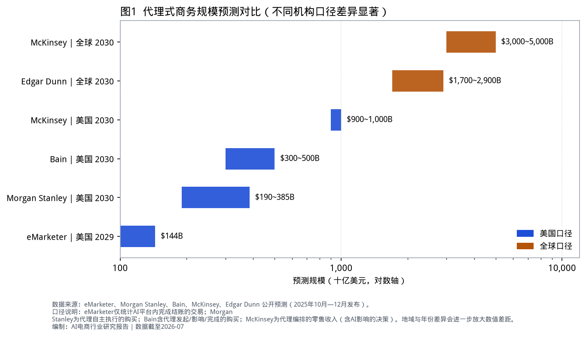
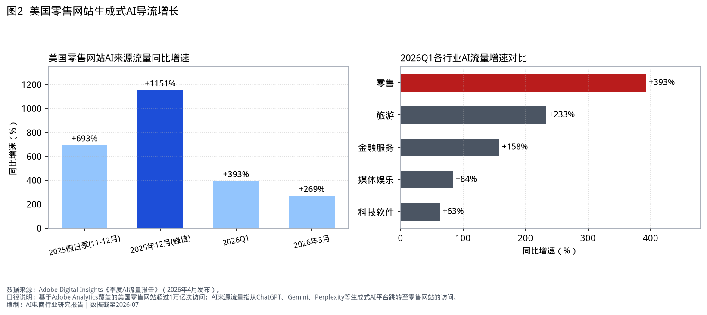
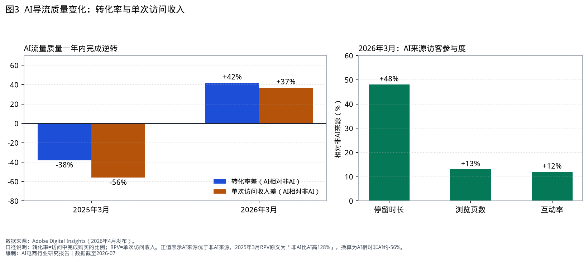
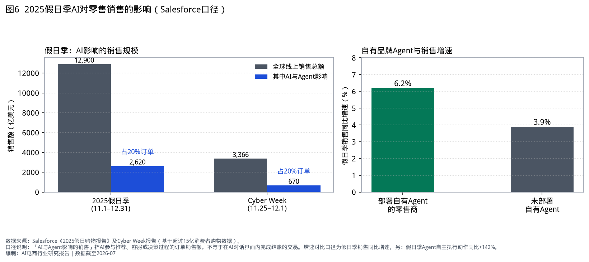
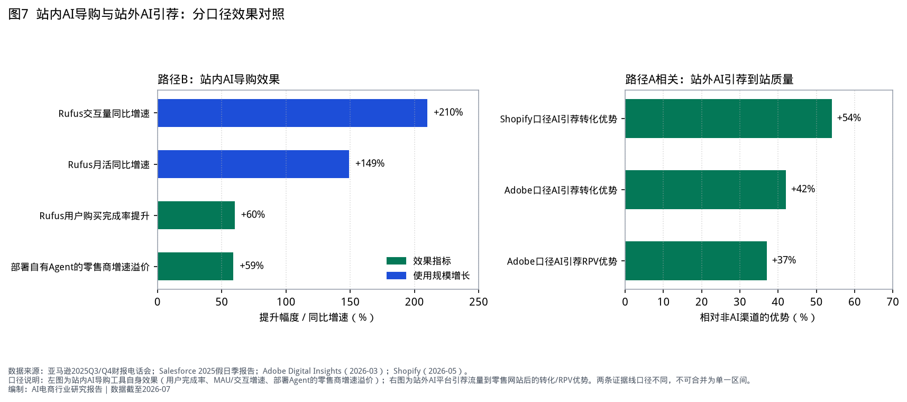
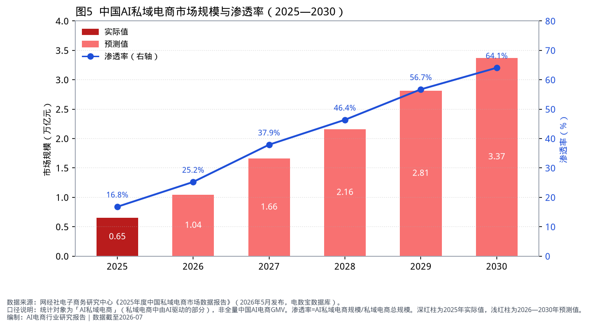
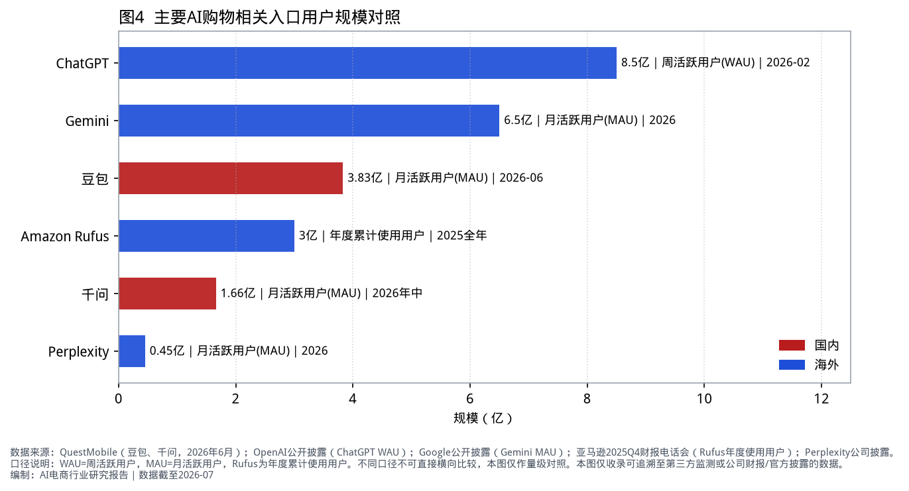

# AI电商行业研究报告

**版本**：正式版 v2.0  
**数据截至**：2026年7月  
**编制说明**：本报告面向行业研究与业务决策参考，基于公开数据与第三方机构报告整理。全文仅采用可追溯至第三方监测、公司财报或官方公告的数据；未经独立验证的自报运营数据不予展示。

---

## 目录

1. [研究说明与数据口径](#1-研究说明与数据口径)
2. [执行摘要](#2-执行摘要)
3. [全球市场全景](#3-全球市场全景)
4. [双路径分析：站外LLM与站内AI导购](#4-双路径分析站外llm与站内ai导购)
5. [中国市场格局](#5-中国市场格局)
6. [产业链结构（MECE）](#6-产业链结构mece)
7. [零售与生鲜场景结合点](#7-零售与生鲜场景结合点)
8. [产品与技术机会](#8-产品与技术机会)
9. [结论与建议](#9-结论与建议)
10. [附录：图表与数据来源索引](#10-附录图表与数据来源索引)

---

## 1. 研究说明与数据口径

### 1.1 研究范围

本报告所称「AI电商」，指以大模型或智能体技术介入消费者「需求唤起—决策—交易—履约—售后」链路，或介入商家经营链路的电商形态。研究重点为消费者侧导购与交易环节；商家侧经营提效（营销内容、客服、供应链）作为产业链一层覆盖。

报告同时覆盖两条路径：

| 路径 | 定义 | 代表 |
|---|---|---|
| 路径A：站外2C LLM | 用户在通用AI助手内完成购物决策起点，再导流或闭环成交 | ChatGPT、Gemini、Perplexity、豆包、千问、元宝 |
| 路径B：站内AI导购 | 电商或零售App内嵌的AI辅助导购工具 | Amazon Rufus、Walmart Sparky、淘宝AI万能搜/千问购物助手、Instacart Cart Assistant |

### 1.2 能力分级框架

| 级别 | 名称 | 特征 |
|---|---|---|
| A1 | 站内问答辅助 | 答疑、比较、攻略，不改变交易流程 |
| A2 | 站外种草导流 | AI推荐后跳转至商家或平台完成交易 |
| A3 | 对话内闭环 | 选品、下单、支付均在对话界面内完成 |
| A4 | 授权代理执行 | 在用户授权下执行凑单、盯价、自动补货等任务 |
| A5 | 自主代理 | 长期授权下的跨平台自动采购（尚未规模化） |

### 1.3 数据采用原则

1. **优先采用第三方面板与经审计财务数据**（Adobe、Salesforce、QuestMobile、网经社、CNNIC、上市公司财报）。
2. **公司自报运营数据**须来自财报电话会或官方新闻稿，并标注「公司口径」。
3. **未经独立验证、存在夸大风险的自报数据不予展示**，亦不作为结论依据。
4. **严格区分两类口径**：「AI影响的销售」（AI参与决策过程的订单）与「AI平台内完成的交易」（在AI界面内结账），二者相差约一个数量级，不可混用。

---

## 2. 执行摘要

### 2.1 主要发现

**发现一：购物决策入口正向对话界面迁移，且已体现在流量与转化数据中。**  
美国零售网站AI来源流量2026年一季度同比+393%，转化率由一年前的低于非AI渠道38%转为高于42%（Adobe Digital Insights）。2025年假日季，AI与智能体影响了全球约20%的零售订单、对应销售额约2620亿美元（Salesforce）。国内方面，豆包月活跃用户3.83亿并已接入抖音电商闭环；千问月活跃用户1.66亿并与淘宝打通（QuestMobile及各方官方公告）。

**发现二：交易环节仍宜留在零售商自有体系，「对话内代结账」尚未证明可规模化。**  
ChatGPT Instant Checkout上线约半年后收缩；沃尔玛将其自有购物助手Sparky以插件形式接入ChatGPT与Gemini，用户在对话中选品、回自有体系结账后，转化率约为自有网站的70%，明显高于此前平台代结账阶段（约自有渠道的1/3）。行业共识趋向「AI负责发现与决策辅助，零售商保留交易、会员与履约」。

**发现三：站内AI导购已跑出可量化的经营效果，生鲜与会员制零售具备更高适配度。**  
Amazon Rufus 2025年累计使用用户超过3亿，使用者购买完成率高出约60%，带来约120亿美元增量年化销售（亚马逊财报电话会，公司口径）。生鲜与会员制业态因SKU相对精选、复购规律强、履约网络完整，更适合对话式清单生成与授权复购。

### 2.2 建议方向

1. **站内先行**：在自有App/小程序落地高确定性场景（商品问答、菜谱/清单成车、售后自动化），以转化率与使用率为考核指标。  
2. **供给侧就绪**：推进商品数据结构化与大模型可读性改造；对主要AI入口建立「被推荐率 / 被平替率」监测。  
3. **站外合作坚持交易主权**：与通用AI入口合作时，采用「插件/小程序跳转、结账留在自有体系」模式；避免将结账权让渡给第三方AI平台。

---

## 3. 全球市场全景

### 3.1 规模预测：口径差异决定结论差异

代理式商务（Agentic Commerce）的远期规模预测因统计口径不同而相差显著。窄口径仅统计AI平台内完成的结账；宽口径包含AI影响或编排的零售收入。

| 机构 | 范围与时点 | 预测值 | 口径 |
|---|---|---|---|
| eMarketer | 美国，2026 / 2029 | 约206亿 / 1440亿美元 | 仅AI平台内结账 |
| Morgan Stanley | 美国，2030 | 1900～3850亿美元 | 代理自主执行的购买 |
| Bain | 美国，2030 | 3000～5000亿美元 | 代理发起、影响或完成的购买 |
| McKinsey | 美国 / 全球，2030 | 最高约1万亿 / 3～5万亿美元 | 代理编排的零售收入 |

**解读**：不必以最宽口径作为短期投入依据；窄口径已足以说明试点级投入的合理性，宽口径反映的是中长期战略卡位价值。

### 3.2 AI导流：从边缘渠道到高转化渠道

| 指标 | 数值 | 来源与口径 |
|---|---|---|
| AI来源流量同比 | 2026Q1 +393%；2025假日季 +693%；2025年12月峰值 +1151% | Adobe，美国零售网站超1万亿次访问 |
| 行业对比（2026Q1） | 零售+393% > 旅游+233% > 金融+158% | 同上 |
| 转化率差（AI相对非AI） | 2025-03：-38% → 2026-03：+42% | Adobe |
| 单次访问收入（RPV） | 2026-03 AI高于非AI 37% | Adobe |
| 参与度 | 停留时长+48%，浏览页数+13% | Adobe，2026-03 |
| 消费者态度 | 39%用过AI购物，其中85%称体验改善；66%信任AI结果 | Adobe配套调查，样本约5000人 |

### 3.3 假日季验证

| 指标 | 数值 | 来源与口径 |
|---|---|---|
| 2025假日季全球线上销售 | 1.29万亿美元（+7%） | Salesforce，15亿+消费者样本 |
| 其中AI与Agent影响 | 2620亿美元，约占订单20% | 「影响」宽口径，非AI内结账 |
| Cyber Week AI影响 | 670亿美元，约占订单20% | 同上 |
| 部署自有品牌Agent的零售商 | 假日季增速6.2%，未部署为3.9% | Salesforce |

---

## 4. 双路径分析：站外LLM与站内AI导购

### 4.1 路径A：站外2C LLM（种草、导流、部分闭环）

| 产品 | 关键数据 | 商业化进展 | 来源与口径 |
|---|---|---|---|
| ChatGPT | 周活跃用户约8～9亿；日均购物相关查询约5000万条（汇总口径） | 2025年9月上线Instant Checkout，2026年3月前后收缩，转向「零售商应用+商家自有结账」 | OpenAI公开披露；媒体交叉 |
| Gemini / Google AI Mode | Gemini月活约6.5亿；购物类搜索中AI Overviews出现率约14% | Universal Commerce Protocol（UCP）开放标准，平台费为0 | Google公开披露 |
| Perplexity | 月活约0.3～0.45亿 | 联盟分佣+PayPal结账 | 公司披露 |
| 豆包 | 月活3.83亿（2026-06） | 「买前问豆包」一级入口，App内完成加购支付；2026-07-15起豆包渠道订单纳入抖音电商成交归因 | QuestMobile；官方/媒体报道 |
| 千问 | 月活1.66亿 | 2026-05与淘宝打通，对话内可完成挑选至售后 | QuestMobile；阿里官宣 |
| 元宝 | —（暂无权威MAU披露） | 2026-07与京东打通小程序：对话出商品卡后跳转京东小程序成交 | 腾讯/京东联合官宣 |

### 4.2 路径B：站内AI导购

| 产品 | 关键数据 | 来源与口径 |
|---|---|---|
| Amazon Rufus | 2025年累计使用用户超3亿；MAU同比+149%；交互同比+210%；使用者购买完成率+60%；约120亿美元增量年化销售 | 亚马逊2025Q3/Q4财报电话会（公司口径） |
| Walmart Sparky | 2025年上线；2026-03起以插件形式进入ChatGPT/Gemini；转化约为自有站70%（对比平台代结账阶段约1/3） | 媒体引述公司数据，交叉报道 |
| Instacart Cart Assistant | 企业级白标AI套件，输出给Kroger、Sprouts等 | Instacart官方新闻稿（2025-11） |
| 淘宝AI万能搜 / 千问购物助手 | 2025-08万能搜全量；2026-05千问助手支持试穿、算优惠、帮抢等 | 界面、新华网等报道阿里官宣 |
| 拼多多AI搜索、快手AI购物助手 | 2026年5～6月上线，公开量化数据较少 | 网经社等 |

### 4.3 两条路径的关系

| 维度 | 路径A（站外LLM） | 路径B（站内导购） |
|---|---|---|
| 核心价值 | 截获「下单前的第一句话」，影响品类与品牌心智 | 降低站内决策成本，提升转化与客单 |
| 变现方式 | 交易佣金、技术服务费归因、联盟分佣、订阅 | 不直接收费，价值体现在GMV增量与留存 |
| 主要风险 | 推荐公正性、幻觉错购、交易权争夺 | 推理成本、AI答案页与广告位的冲突 |
| 终局关系 | 更可能成为发现层与部分闭环入口 | 更可能成为交易场内的默认决策层 |

---

## 5. 中国市场格局

### 5.1 宏观底盘

| 指标 | 数值 | 来源与口径 |
|---|---|---|
| 中国电商总规模（2025） | 59.23万亿元（+4.96%） | 网经社《2025年度中国电子商务市场数据报告》 |
| 生成式AI用户 | 5.15亿人，普及率37% | CNNIC（2025） |
| 2026年618全网GMV | 9340亿元（+4%） | 星图数据 |
| AI私域电商规模 | 2025年0.65万亿元，渗透率16.79%；预测2030年3.37万亿元、渗透率64.07% | 网经社（口径为私域子集，非全量AI电商） |
| 零售企业AI采用 | 94%已用AI Agent提效；52%用于预测补货 | 艾瑞《2025中国零售消费行业生成式AI报告》 |

### 5.2 入口格局：四大阵营

| 阵营 | 模式 | 进展 | 数据来源 |
|---|---|---|---|
| 字节：豆包×抖音电商 | 垂直闭环 | 「买前问豆包」一级入口，App内完成交易；订单纳入抖音电商归因 | QuestMobile；官方/媒体 |
| 阿里：千问×淘宝 | 垂直闭环 | 对话完成淘宝全链路；淘宝App内上线千问购物助手 | QuestMobile；阿里官宣 |
| 腾讯×京东：元宝×京东 | 生态联盟 | 对话出商品卡，跳转京东小程序成交 | 联合官宣 |
| 内容与其他 | 社区AI / 站内工具 | 小红书点点并入主站；拼多多、快手上线AI搜索/购物助手 | 36氪、网经社等 |

### 5.3 即时零售相关动态

| 事件 | 要点 | 来源 |
|---|---|---|
| 美团收购叮咚买菜中国业务 | 初始对价约7.17亿美元（2026-02）；合并后前置仓规模显著扩大 | 港交所公告 |
| 盒马 | 「鲜生+NB」双业态；前置仓重启扩张 | 公司管理层公开表述及媒体报道 |
| 山姆会员店线上业务 | 线上占比超过50%；前置仓/云仓数百个量级 | 媒体引述行业估算及沃尔玛国际管理层披露 |

---

## 6. 产业链结构（MECE）

按「一笔AI购物交易必需的功能环节」纵向切分为六层：

| 层级 | 职能 | 国内代表 | 海外代表 | 收入模式 | 主要成本 |
|---|---|---|---|---|---|
| L1 模型与算力 | 提供推理与多模态能力 | 豆包大模型、通义、混元、DeepSeek | OpenAI、Google、Anthropic | API、云捆绑、订阅 | 训练与推理算力 |
| L2 入口与流量 | 承接购物意图 | 豆包、千问、元宝、点点；站内万能搜等 | ChatGPT、Gemini、Perplexity、Rufus、Sparky | 佣金、归因结算、订阅、战略价值 | 推理、获客、合规 |
| L3 商品与交易 | 商品池、定价、交易与售后 | 淘天、京东、抖音电商、拼多多 | Amazon、Walmart、Shopify商家 | GMV与佣金 | 商品运营、渠道费率、feed改造 |
| L4 交易基建 | 商务协议与支付信任 | 支付宝、微信支付、抖音支付 | ACP、UCP、Stripe、Visa、Mastercard、AP2 | 通道费、令牌服务 | 风控与标准建设 |
| L5 商家服务 | GEO/AEO、SaaS、数字人、监测 | 清蓝等GEO服务商；有赞、微盟 | Profound、Salesforce Agentforce、Adobe | 订阅与咨询 | 研发与多模型适配 |
| L6 履约供应链AI | 预测、补货、调度、品控 | 物流与即时零售算法体系 | Instacart Store View等 | 效率带来的成本节约 | 数据与算法团队 |

**三种竞合模式**：

1. **垂直自建闭环**（豆包×抖音、千问×淘宝、Amazon Rufus）：体验完整，但商品池封闭、比价中立性受限。  
2. **生态联盟/插件**（元宝×京东、Sparky×ChatGPT）：各方保留核心资产，责任边界与佣金谈判是关键。  
3. **中立第三方**（Perplexity联盟模式、Google UCP）：叙事上有利于用户信任，国内因平台数据封闭较难成立。

---

## 7. 零售与生鲜场景结合点

### 7.1 综合零售：按消费者旅程

| 旅程环节 | 结合点 | 已验证方向 |
|---|---|---|
| 需求唤起 | 站外LLM中的商品推荐 | ChatGPT购物查询；豆包一级购物入口 |
| 方案生成 | 「答案报告」式导购（攻略+商品+评测） | 淘宝AI万能搜；Rufus Help Me Decide |
| 选品比较 | 参数对比、评论提炼 | Rufus购买完成率提升；站内助手渗透 |
| 比价凑单 | 算优惠、盯价 | 淘宝AI算优惠/帮抢；Rufus价格追踪 |
| 下单支付 | 对话内闭环 vs 跳转商家结账 | Instant Checkout收缩 vs Sparky插件模式 |
| 履约与售后 | 物流问答、退换货自动化 | Salesforce：假日季Agent自主动作+142% |
| 复购 | 偏好记忆、补货提醒 | Alexa+/Rufus账户记忆 |

### 7.2 生鲜零售：结构性特征决定结合点

| 生鲜特征 | 痛点 | AI结合点 |
|---|---|---|
| 高频刚需 | 重复选购、决策疲劳 | 清单式/语音快速成单 |
| 菜谱驱动 | 「吃什么」先于「买什么」 | 菜谱→食材购物车；膳食规划 |
| 低毛利 | 导购ROI敏感 | 轻量模型；价值重心放在供应链侧 |
| 易损耗 | 损耗直接侵蚀利润 | 需求预测、智能补货、临期动态推荐 |
| 即时履约 | 仓网与调度决定体验 | 算法仓网规划与配送调度 |
| 非标商品 | 线上信任门槛高 | 图像品控、售后自动理赔 |

**三类优先组合**：

1. **餐桌助手**：对话/语音 + 菜谱成车 + 家庭偏好记忆 + 周期购。  
2. **损耗联动导购**：库存与效期数据接入推荐，临期折扣与当日菜谱联动。  
3. **白标AI基建**：面向区域商超输出对话建车与膳食规划能力（参照Instacart模式）。

---

## 8. 产品与技术机会

### 8.1 交互范式变化

| 原有范式 | 当前变化 | 产品含义 |
|---|---|---|
| 关键词 → 商品列表 | 模糊需求 → 多轮澄清 → 答案报告 | 结果页设计转向答案组织设计 |
| 用户自行完成漏斗 | AI压缩决策路径 | 一级指标变为意图识别准确率、澄清轮次、推荐采纳率 |
| 竞价与推荐分配流量 | 模型引用与feed质量影响曝光 | 商家运营对象转向结构化内容资产 |
| 终点为下单 | 终点延伸至授权代理 | 需要授权管理（额度、品类、撤销） |

### 8.2 商业化机制对照

| 模式 | 代表 | 机制要点 |
|---|---|---|
| 交易佣金 | ChatGPT（约4%+支付通道费） | 当前整体费率仍低于部分大型电商平台佣金 |
| 技术服务费+归因 | 抖音电商×豆包 | 将AI入口纳入电商财务结算体系 |
| 联盟分佣 | Perplexity | CPS，适合高客单试水 |
| 零平台费换生态 | Google UCP | 后续可能回归广告变现 |
| 暂不商业化 | 部分站内AI搜索 | 战略观察期，窗口期有利于供给侧内容建设 |

### 8.3 分角色机会

- **平台**：站内助手从问答升级到任务代理；AI答案页的商业化规则设计；用户授权中心。  
- **品牌/商家**：商品feed结构化与大模型可读性；GEO监测与内容供给；自有Agent接入主流AI入口。  
- **生鲜/即时零售**：餐桌助手、损耗联动推荐、白标能力输出。  
- **服务商与开发者**：协议适配中间件、导购效果评测与监测工具、垂类导购智能体。

### 8.4 合规要点

面向公众的AI导购需关注：生成式人工智能服务与算法推荐备案、生成合成内容标识、个人信息保护影响评估、数据出境限制、未成年人消费与代扣授权、价格表述与不正当竞争相关规定。

---

## 9. 结论与建议

### 9.1 结论

1. AI电商已从概念验证进入规模化应用阶段，依据是AI导流增速、转化率逆转与假日季影响占比等可验证数据。  
2. 站外LLM与站内导购将长期并存：前者竞争决策入口，后者竞争交易场内效率。  
3. 「AI发现 + 零售商成交」是当前更稳健的分工；对话内完全代结账尚未得到规模化验证。  
4. 生鲜与会员制零售因SKU结构、复购频率与履约能力，具备更高的AI导购适配度。

### 9.2 建议（按优先级）

| 优先级 | 动作 | 说明 |
|---|---|---|
| P0 | 建立数据口径与监测体系 | 区分「影响」与「成交」；对主要AI入口做月度可见度监测 |
| P1 | 站内高确定性场景试点 | 商品问答、清单/菜谱成车、售后自动化；设定转化与客诉门槛 |
| P2 | 商品数据LLM就绪化 | 结构化feed、评价与说明书治理；服务站内助手与站外被发现 |
| P3 | 选择性接入站外入口 | 优先「插件/小程序跳转、结账自有」模式；明确数据与会员边界 |
| P4 | 生鲜专项 | 评估餐桌助手与损耗联动推荐的投入产出 |

---

## 10. 附录：图表与数据来源索引

| 图号 | 内容 | 主要数据来源 | 口径要点 |
|---|---|---|---|
| 图1 | 代理式商务规模预测对比 | eMarketer / MS / Bain / McKinsey / Edgar Dunn | 窄口径=平台内结账；宽口径=AI影响/编排收入 |
| 图2 | 美国零售AI导流增速 | Adobe Digital Insights，2026-04 | AI平台跳转至零售网站的访问 |
| 图3 | AI导流转化与RPV逆转 | Adobe Digital Insights | AI相对非AI渠道 |
| 图4 | AI购物入口用户规模 | QuestMobile；OpenAI；Google；亚马逊财报；Perplexity | WAU/MAU/年度用户口径不同，仅作量级对照 |
| 图5 | 中国AI私域电商规模 | 网经社，2026-05 | 私域子集，非全量AI电商GMV |
| 图6 | 假日季AI影响销售 | Salesforce 2025假日季/Cyber Week报告 | 「影响」宽口径 |
| 图7 | 站内导购与站外引荐效果 | 亚马逊财报电话会；Salesforce；Adobe；Shopify | 两条证据线分列，不可合并 |

**数据更新方式**：修改 `data/*.csv` 后执行 `python3 scripts/make_charts.py` 可重新生成全部图表。
